Exploring patterns of resilience components
===========================================

Read and prepare data
---------------------

``` r
# Read data
eviresi <- read.csv(file=paste(di, "/data/evi_resilience.csv", sep=""), header = TRUE, sep = ',')

# Prepare data
elev <- read.csv(file=paste(di, "/data/elev.csv", sep=""), header = TRUE, sep = ',')

eviresi <- eviresi %>% 
  # join elevation data
  dplyr::inner_join(elev, by='iv_malla_modi_id') %>% 
  # Add a variable for population cluster
  mutate(clu_pop = as.factor(ifelse(poblacion == 1, 'a', 
                          ifelse(poblacion %in% c(2,3,4,5), 'b', 
                                 ifelse(poblacion %in% c(6,7,8), 'c', 'out')))))

# Filter out cluster 
eviresi_f <- eviresi %>% 
  filter(clu_pop != 'out') %>%
  mutate(clu_popf = as.factor(ifelse(clu_pop == 'a', 'Camarate',
                           ifelse(clu_pop == 'b','Northern slopes', 'Southern slopes'))))
```

Models
======

Resilience
----------

``` r
variable <- 'rs'

# Model 
myformula <- as.formula(paste0(variable, " ~ elev + clu_popf + elev:clu_popf"))
mymodel <- aov(myformula, data=eviresi_f)

## Summary model 
kable(broom::tidy(mymodel), col.names = c("Source", "df", "SS", "MS", "F", "p"))
```

| Source         |    df|         SS|         MS|          F|      p|
|:---------------|-----:|----------:|----------:|----------:|------:|
| elev           |     1|  1.5175335|  1.5175335|  672.05719|  0e+00|
| clu\_popf      |     2|  0.4327424|  0.2163712|   95.82248|  0e+00|
| elev:clu\_popf |     2|  0.0712757|  0.0356379|   15.78264|  2e-07|
| Residuals      |  1760|  3.9741542|  0.0022580|         NA|     NA|

``` r
broom::glance(mymodel)
```

    ##   r.squared adj.r.squared      sigma statistic      p.value df   logLik
    ## 1 0.3371666     0.3352835 0.04751886  179.0535 2.64913e-154  6 2877.506
    ##         AIC       BIC deviance df.residual
    ## 1 -5741.011 -5702.676 3.974154        1760

``` r
## Evaluate terms 
drop1(mymodel, test="Chi")
```

    ## Single term deletions
    ## 
    ## Model:
    ## rs ~ elev + clu_popf + elev:clu_popf
    ##               Df Sum of Sq    RSS    AIC  Pr(>Chi)    
    ## <none>                     3.9742 -10755              
    ## elev:clu_popf  2  0.071276 4.0454 -10727 1.525e-07 ***
    ## ---
    ## Signif. codes:  0 '***' 0.001 '**' 0.01 '*' 0.05 '.' 0.1 ' ' 1

``` r
## Effects plots 
### Population 
plot(effect("clu_popf",mymodel), 
     main=paste0(variable, ' vs. Cluster population'),
     xlab='Cluster population')
```

    ## NOTE: clu_popf is not a high-order term in the model

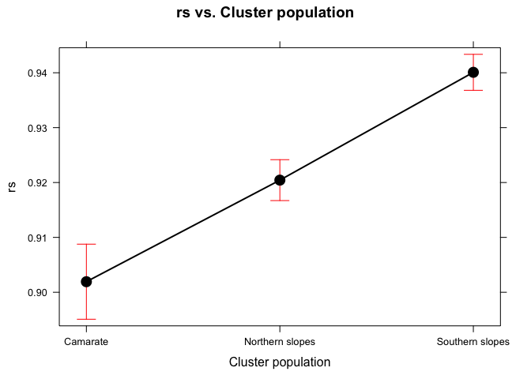<!-- -->

``` r
### Elevation
plot(effect("elev",mymodel), 
     main=paste0(variable, ' vs. Elevation'),
     xlab='Elevation (m)')
```

    ## NOTE: elev is not a high-order term in the model

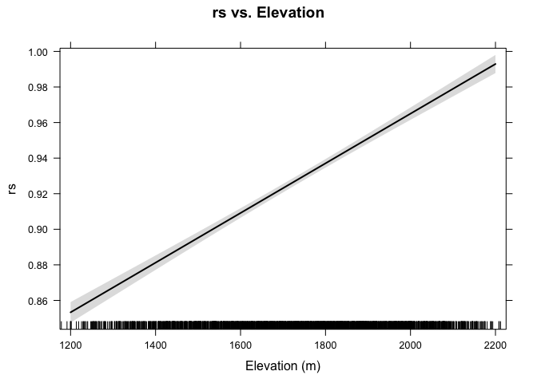<!-- -->

``` r
### Both 
plot(effect("elev:clu_popf",mymodel), 
     main=paste0('Interaction plot (',variable, ')'),
     xlab='Elevation (m)')
```

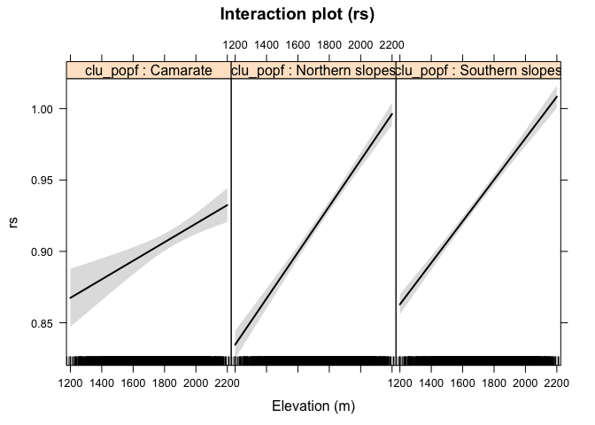<!-- -->

``` r
## Multiple comparison 
tuk <- glht(mymodel, linfct = mcp(clu_popf = "Tukey"))
```

    ## Warning in mcp2matrix(model, linfct = linfct): covariate interactions found
    ## -- default contrast might be inappropriate

``` r
summary(tuk)
```

    ## 
    ##   Simultaneous Tests for General Linear Hypotheses
    ## 
    ## Multiple Comparisons of Means: Tukey Contrasts
    ## 
    ## 
    ## Fit: aov(formula = myformula, data = eviresi_f)
    ## 
    ## Linear Hypotheses:
    ##                                        Estimate Std. Error t value
    ## Northern slopes - Camarate == 0        -0.14868    0.03184  -4.670
    ## Southern slopes - Camarate == 0        -0.10102    0.03069  -3.292
    ## Southern slopes - Northern slopes == 0  0.04766    0.01857   2.567
    ##                                        Pr(>|t|)    
    ## Northern slopes - Camarate == 0         < 1e-04 ***
    ## Southern slopes - Camarate == 0         0.00275 ** 
    ## Southern slopes - Northern slopes == 0  0.02638 *  
    ## ---
    ## Signif. codes:  0 '***' 0.001 '**' 0.01 '*' 0.05 '.' 0.1 ' ' 1
    ## (Adjusted p values reported -- single-step method)

``` r
# Convert comparisons into letters 
df_letter <- fortify(cld(tuk)) %>%
  transmute(clu_popf = as.factor(lhs),
         tukey = letters) %>%
  mutate(variable = variable)

aux_name <- paste0('df_tuk_', variable)
assign(aux_name, df_letter)
```

Resistence
----------

``` r
variable <- 'rt'

# Model 
myformula <- as.formula(paste0(variable, " ~ elev + clu_popf + elev:clu_popf"))
mymodel <- aov(myformula, data=eviresi_f)

## Summary model 
broom::tidy(mymodel)
```

    ##            term   df       sumsq      meansq   statistic       p.value
    ## 1          elev    1 0.284412288 0.284412288 112.7291873  1.441255e-25
    ## 2      clu_popf    2 1.832680182 0.916340091 363.1990533 8.891218e-133
    ## 3 elev:clu_popf    2 0.004731095 0.002365547   0.9376044  3.917602e-01
    ## 4     Residuals 1760 4.440426113 0.002522969          NA            NA

``` r
broom::glance(mymodel)
```

    ##   r.squared adj.r.squared      sigma statistic       p.value df   logLik
    ## 1 0.3233378     0.3214155 0.05022917  168.2005 1.937821e-146  6 2779.547
    ##         AIC       BIC deviance df.residual
    ## 1 -5545.094 -5506.759 4.440426        1760

``` r
## Evaluate terms 
drop1(mymodel, test="Chi")
```

    ## Single term deletions
    ## 
    ## Model:
    ## rt ~ elev + clu_popf + elev:clu_popf
    ##               Df Sum of Sq    RSS    AIC Pr(>Chi)
    ## <none>                     4.4404 -10559         
    ## elev:clu_popf  2 0.0047311 4.4452 -10561   0.3905

``` r
## Effects plots 
### Population 
plot(effect("clu_popf",mymodel), 
     main=paste0(variable, ' vs. Cluster population'),
     xlab='Cluster population')
```

    ## NOTE: clu_popf is not a high-order term in the model

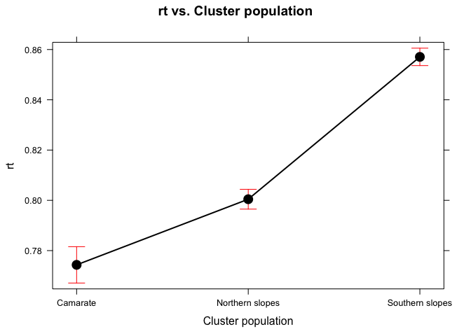<!-- -->

``` r
### Elevation
plot(effect("elev",mymodel), 
     main=paste0(variable, ' vs. Elevation'),
     xlab='Elevation (m)')
```

    ## NOTE: elev is not a high-order term in the model

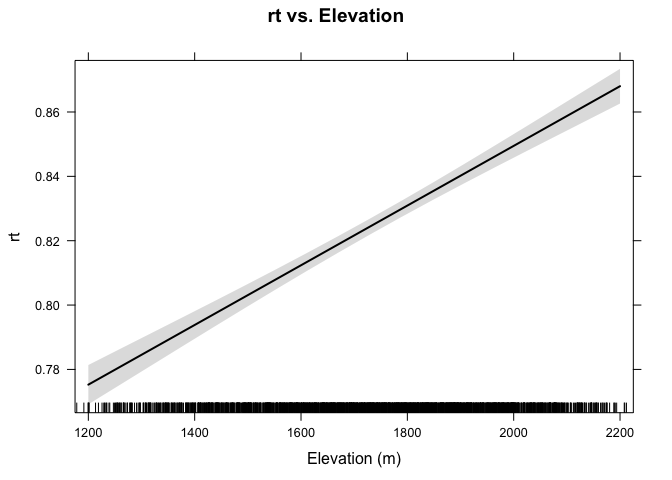<!-- -->

``` r
### Both 
plot(effect("elev:clu_popf",mymodel), 
     main=paste0('Interaction plot (',variable, ')'),
     xlab='Elevation (m)')
```

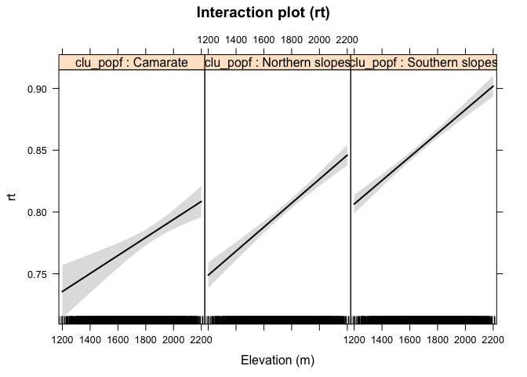<!-- -->

``` r
## Multiple comparison 
tuk <- glht(mymodel, linfct = mcp(clu_popf = "Tukey"))
```

    ## Warning in mcp2matrix(model, linfct = linfct): covariate interactions found
    ## -- default contrast might be inappropriate

``` r
summary(tuk)
```

    ## 
    ##   Simultaneous Tests for General Linear Hypotheses
    ## 
    ## Multiple Comparisons of Means: Tukey Contrasts
    ## 
    ## 
    ## Fit: aov(formula = myformula, data = eviresi_f)
    ## 
    ## Linear Hypotheses:
    ##                                        Estimate Std. Error t value
    ## Northern slopes - Camarate == 0        -0.01573    0.03365  -0.468
    ## Southern slopes - Camarate == 0         0.04380    0.03244   1.350
    ## Southern slopes - Northern slopes == 0  0.05953    0.01963   3.033
    ##                                        Pr(>|t|)   
    ## Northern slopes - Camarate == 0         0.88328   
    ## Southern slopes - Camarate == 0         0.35827   
    ## Southern slopes - Northern slopes == 0  0.00652 **
    ## ---
    ## Signif. codes:  0 '***' 0.001 '**' 0.01 '*' 0.05 '.' 0.1 ' ' 1
    ## (Adjusted p values reported -- single-step method)

``` r
# Convert comparisons into letters 
df_letter <- fortify(cld(tuk)) %>%
  transmute(clu_popf = as.factor(lhs),
         tukey = letters) %>%
  mutate(variable = variable)

aux_name <- paste0('df_tuk_', variable)
assign(aux_name, df_letter)
```

Recovery
--------

``` r
variable <- 'rc'

# Model 
myformula <- as.formula(paste0(variable, " ~ elev + clu_popf + elev:clu_popf"))
mymodel <- aov(myformula, data=eviresi_f)

## Summary model 
broom::tidy(mymodel)
```

    ##            term   df      sumsq     meansq  statistic      p.value
    ## 1          elev    1 0.62417056 0.62417056 146.551949 1.843660e-32
    ## 2      clu_popf    2 1.24570802 0.62285401 146.242829 1.756436e-59
    ## 3 elev:clu_popf    2 0.06452173 0.03226087   7.574681 5.301945e-04
    ## 4     Residuals 1760 7.49590982 0.00425904         NA           NA

``` r
broom::glance(mymodel)
```

    ##   r.squared adj.r.squared      sigma statistic      p.value df   logLik
    ## 1 0.2051258     0.2028677 0.06526132  90.83739 3.368817e-85  6 2317.202
    ##         AIC       BIC deviance df.residual
    ## 1 -4620.404 -4582.069  7.49591        1760

``` r
## Evaluate terms 
drop1(mymodel, test="Chi")
```

    ## Single term deletions
    ## 
    ## Model:
    ## rc ~ elev + clu_popf + elev:clu_popf
    ##               Df Sum of Sq    RSS     AIC  Pr(>Chi)    
    ## <none>                     7.4959 -9634.1              
    ## elev:clu_popf  2  0.064522 7.5604 -9623.0 0.0005167 ***
    ## ---
    ## Signif. codes:  0 '***' 0.001 '**' 0.01 '*' 0.05 '.' 0.1 ' ' 1

``` r
## Effects plots 
### Population 
plot(effect("clu_popf",mymodel), 
     main=paste0(variable, ' vs. Cluster population'),
     xlab='Cluster population')
```

    ## NOTE: clu_popf is not a high-order term in the model

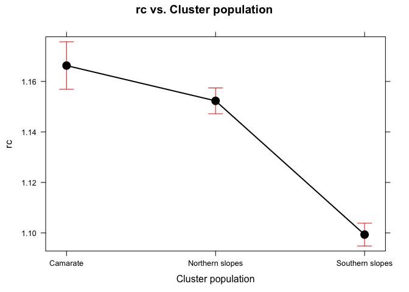<!-- -->

``` r
### Elevation
plot(effect("elev",mymodel), 
     main=paste0(variable, ' vs. Elevation'),
     xlab='Elevation (m)')
```

    ## NOTE: elev is not a high-order term in the model

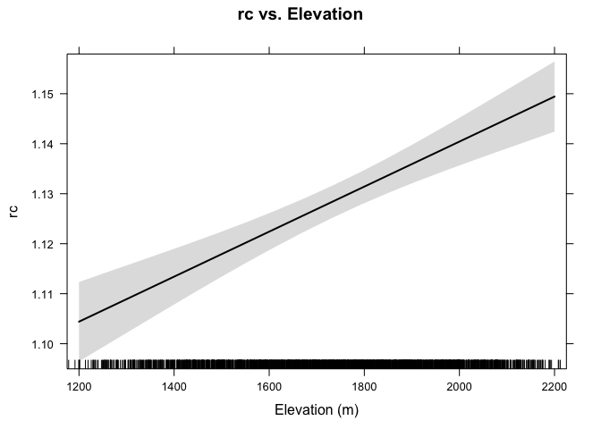<!-- -->

``` r
### Both 
plot(effect("elev:clu_popf",mymodel), 
     main=paste0('Interaction plot (',variable, ')'),
     xlab='Elevation (m)')
```

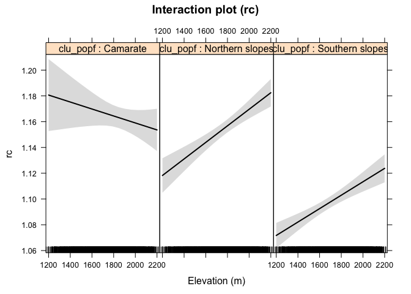<!-- -->

``` r
## Multiple comparison 
tuk <- glht(mymodel, linfct = mcp(clu_popf = "Tukey"))
```

    ## Warning in mcp2matrix(model, linfct = linfct): covariate interactions found
    ## -- default contrast might be inappropriate

``` r
summary(tuk)
```

    ## 
    ##   Simultaneous Tests for General Linear Hypotheses
    ## 
    ## Multiple Comparisons of Means: Tukey Contrasts
    ## 
    ## 
    ## Fit: aov(formula = myformula, data = eviresi_f)
    ## 
    ## Linear Hypotheses:
    ##                                        Estimate Std. Error t value
    ## Northern slopes - Camarate == 0        -0.17191    0.04372  -3.932
    ## Southern slopes - Camarate == 0        -0.20388    0.04215  -4.837
    ## Southern slopes - Northern slopes == 0 -0.03197    0.02550  -1.254
    ##                                        Pr(>|t|)    
    ## Northern slopes - Camarate == 0        0.000245 ***
    ## Southern slopes - Camarate == 0         < 1e-05 ***
    ## Southern slopes - Northern slopes == 0 0.412204    
    ## ---
    ## Signif. codes:  0 '***' 0.001 '**' 0.01 '*' 0.05 '.' 0.1 ' ' 1
    ## (Adjusted p values reported -- single-step method)

``` r
# Convert comparisons into letters 
df_letter <- fortify(cld(tuk)) %>%
  transmute(clu_popf = as.factor(lhs),
         tukey = letters) %>%
  mutate(variable = variable)

aux_name <- paste0('df_tuk_', variable)
assign(aux_name, df_letter)
```

Relative resilience
-------------------

``` r
variable <- 'rrs'

# Model 
myformula <- as.formula(paste0(variable, " ~ elev + clu_popf + elev:clu_popf"))
mymodel <- aov(myformula, data=eviresi_f)

## Summary model 
broom::tidy(mymodel)
```

    ##            term   df     sumsq      meansq  statistic      p.value
    ## 1          elev    1 0.4880125 0.488012478 189.006138 6.295796e-41
    ## 2      clu_popf    2 0.5825321 0.291266053 112.806689 8.013465e-47
    ## 3 elev:clu_popf    2 0.0397780 0.019888998   7.702964 4.668763e-04
    ## 4     Residuals 1760 4.5443072 0.002581993         NA           NA

``` r
broom::glance(mymodel)
```

    ##   r.squared adj.r.squared      sigma statistic      p.value df   logLik
    ## 1 0.1963564     0.1940733 0.05081331  86.00509 4.925939e-81  6 2759.128
    ##         AIC      BIC deviance df.residual
    ## 1 -5504.256 -5465.92 4.544307        1760

``` r
## Evaluate terms 
drop1(mymodel, test="Chi")
```

    ## Single term deletions
    ## 
    ## Model:
    ## rrs ~ elev + clu_popf + elev:clu_popf
    ##               Df Sum of Sq    RSS    AIC  Pr(>Chi)    
    ## <none>                     4.5443 -10518              
    ## elev:clu_popf  2  0.039778 4.5841 -10507 0.0004548 ***
    ## ---
    ## Signif. codes:  0 '***' 0.001 '**' 0.01 '*' 0.05 '.' 0.1 ' ' 1

``` r
## Effects plots 
### Population 
plot(effect("clu_popf",mymodel), 
     main=paste0(variable, ' vs. Cluster population'),
     xlab='Cluster population')
```

    ## NOTE: clu_popf is not a high-order term in the model

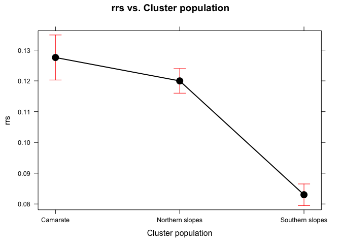<!-- -->

``` r
### Elevation
plot(effect("elev",mymodel), 
     main=paste0(variable, ' vs. Elevation'),
     xlab='Elevation (m)')
```

    ## NOTE: elev is not a high-order term in the model

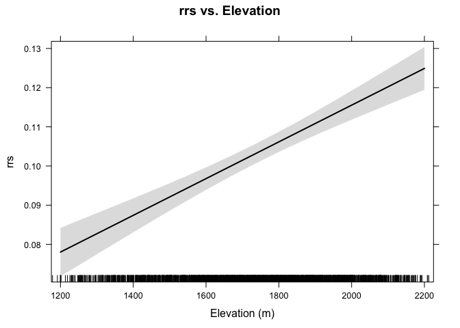<!-- -->

``` r
### Both 
plot(effect("elev:clu_popf",mymodel), 
     main=paste0('Interaction plot (',variable, ')'),
     xlab='Elevation (m)')
```

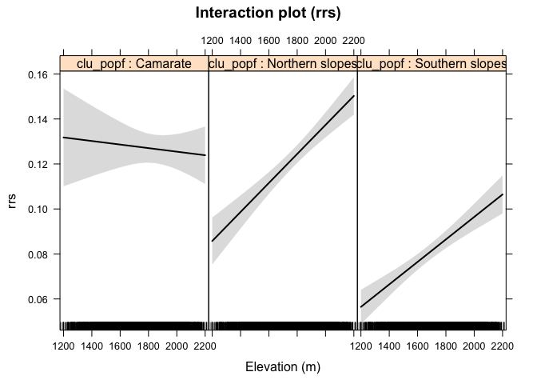<!-- -->

``` r
## Multiple comparison 
tuk <- glht(mymodel, linfct = mcp(clu_popf = "Tukey"))
```

    ## Warning in mcp2matrix(model, linfct = linfct): covariate interactions found
    ## -- default contrast might be inappropriate

``` r
summary(tuk)
```

    ## 
    ##   Simultaneous Tests for General Linear Hypotheses
    ## 
    ## Multiple Comparisons of Means: Tukey Contrasts
    ## 
    ## 
    ## Fit: aov(formula = myformula, data = eviresi_f)
    ## 
    ## Linear Hypotheses:
    ##                                        Estimate Std. Error t value
    ## Northern slopes - Camarate == 0        -0.13294    0.03404  -3.905
    ## Southern slopes - Camarate == 0        -0.14482    0.03282  -4.413
    ## Southern slopes - Northern slopes == 0 -0.01187    0.01986  -0.598
    ##                                        Pr(>|t|)    
    ## Northern slopes - Camarate == 0        0.000279 ***
    ## Southern slopes - Camarate == 0        3.08e-05 ***
    ## Southern slopes - Northern slopes == 0 0.816451    
    ## ---
    ## Signif. codes:  0 '***' 0.001 '**' 0.01 '*' 0.05 '.' 0.1 ' ' 1
    ## (Adjusted p values reported -- single-step method)

``` r
# Convert comparisons into letters 
df_letter <- fortify(cld(tuk)) %>%
  transmute(clu_popf = as.factor(lhs),
         tukey = letters) %>%
  mutate(variable = variable)

aux_name <- paste0('df_tuk_', variable)
assign(aux_name, df_letter)
```

``` r
variables <- c('rs','rc','rt','rrs')
auxdf <- data.frame() 

for (i in variables){ 
aux <- eviresi_f %>% 
  dplyr::group_by(clu_popf) %>% 
  summarise_each_(funs(mean, sd, se=sd(.)/sqrt(n())), i) %>% mutate(variable=i) 

auxdf <- rbind(auxdf, aux) }

label_variable <- c('rt' = 'Resistance', 
                    'rc' = 'Recovery',
                    'rs' = 'Resilience',
                    'rrs' = 'Relative Resilience')


df_all_letters <- rbind(df_tuk_rs, df_tuk_rt, df_tuk_rc, df_tuk_rrs)

auxdf <- auxdf %>% 
  inner_join(df_all_letters, by=c('clu_popf', 'variable')) 


gpop_bar_letter <- ggplot(auxdf[auxdf$variable != 'rrs',], aes(x=clu_popf, y=mean)) + 
  geom_bar(stat='identity', fill='black', colour='black') + 
  geom_errorbar(aes(ymin=mean-sd, ymax=mean+sd), 
                width=.2, position=position_dodge(.9))  +
  facet_wrap(~variable, labeller = as_labeller(label_variable)) + 
  theme_bw() + xlab('') + ylab('') + 
  geom_text(aes(label = tukey, 
                y=(mean+1.7*sd)),
           position = position_dodge(width=0.9)) +
  theme(strip.background = element_rect(fill = "white"))

gpop_bar_letter
```

<!-- -->

``` r
pdf(file=paste0(di, "/man/images/plot_resicomp_bar_tukey_by_cluster.pdf"), height = 7, width = 8)
gpop_bar_letter
dev.off()
```

    ## quartz_off_screen 
    ##                 2

``` r
gpop_bar_letter_rrs <- ggplot(auxdf[auxdf$variable == 'rrs',], aes(x=clu_popf, y=mean)) + 
  geom_bar(stat='identity', fill='black', colour='black') + 
  geom_errorbar(aes(ymin=mean-sd, ymax=mean+sd), 
                width=.2, position=position_dodge(.9))  +
  theme_bw() + xlab('') + ylab('Relative resilience') + 
  geom_text(aes(label = tukey, 
                y=(mean+1.7*sd)),
           position = position_dodge(width=0.9)) +
  theme(strip.background = element_rect(fill = "white"))

gpop_bar_letter_rrs
```

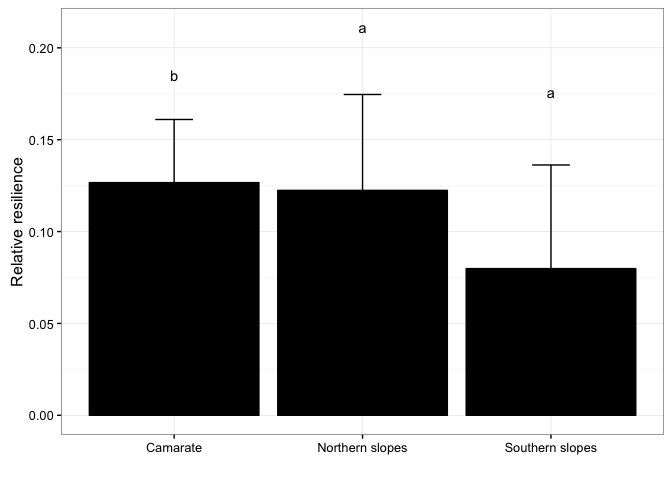<!-- -->

``` r
pdf(file=paste0(di, "/man/images/plot_rrs_bar_tukey_by_cluster.pdf"), height = 7, width = 8)
gpop_bar_letter_rrs
dev.off()
```

    ## quartz_off_screen 
    ##                 2
