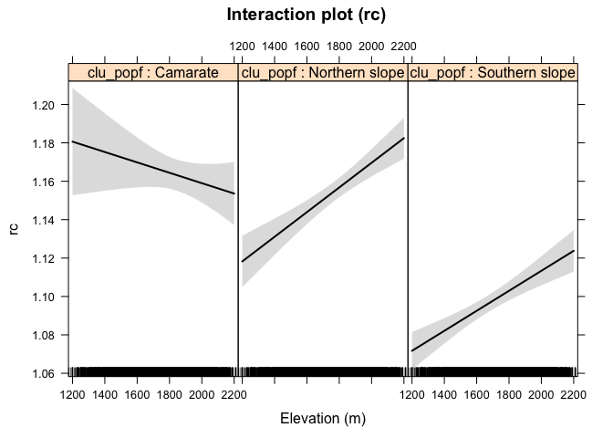
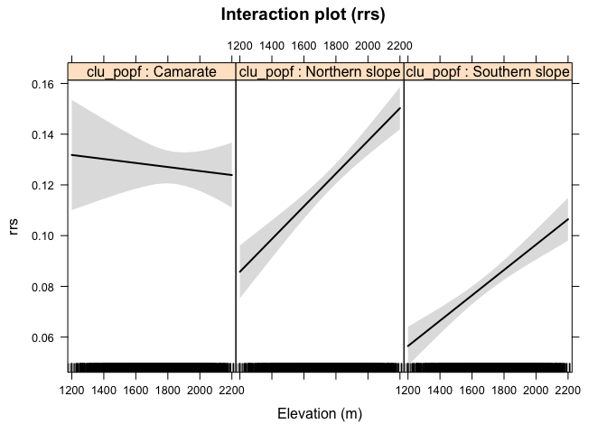
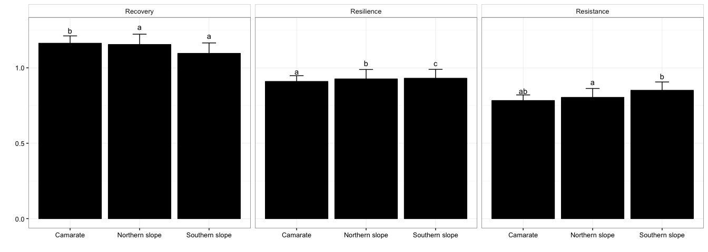
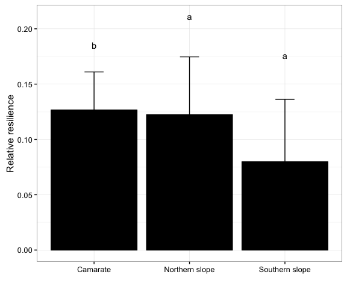

-   [Exploring patterns of resilience components (models)](#exploring-patterns-of-resilience-components-models)
-   [Resilience](#resilience)
    -   [Mean values (Cluster population)](#mean-values-cluster-population)
    -   [Summary ANCOVA model](#summary-ancova-model)
    -   [Effects plot](#effects-plot)
        -   [. ~ Cluster population](#cluster-population)
        -   [. ~ Elevation](#elevation)
        -   [. ~ Cluster population:Elevation](#cluster-populationelevation)
    -   [Post-hoc comparison](#post-hoc-comparison)
-   [Resistence](#resistence)
    -   [Mean values (Cluster population)](#mean-values-cluster-population-1)
    -   [Summary ANCOVA model](#summary-ancova-model-1)
    -   [Effects plot](#effects-plot-1)
        -   [. ~ Cluster population](#cluster-population-1)
        -   [. ~ Elevation](#elevation-1)
        -   [. ~ Cluster population:Elevation](#cluster-populationelevation-1)
    -   [Post-hoc comparison](#post-hoc-comparison-1)
-   [Recovery](#recovery)
    -   [Mean values (Cluster population)](#mean-values-cluster-population-2)
    -   [Summary ANCOVA model](#summary-ancova-model-2)
    -   [Effects plot](#effects-plot-2)
        -   [. ~ Cluster population](#cluster-population-2)
        -   [. ~ Elevation](#elevation-2)
        -   [. ~ Cluster population:Elevation](#cluster-populationelevation-2)
    -   [Post-hoc comparison](#post-hoc-comparison-2)
-   [Relative resilience](#relative-resilience)
    -   [Mean values (Cluster population)](#mean-values-cluster-population-3)
    -   [Summary ANCOVA model](#summary-ancova-model-3)
    -   [Effects plot](#effects-plot-3)
        -   [. ~ Cluster population](#cluster-population-3)
        -   [. ~ Elevation](#elevation-3)
        -   [. ~ Cluster population:Elevation](#cluster-populationelevation-3)
    -   [Post-hoc comparison](#post-hoc-comparison-3)
-   [Summary plots](#summary-plots)

    ## Warning: package 'knitr' was built under R version 3.2.5

Exploring patterns of resilience components (models)
====================================================

Resilience
==========

Mean values (Cluster population)
--------------------------------

<table style="width:83%;">
<caption>Mean values (rs)</caption>
<colgroup>
<col width="20%" />
<col width="13%" />
<col width="15%" />
<col width="16%" />
<col width="16%" />
</colgroup>
<thead>
<tr class="header">
<th align="center">clu_popf</th>
<th align="center">mean</th>
<th align="center">sd</th>
<th align="center">se</th>
<th align="center">variable</th>
</tr>
</thead>
<tbody>
<tr class="odd">
<td align="center">Camarate</td>
<td align="center">0.9097170</td>
<td align="center">0.03828143</td>
<td align="center">0.002392589</td>
<td align="center">rs</td>
</tr>
<tr class="even">
<td align="center">Northern slope</td>
<td align="center">0.9265084</td>
<td align="center">0.06251420</td>
<td align="center">0.002467239</td>
<td align="center">rs</td>
</tr>
<tr class="odd">
<td align="center">Southern slope</td>
<td align="center">0.9308963</td>
<td align="center">0.05909947</td>
<td align="center">0.002005967</td>
<td align="center">rs</td>
</tr>
</tbody>
</table>

Summary ANCOVA model
--------------------

<table style="width:79%;">
<caption>ANOVA table</caption>
<colgroup>
<col width="19%" />
<col width="6%" />
<col width="11%" />
<col width="12%" />
<col width="16%" />
<col width="12%" />
</colgroup>
<thead>
<tr class="header">
<th align="center">term</th>
<th align="center">df</th>
<th align="center">sumsq</th>
<th align="center">meansq</th>
<th align="center">statistic</th>
<th align="center">p.value</th>
</tr>
</thead>
<tbody>
<tr class="odd">
<td align="center">elev</td>
<td align="center">1</td>
<td align="center">1.518</td>
<td align="center">1.518</td>
<td align="center">672.1</td>
<td align="center"><strong>0</strong></td>
</tr>
<tr class="even">
<td align="center">clu_popf</td>
<td align="center">2</td>
<td align="center">0.4327</td>
<td align="center">0.2164</td>
<td align="center">95.82</td>
<td align="center"><strong>0</strong></td>
</tr>
<tr class="odd">
<td align="center">elev:clu_popf</td>
<td align="center">2</td>
<td align="center">0.07128</td>
<td align="center">0.03564</td>
<td align="center">15.78</td>
<td align="center"><strong>0</strong></td>
</tr>
<tr class="even">
<td align="center">Residuals</td>
<td align="center">1760</td>
<td align="center">3.974</td>
<td align="center">0.00226</td>
<td align="center"></td>
<td align="center"></td>
</tr>
</tbody>
</table>

<table style="width:49%;">
<colgroup>
<col width="33%" />
<col width="15%" />
</colgroup>
<thead>
<tr class="header">
<th align="center"> </th>
<th align="center">Statistic</th>
</tr>
</thead>
<tbody>
<tr class="odd">
<td align="center"><strong><em>R</em>2</strong></td>
<td align="center">0.34</td>
</tr>
<tr class="even">
<td align="center"><strong><em>a</em><em>d</em><em>j</em><em>R</em>2</strong></td>
<td align="center">0.34</td>
</tr>
<tr class="odd">
<td align="center"><strong><em>σ</em><em>e</em></strong></td>
<td align="center">0.05</td>
</tr>
<tr class="even">
<td align="center"><strong><em>F</em></strong></td>
<td align="center">179.05</td>
</tr>
<tr class="odd">
<td align="center"><strong><em>p</em></strong></td>
<td align="center">0.00</td>
</tr>
<tr class="even">
<td align="center"><strong><em>d</em><em>f</em><em>m</em></strong></td>
<td align="center">6.00</td>
</tr>
<tr class="odd">
<td align="center"><strong><em>l</em><em>o</em><em>g</em><em>L</em><em>i</em><em>k</em></strong></td>
<td align="center">2877.51</td>
</tr>
<tr class="even">
<td align="center"><strong><em>A</em><em>I</em><em>C</em></strong></td>
<td align="center">-5741.01</td>
</tr>
<tr class="odd">
<td align="center"><strong><em>B</em><em>I</em><em>C</em></strong></td>
<td align="center">-5702.68</td>
</tr>
<tr class="even">
<td align="center"><strong><em>d</em><em>e</em><em>v</em></strong></td>
<td align="center">3.97</td>
</tr>
<tr class="odd">
<td align="center"><strong><em>d</em><em>f</em><em>e</em></strong></td>
<td align="center">1760.00</td>
</tr>
</tbody>
</table>

Effects plot
------------

### . ~ Cluster population

### . ~ Elevation

### . ~ Cluster population:Elevation

Post-hoc comparison
-------------------

<table style="width:100%;">
<caption>Post hoc comparison (Tukey, alpha = 0.05)</caption>
<colgroup>
<col width="42%" />
<col width="14%" />
<col width="17%" />
<col width="13%" />
<col width="13%" />
</colgroup>
<thead>
<tr class="header">
<th align="center"> </th>
<th align="center">Estimate</th>
<th align="center">Std. Error</th>
<th align="center">t value</th>
<th align="center">Pr(&gt;|t|)</th>
</tr>
</thead>
<tbody>
<tr class="odd">
<td align="center"><strong>Northern slope - Camarate</strong></td>
<td align="center">-0.1487</td>
<td align="center">0.0318</td>
<td align="center">-4.67</td>
<td align="center"><strong>0</strong></td>
</tr>
<tr class="even">
<td align="center"><strong>Southern slope - Camarate</strong></td>
<td align="center">-0.101</td>
<td align="center">0.0307</td>
<td align="center">-3.292</td>
<td align="center"><strong>0.0027</strong></td>
</tr>
<tr class="odd">
<td align="center"><strong>Southern slope - Northern slope</strong></td>
<td align="center">0.0477</td>
<td align="center">0.0186</td>
<td align="center">2.567</td>
<td align="center"><strong>0.0264</strong></td>
</tr>
</tbody>
</table>

Resistence
==========

Mean values (Cluster population)
--------------------------------

<table style="width:83%;">
<caption>Mean values (rt)</caption>
<colgroup>
<col width="20%" />
<col width="13%" />
<col width="15%" />
<col width="16%" />
<col width="16%" />
</colgroup>
<thead>
<tr class="header">
<th align="center">clu_popf</th>
<th align="center">mean</th>
<th align="center">sd</th>
<th align="center">se</th>
<th align="center">variable</th>
</tr>
</thead>
<tbody>
<tr class="odd">
<td align="center">Camarate</td>
<td align="center">0.7830706</td>
<td align="center">0.03744782</td>
<td align="center">0.002340489</td>
<td align="center">rt</td>
</tr>
<tr class="even">
<td align="center">Northern slope</td>
<td align="center">0.8040958</td>
<td align="center">0.05909288</td>
<td align="center">0.002332210</td>
<td align="center">rt</td>
</tr>
<tr class="odd">
<td align="center">Southern slope</td>
<td align="center">0.8510511</td>
<td align="center">0.05526450</td>
<td align="center">0.001875799</td>
<td align="center">rt</td>
</tr>
</tbody>
</table>

Summary ANCOVA model
--------------------

<table style="width:79%;">
<caption>ANOVA table</caption>
<colgroup>
<col width="19%" />
<col width="6%" />
<col width="11%" />
<col width="12%" />
<col width="16%" />
<col width="12%" />
</colgroup>
<thead>
<tr class="header">
<th align="center">term</th>
<th align="center">df</th>
<th align="center">sumsq</th>
<th align="center">meansq</th>
<th align="center">statistic</th>
<th align="center">p.value</th>
</tr>
</thead>
<tbody>
<tr class="odd">
<td align="center">elev</td>
<td align="center">1</td>
<td align="center">0.2844</td>
<td align="center">0.2844</td>
<td align="center">112.7</td>
<td align="center"><strong>0</strong></td>
</tr>
<tr class="even">
<td align="center">clu_popf</td>
<td align="center">2</td>
<td align="center">1.833</td>
<td align="center">0.9163</td>
<td align="center">363.2</td>
<td align="center"><strong>0</strong></td>
</tr>
<tr class="odd">
<td align="center">elev:clu_popf</td>
<td align="center">2</td>
<td align="center">0.00473</td>
<td align="center">0.00237</td>
<td align="center">0.9376</td>
<td align="center">0.3918</td>
</tr>
<tr class="even">
<td align="center">Residuals</td>
<td align="center">1760</td>
<td align="center">4.44</td>
<td align="center">0.00252</td>
<td align="center"></td>
<td align="center"></td>
</tr>
</tbody>
</table>

<table style="width:49%;">
<colgroup>
<col width="33%" />
<col width="15%" />
</colgroup>
<thead>
<tr class="header">
<th align="center"> </th>
<th align="center">Statistic</th>
</tr>
</thead>
<tbody>
<tr class="odd">
<td align="center"><strong><em>R</em>2</strong></td>
<td align="center">0.32</td>
</tr>
<tr class="even">
<td align="center"><strong><em>a</em><em>d</em><em>j</em><em>R</em>2</strong></td>
<td align="center">0.32</td>
</tr>
<tr class="odd">
<td align="center"><strong><em>σ</em><em>e</em></strong></td>
<td align="center">0.05</td>
</tr>
<tr class="even">
<td align="center"><strong><em>F</em></strong></td>
<td align="center">168.20</td>
</tr>
<tr class="odd">
<td align="center"><strong><em>p</em></strong></td>
<td align="center">0.00</td>
</tr>
<tr class="even">
<td align="center"><strong><em>d</em><em>f</em><em>m</em></strong></td>
<td align="center">6.00</td>
</tr>
<tr class="odd">
<td align="center"><strong><em>l</em><em>o</em><em>g</em><em>L</em><em>i</em><em>k</em></strong></td>
<td align="center">2779.55</td>
</tr>
<tr class="even">
<td align="center"><strong><em>A</em><em>I</em><em>C</em></strong></td>
<td align="center">-5545.09</td>
</tr>
<tr class="odd">
<td align="center"><strong><em>B</em><em>I</em><em>C</em></strong></td>
<td align="center">-5506.76</td>
</tr>
<tr class="even">
<td align="center"><strong><em>d</em><em>e</em><em>v</em></strong></td>
<td align="center">4.44</td>
</tr>
<tr class="odd">
<td align="center"><strong><em>d</em><em>f</em><em>e</em></strong></td>
<td align="center">1760.00</td>
</tr>
</tbody>
</table>

Effects plot
------------

### . ~ Cluster population

### . ~ Elevation

### . ~ Cluster population:Elevation

Post-hoc comparison
-------------------

<table style="width:100%;">
<caption>Post hoc comparison (Tukey, alpha = 0.05)</caption>
<colgroup>
<col width="42%" />
<col width="14%" />
<col width="17%" />
<col width="13%" />
<col width="13%" />
</colgroup>
<thead>
<tr class="header">
<th align="center"> </th>
<th align="center">Estimate</th>
<th align="center">Std. Error</th>
<th align="center">t value</th>
<th align="center">Pr(&gt;|t|)</th>
</tr>
</thead>
<tbody>
<tr class="odd">
<td align="center"><strong>Northern slope - Camarate</strong></td>
<td align="center">-0.0157</td>
<td align="center">0.0337</td>
<td align="center">-0.4676</td>
<td align="center">0.8833</td>
</tr>
<tr class="even">
<td align="center"><strong>Southern slope - Camarate</strong></td>
<td align="center">0.0438</td>
<td align="center">0.0324</td>
<td align="center">1.35</td>
<td align="center">0.3583</td>
</tr>
<tr class="odd">
<td align="center"><strong>Southern slope - Northern slope</strong></td>
<td align="center">0.0595</td>
<td align="center">0.0196</td>
<td align="center">3.033</td>
<td align="center"><strong>0.0065</strong></td>
</tr>
</tbody>
</table>

Recovery
========

Mean values (Cluster population)
--------------------------------

<table style="width:82%;">
<caption>Mean values (rc)</caption>
<colgroup>
<col width="20%" />
<col width="12%" />
<col width="15%" />
<col width="16%" />
<col width="16%" />
</colgroup>
<thead>
<tr class="header">
<th align="center">clu_popf</th>
<th align="center">mean</th>
<th align="center">sd</th>
<th align="center">se</th>
<th align="center">variable</th>
</tr>
</thead>
<tbody>
<tr class="odd">
<td align="center">Camarate</td>
<td align="center">1.163044</td>
<td align="center">0.04879727</td>
<td align="center">0.003049830</td>
<td align="center">rc</td>
</tr>
<tr class="even">
<td align="center">Northern slope</td>
<td align="center">1.154735</td>
<td align="center">0.06855112</td>
<td align="center">0.002705497</td>
<td align="center">rc</td>
</tr>
<tr class="odd">
<td align="center">Southern slope</td>
<td align="center">1.096049</td>
<td align="center">0.06920996</td>
<td align="center">0.002349139</td>
<td align="center">rc</td>
</tr>
</tbody>
</table>

Summary ANCOVA model
--------------------

<table style="width:83%;">
<caption>ANOVA table</caption>
<colgroup>
<col width="19%" />
<col width="6%" />
<col width="11%" />
<col width="12%" />
<col width="16%" />
<col width="16%" />
</colgroup>
<thead>
<tr class="header">
<th align="center">term</th>
<th align="center">df</th>
<th align="center">sumsq</th>
<th align="center">meansq</th>
<th align="center">statistic</th>
<th align="center">p.value</th>
</tr>
</thead>
<tbody>
<tr class="odd">
<td align="center">elev</td>
<td align="center">1</td>
<td align="center">0.6242</td>
<td align="center">0.6242</td>
<td align="center">146.6</td>
<td align="center"><strong>0</strong></td>
</tr>
<tr class="even">
<td align="center">clu_popf</td>
<td align="center">2</td>
<td align="center">1.246</td>
<td align="center">0.6229</td>
<td align="center">146.2</td>
<td align="center"><strong>0</strong></td>
</tr>
<tr class="odd">
<td align="center">elev:clu_popf</td>
<td align="center">2</td>
<td align="center">0.06452</td>
<td align="center">0.03226</td>
<td align="center">7.575</td>
<td align="center"><strong>0.00053</strong></td>
</tr>
<tr class="even">
<td align="center">Residuals</td>
<td align="center">1760</td>
<td align="center">7.496</td>
<td align="center">0.00426</td>
<td align="center"></td>
<td align="center"></td>
</tr>
</tbody>
</table>

<table style="width:49%;">
<colgroup>
<col width="33%" />
<col width="15%" />
</colgroup>
<thead>
<tr class="header">
<th align="center"> </th>
<th align="center">Statistic</th>
</tr>
</thead>
<tbody>
<tr class="odd">
<td align="center"><strong><em>R</em>2</strong></td>
<td align="center">0.21</td>
</tr>
<tr class="even">
<td align="center"><strong><em>a</em><em>d</em><em>j</em><em>R</em>2</strong></td>
<td align="center">0.20</td>
</tr>
<tr class="odd">
<td align="center"><strong><em>σ</em><em>e</em></strong></td>
<td align="center">0.07</td>
</tr>
<tr class="even">
<td align="center"><strong><em>F</em></strong></td>
<td align="center">90.84</td>
</tr>
<tr class="odd">
<td align="center"><strong><em>p</em></strong></td>
<td align="center">0.00</td>
</tr>
<tr class="even">
<td align="center"><strong><em>d</em><em>f</em><em>m</em></strong></td>
<td align="center">6.00</td>
</tr>
<tr class="odd">
<td align="center"><strong><em>l</em><em>o</em><em>g</em><em>L</em><em>i</em><em>k</em></strong></td>
<td align="center">2317.20</td>
</tr>
<tr class="even">
<td align="center"><strong><em>A</em><em>I</em><em>C</em></strong></td>
<td align="center">-4620.40</td>
</tr>
<tr class="odd">
<td align="center"><strong><em>B</em><em>I</em><em>C</em></strong></td>
<td align="center">-4582.07</td>
</tr>
<tr class="even">
<td align="center"><strong><em>d</em><em>e</em><em>v</em></strong></td>
<td align="center">7.50</td>
</tr>
<tr class="odd">
<td align="center"><strong><em>d</em><em>f</em><em>e</em></strong></td>
<td align="center">1760.00</td>
</tr>
</tbody>
</table>

Effects plot
------------

### . ~ Cluster population

### . ~ Elevation

### . ~ Cluster population:Elevation

Post-hoc comparison
-------------------

<table style="width:100%;">
<caption>Post hoc comparison (Tukey, alpha = 0.05)</caption>
<colgroup>
<col width="42%" />
<col width="14%" />
<col width="17%" />
<col width="13%" />
<col width="13%" />
</colgroup>
<thead>
<tr class="header">
<th align="center"> </th>
<th align="center">Estimate</th>
<th align="center">Std. Error</th>
<th align="center">t value</th>
<th align="center">Pr(&gt;|t|)</th>
</tr>
</thead>
<tbody>
<tr class="odd">
<td align="center"><strong>Northern slope - Camarate</strong></td>
<td align="center">-0.1719</td>
<td align="center">0.0437</td>
<td align="center">-3.932</td>
<td align="center"><strong>3e-04</strong></td>
</tr>
<tr class="even">
<td align="center"><strong>Southern slope - Camarate</strong></td>
<td align="center">-0.2039</td>
<td align="center">0.0421</td>
<td align="center">-4.838</td>
<td align="center"><strong>0</strong></td>
</tr>
<tr class="odd">
<td align="center"><strong>Southern slope - Northern slope</strong></td>
<td align="center">-0.032</td>
<td align="center">0.0255</td>
<td align="center">-1.254</td>
<td align="center">0.4122</td>
</tr>
</tbody>
</table>

Relative resilience
===================

Mean values (Cluster population)
--------------------------------

<table style="width:83%;">
<caption>Mean values (rrs)</caption>
<colgroup>
<col width="20%" />
<col width="13%" />
<col width="15%" />
<col width="16%" />
<col width="16%" />
</colgroup>
<thead>
<tr class="header">
<th align="center">clu_popf</th>
<th align="center">mean</th>
<th align="center">sd</th>
<th align="center">se</th>
<th align="center">variable</th>
</tr>
</thead>
<tbody>
<tr class="odd">
<td align="center">Camarate</td>
<td align="center">0.1266463</td>
<td align="center">0.03435465</td>
<td align="center">0.002147166</td>
<td align="center">rrs</td>
</tr>
<tr class="even">
<td align="center">Northern slope</td>
<td align="center">0.1224126</td>
<td align="center">0.05219402</td>
<td align="center">0.002059934</td>
<td align="center">rrs</td>
</tr>
<tr class="odd">
<td align="center">Southern slope</td>
<td align="center">0.0798452</td>
<td align="center">0.05640528</td>
<td align="center">0.001914520</td>
<td align="center">rrs</td>
</tr>
</tbody>
</table>

Summary ANCOVA model
--------------------

<table style="width:83%;">
<caption>ANOVA table</caption>
<colgroup>
<col width="19%" />
<col width="6%" />
<col width="11%" />
<col width="12%" />
<col width="16%" />
<col width="16%" />
</colgroup>
<thead>
<tr class="header">
<th align="center">term</th>
<th align="center">df</th>
<th align="center">sumsq</th>
<th align="center">meansq</th>
<th align="center">statistic</th>
<th align="center">p.value</th>
</tr>
</thead>
<tbody>
<tr class="odd">
<td align="center">elev</td>
<td align="center">1</td>
<td align="center">0.488</td>
<td align="center">0.488</td>
<td align="center">189</td>
<td align="center"><strong>0</strong></td>
</tr>
<tr class="even">
<td align="center">clu_popf</td>
<td align="center">2</td>
<td align="center">0.5825</td>
<td align="center">0.2913</td>
<td align="center">112.8</td>
<td align="center"><strong>0</strong></td>
</tr>
<tr class="odd">
<td align="center">elev:clu_popf</td>
<td align="center">2</td>
<td align="center">0.03978</td>
<td align="center">0.01989</td>
<td align="center">7.703</td>
<td align="center"><strong>0.00047</strong></td>
</tr>
<tr class="even">
<td align="center">Residuals</td>
<td align="center">1760</td>
<td align="center">4.544</td>
<td align="center">0.00258</td>
<td align="center"></td>
<td align="center"></td>
</tr>
</tbody>
</table>

<table style="width:49%;">
<colgroup>
<col width="33%" />
<col width="15%" />
</colgroup>
<thead>
<tr class="header">
<th align="center"> </th>
<th align="center">Statistic</th>
</tr>
</thead>
<tbody>
<tr class="odd">
<td align="center"><strong><em>R</em>2</strong></td>
<td align="center">0.20</td>
</tr>
<tr class="even">
<td align="center"><strong><em>a</em><em>d</em><em>j</em><em>R</em>2</strong></td>
<td align="center">0.19</td>
</tr>
<tr class="odd">
<td align="center"><strong><em>σ</em><em>e</em></strong></td>
<td align="center">0.05</td>
</tr>
<tr class="even">
<td align="center"><strong><em>F</em></strong></td>
<td align="center">86.01</td>
</tr>
<tr class="odd">
<td align="center"><strong><em>p</em></strong></td>
<td align="center">0.00</td>
</tr>
<tr class="even">
<td align="center"><strong><em>d</em><em>f</em><em>m</em></strong></td>
<td align="center">6.00</td>
</tr>
<tr class="odd">
<td align="center"><strong><em>l</em><em>o</em><em>g</em><em>L</em><em>i</em><em>k</em></strong></td>
<td align="center">2759.13</td>
</tr>
<tr class="even">
<td align="center"><strong><em>A</em><em>I</em><em>C</em></strong></td>
<td align="center">-5504.26</td>
</tr>
<tr class="odd">
<td align="center"><strong><em>B</em><em>I</em><em>C</em></strong></td>
<td align="center">-5465.92</td>
</tr>
<tr class="even">
<td align="center"><strong><em>d</em><em>e</em><em>v</em></strong></td>
<td align="center">4.54</td>
</tr>
<tr class="odd">
<td align="center"><strong><em>d</em><em>f</em><em>e</em></strong></td>
<td align="center">1760.00</td>
</tr>
</tbody>
</table>

Effects plot
------------

### . ~ Cluster population

### . ~ Elevation

### . ~ Cluster population:Elevation

Post-hoc comparison
-------------------

<table style="width:100%;">
<caption>Post hoc comparison (Tukey, alpha = 0.05)</caption>
<colgroup>
<col width="42%" />
<col width="14%" />
<col width="17%" />
<col width="13%" />
<col width="13%" />
</colgroup>
<thead>
<tr class="header">
<th align="center"> </th>
<th align="center">Estimate</th>
<th align="center">Std. Error</th>
<th align="center">t value</th>
<th align="center">Pr(&gt;|t|)</th>
</tr>
</thead>
<tbody>
<tr class="odd">
<td align="center"><strong>Northern slope - Camarate</strong></td>
<td align="center">-0.1329</td>
<td align="center">0.034</td>
<td align="center">-3.905</td>
<td align="center"><strong>3e-04</strong></td>
</tr>
<tr class="even">
<td align="center"><strong>Southern slope - Camarate</strong></td>
<td align="center">-0.1448</td>
<td align="center">0.0328</td>
<td align="center">-4.413</td>
<td align="center"><strong>0</strong></td>
</tr>
<tr class="odd">
<td align="center"><strong>Southern slope - Northern slope</strong></td>
<td align="center">-0.0119</td>
<td align="center">0.0199</td>
<td align="center">-0.5979</td>
<td align="center">0.8164</td>
</tr>
</tbody>
</table>

Summary plots
=============

    ## quartz_off_screen 
    ##                 2

    ## quartz_off_screen 
    ##                 2
