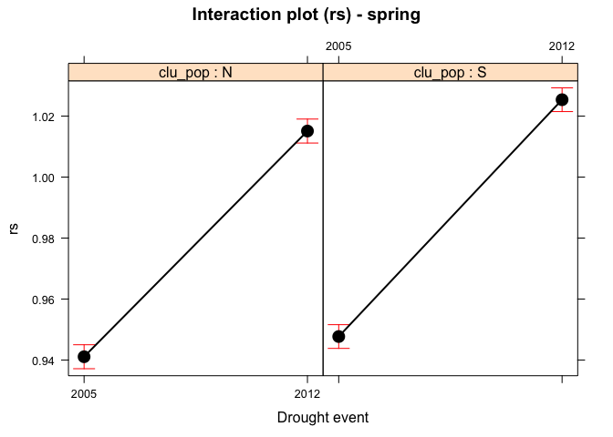
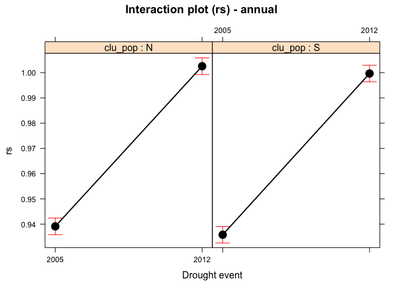
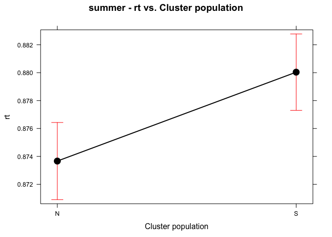
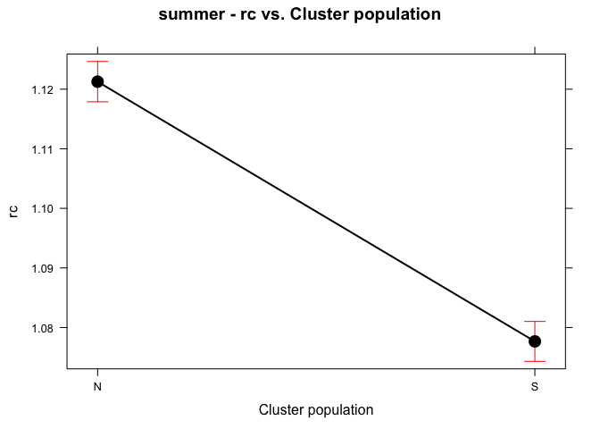
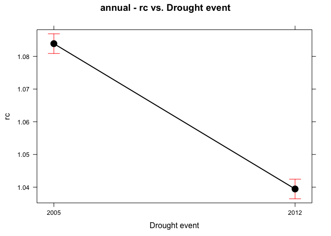
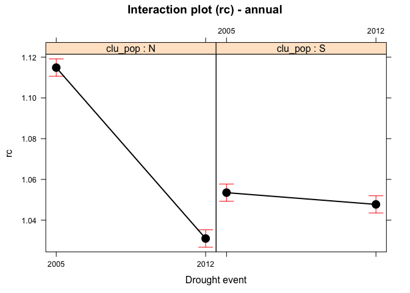
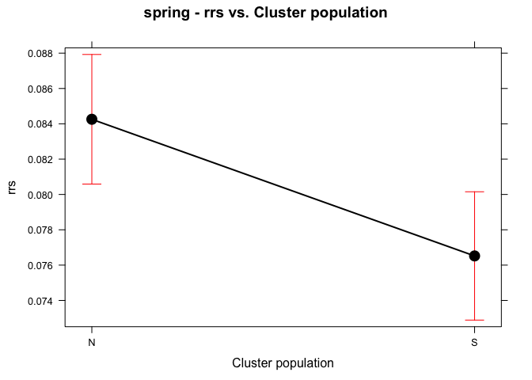
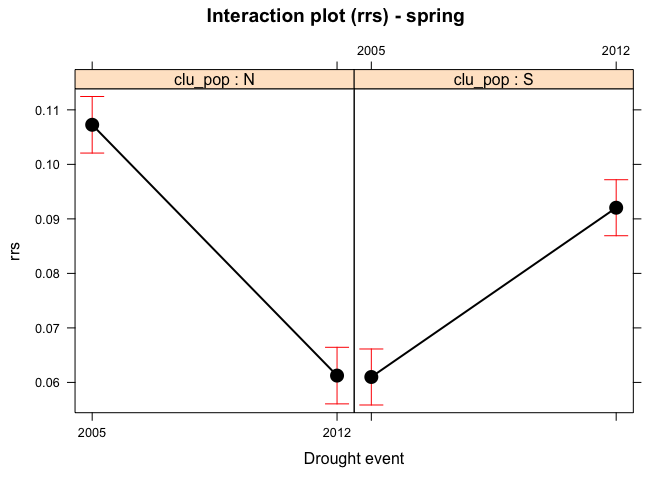
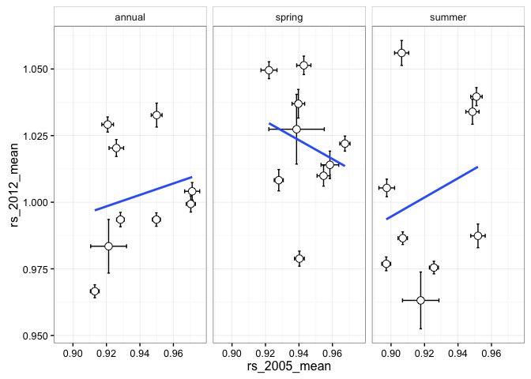

-   [Resilience](#resilience)
    -   [Mean values (Cluster population)](#mean-values-cluster-population)
    -   [Summer](#summer)
        -   [Summary ANOVA model](#summary-anova-model)
        -   [Effects plot](#effects-plot)
        -   [Post-hoc comparison](#post-hoc-comparison)
    -   [Spring](#spring)
        -   [Summary ANOVA model](#summary-anova-model-1)
        -   [Effects plot](#effects-plot-1)
        -   [Post-hoc comparison](#post-hoc-comparison-1)
    -   [Annual](#annual)
        -   [Summary ANOVA model](#summary-anova-model-2)
        -   [Effects plot](#effects-plot-2)
        -   [Post-hoc comparison](#post-hoc-comparison-2)
-   [Resistance](#resistance)
    -   [Mean values (Cluster population)](#mean-values-cluster-population-1)
    -   [Summer](#summer-1)
        -   [Summary ANOVA model](#summary-anova-model-3)
        -   [Effects plot](#effects-plot-3)
        -   [Post-hoc comparison](#post-hoc-comparison-3)
    -   [Spring](#spring-1)
        -   [Summary ANOVA model](#summary-anova-model-4)
        -   [Effects plot](#effects-plot-4)
        -   [Post-hoc comparison](#post-hoc-comparison-4)
    -   [Annual](#annual-1)
        -   [Summary ANOVA model](#summary-anova-model-5)
        -   [Effects plot](#effects-plot-5)
        -   [Post-hoc comparison](#post-hoc-comparison-5)
-   [Recovery](#recovery)
    -   [Mean values (Cluster population)](#mean-values-cluster-population-2)
    -   [Summer](#summer-2)
        -   [Summary ANOVA model](#summary-anova-model-6)
        -   [Effects plot](#effects-plot-6)
        -   [Post-hoc comparison](#post-hoc-comparison-6)
    -   [Spring](#spring-2)
        -   [Summary ANOVA model](#summary-anova-model-7)
        -   [Effects plot](#effects-plot-7)
        -   [Post-hoc comparison](#post-hoc-comparison-7)
    -   [Annual](#annual-2)
        -   [Summary ANOVA model](#summary-anova-model-8)
        -   [Effects plot](#effects-plot-8)
        -   [Post-hoc comparison](#post-hoc-comparison-8)
-   [Otros plots](#otros-plots)
    -   [Resilience](#resilience-1)
    -   [Resistance](#resistance-1)
    -   [Recovery](#recovery-1)
-   [Correlation](#correlation)

    ## Warning: package 'knitr' was built under R version 3.2.5

Resilience
==========

Mean values (Cluster population)
--------------------------------

<table style="width:99%;">
<caption>Mean values (rs)</caption>
<colgroup>
<col width="13%" />
<col width="13%" />
<col width="15%" />
<col width="16%" />
<col width="15%" />
<col width="11%" />
<col width="12%" />
</colgroup>
<thead>
<tr class="header">
<th align="center">clu_pop</th>
<th align="center">mean</th>
<th align="center">sd</th>
<th align="center">se</th>
<th align="center">variable</th>
<th align="center">event</th>
<th align="center">seasonF</th>
</tr>
</thead>
<tbody>
<tr class="odd">
<td align="center">N</td>
<td align="center">0.9391200</td>
<td align="center">0.05105309</td>
<td align="center">0.001703664</td>
<td align="center">rs</td>
<td align="center">2005</td>
<td align="center">annual</td>
</tr>
<tr class="even">
<td align="center">S</td>
<td align="center">0.9357996</td>
<td align="center">0.05235562</td>
<td align="center">0.001729879</td>
<td align="center">rs</td>
<td align="center">2005</td>
<td align="center">annual</td>
</tr>
<tr class="odd">
<td align="center">N</td>
<td align="center">1.0025355</td>
<td align="center">0.04849661</td>
<td align="center">0.001618353</td>
<td align="center">rs</td>
<td align="center">2012</td>
<td align="center">annual</td>
</tr>
<tr class="even">
<td align="center">S</td>
<td align="center">0.9996486</td>
<td align="center">0.04983377</td>
<td align="center">0.001646554</td>
<td align="center">rs</td>
<td align="center">2012</td>
<td align="center">annual</td>
</tr>
<tr class="odd">
<td align="center">N</td>
<td align="center">0.9410772</td>
<td align="center">0.05756861</td>
<td align="center">0.001921089</td>
<td align="center">rs</td>
<td align="center">2005</td>
<td align="center">spring</td>
</tr>
<tr class="even">
<td align="center">S</td>
<td align="center">0.9477028</td>
<td align="center">0.06257670</td>
<td align="center">0.002067593</td>
<td align="center">rs</td>
<td align="center">2005</td>
<td align="center">spring</td>
</tr>
<tr class="odd">
<td align="center">N</td>
<td align="center">1.0151042</td>
<td align="center">0.05766974</td>
<td align="center">0.001924464</td>
<td align="center">rs</td>
<td align="center">2012</td>
<td align="center">spring</td>
</tr>
<tr class="even">
<td align="center">S</td>
<td align="center">1.0253790</td>
<td align="center">0.06215434</td>
<td align="center">0.002053637</td>
<td align="center">rs</td>
<td align="center">2012</td>
<td align="center">spring</td>
</tr>
<tr class="odd">
<td align="center">N</td>
<td align="center">0.9271526</td>
<td align="center">0.05488102</td>
<td align="center">0.001831403</td>
<td align="center">rs</td>
<td align="center">2005</td>
<td align="center">summer</td>
</tr>
<tr class="even">
<td align="center">S</td>
<td align="center">0.9094511</td>
<td align="center">0.05774945</td>
<td align="center">0.001908096</td>
<td align="center">rs</td>
<td align="center">2005</td>
<td align="center">summer</td>
</tr>
<tr class="odd">
<td align="center">N</td>
<td align="center">1.0196845</td>
<td align="center">0.06014536</td>
<td align="center">0.002007077</td>
<td align="center">rs</td>
<td align="center">2012</td>
<td align="center">summer</td>
</tr>
<tr class="even">
<td align="center">S</td>
<td align="center">0.9826980</td>
<td align="center">0.04923157</td>
<td align="center">0.001626657</td>
<td align="center">rs</td>
<td align="center">2012</td>
<td align="center">summer</td>
</tr>
</tbody>
</table>

Summer
------

### Summary ANOVA model

<table style="width:79%;">
<caption>ANOVA table: rs summer</caption>
<colgroup>
<col width="19%" />
<col width="6%" />
<col width="11%" />
<col width="12%" />
<col width="16%" />
<col width="12%" />
</colgroup>
<thead>
<tr class="header">
<th align="center">term</th>
<th align="center">df</th>
<th align="center">sumsq</th>
<th align="center">meansq</th>
<th align="center">statistic</th>
<th align="center">p.value</th>
</tr>
</thead>
<tbody>
<tr class="odd">
<td align="center">event</td>
<td align="center">1</td>
<td align="center">6.217</td>
<td align="center">6.217</td>
<td align="center">2009</td>
<td align="center"><strong>0</strong></td>
</tr>
<tr class="even">
<td align="center">clu_pop</td>
<td align="center">1</td>
<td align="center">0.6781</td>
<td align="center">0.6781</td>
<td align="center">219.1</td>
<td align="center"><strong>0</strong></td>
</tr>
<tr class="odd">
<td align="center">event:clu_pop</td>
<td align="center">1</td>
<td align="center">0.08432</td>
<td align="center">0.08432</td>
<td align="center">27.25</td>
<td align="center"><strong>0</strong></td>
</tr>
<tr class="even">
<td align="center">Residuals</td>
<td align="center">3624</td>
<td align="center">11.22</td>
<td align="center">0.00309</td>
<td align="center"></td>
<td align="center"></td>
</tr>
</tbody>
</table>

<table style="width:49%;">
<colgroup>
<col width="33%" />
<col width="15%" />
</colgroup>
<thead>
<tr class="header">
<th align="center"> </th>
<th align="center">Statistic</th>
</tr>
</thead>
<tbody>
<tr class="odd">
<td align="center"><strong><em>R</em>2</strong></td>
<td align="center">0.38</td>
</tr>
<tr class="even">
<td align="center"><strong><em>a</em><em>d</em><em>j</em><em>R</em>2</strong></td>
<td align="center">0.38</td>
</tr>
<tr class="odd">
<td align="center"><strong><em>σ</em><em>e</em></strong></td>
<td align="center">0.06</td>
</tr>
<tr class="even">
<td align="center"><strong><em>F</em></strong></td>
<td align="center">751.75</td>
</tr>
<tr class="odd">
<td align="center"><strong><em>p</em></strong></td>
<td align="center">0.00</td>
</tr>
<tr class="even">
<td align="center"><strong><em>d</em><em>f</em><em>m</em></strong></td>
<td align="center">4.00</td>
</tr>
<tr class="odd">
<td align="center"><strong><em>l</em><em>o</em><em>g</em><em>L</em><em>i</em><em>k</em></strong></td>
<td align="center">5335.40</td>
</tr>
<tr class="even">
<td align="center"><strong><em>A</em><em>I</em><em>C</em></strong></td>
<td align="center">-10660.80</td>
</tr>
<tr class="odd">
<td align="center"><strong><em>B</em><em>I</em><em>C</em></strong></td>
<td align="center">-10629.82</td>
</tr>
<tr class="even">
<td align="center"><strong><em>d</em><em>e</em><em>v</em></strong></td>
<td align="center">11.22</td>
</tr>
<tr class="odd">
<td align="center"><strong><em>d</em><em>f</em><em>e</em></strong></td>
<td align="center">3624.00</td>
</tr>
</tbody>
</table>

### Effects plot

#### . ~ Cluster population

#### . ~ Disturbance Event

##### . ~ Cluster population:Elevation

### Post-hoc comparison

    ## 
    ## ### Event ###
    ## $lsmeans
    ##  event    lsmean          SE   df  lower.CL  upper.CL
    ##  2005  0.9183018 0.001306243 3624 0.9157408 0.9208629
    ##  2012  1.0011913 0.001306243 3624 0.9986302 1.0037523
    ## 
    ## Results are averaged over the levels of: clu_pop 
    ## Confidence level used: 0.95 
    ## 
    ## $contrasts
    ##  contrast       estimate          SE   df t.ratio p.value
    ##  2005 - 2012 -0.08288943 0.001847307 3624  -44.87  <.0001
    ## 
    ## Results are averaged over the levels of: clu_pop 
    ## 
    ##  event    lsmean          SE   df  lower.CL  upper.CL .group
    ##  2005  0.9183018 0.001306243 3624 0.9153792 0.9212244  a    
    ##  2012  1.0011913 0.001306243 3624 0.9982687 1.0041139   b   
    ## 
    ## Results are averaged over the levels of: clu_pop 
    ## Confidence level used: 0.95 
    ## Conf-level adjustment: sidak method for 2 estimates 
    ## significance level used: alpha = 0.01 
    ## 
    ## ### Clu pop ###
    ## $lsmeans
    ##  clu_pop    lsmean          SE   df  lower.CL  upper.CL
    ##  N       0.9734185 0.001312708 3624 0.9708448 0.9759923
    ##  S       0.9460745 0.001299746 3624 0.9435262 0.9486228
    ## 
    ## Results are averaged over the levels of: event 
    ## Confidence level used: 0.95 
    ## 
    ## $contrasts
    ##  contrast   estimate          SE   df t.ratio p.value
    ##  N - S    0.02734401 0.001847307 3624  14.802  <.0001
    ## 
    ## Results are averaged over the levels of: event 
    ## 
    ##  clu_pop    lsmean          SE   df  lower.CL  upper.CL .group
    ##  S       0.9460745 0.001299746 3624 0.9431665 0.9489826  a    
    ##  N       0.9734185 0.001312708 3624 0.9704815 0.9763556   b   
    ## 
    ## Results are averaged over the levels of: event 
    ## Confidence level used: 0.95 
    ## Conf-level adjustment: sidak method for 2 estimates 
    ## significance level used: alpha = 0.01 
    ## 
    ## ### Event:Clu pop ###
    ## $lsmeans
    ##  event clu_pop    lsmean          SE   df  lower.CL  upper.CL
    ##  2005  N       0.9271526 0.001856450 3624 0.9235128 0.9307923
    ##  2012  N       1.0196845 0.001856450 3624 1.0160447 1.0233243
    ##  2005  S       0.9094511 0.001838119 3624 0.9058472 0.9130549
    ##  2012  S       0.9826980 0.001838119 3624 0.9790941 0.9863018
    ## 
    ## Confidence level used: 0.95 
    ## 
    ## $contrasts
    ##  contrast           estimate          SE   df t.ratio p.value
    ##  2005,N - 2012,N -0.09253197 0.002625416 3624 -35.245  <.0001
    ##  2005,N - 2005,S  0.01770146 0.002612487 3624   6.776  <.0001
    ##  2005,N - 2012,S -0.05554543 0.002612487 3624 -21.262  <.0001
    ##  2012,N - 2005,S  0.11023344 0.002612487 3624  42.195  <.0001
    ##  2012,N - 2012,S  0.03698655 0.002612487 3624  14.158  <.0001
    ##  2005,S - 2012,S -0.07324689 0.002599493 3624 -28.177  <.0001
    ## 
    ## P value adjustment: tukey method for comparing a family of 4 estimates

Spring
------

### Summary ANOVA model

<table style="width:79%;">
<caption>ANOVA table: rs spring</caption>
<colgroup>
<col width="19%" />
<col width="6%" />
<col width="11%" />
<col width="12%" />
<col width="16%" />
<col width="12%" />
</colgroup>
<thead>
<tr class="header">
<th align="center">term</th>
<th align="center">df</th>
<th align="center">sumsq</th>
<th align="center">meansq</th>
<th align="center">statistic</th>
<th align="center">p.value</th>
</tr>
</thead>
<tbody>
<tr class="odd">
<td align="center">event</td>
<td align="center">1</td>
<td align="center">5.221</td>
<td align="center">5.221</td>
<td align="center">1447</td>
<td align="center"><strong>0</strong></td>
</tr>
<tr class="even">
<td align="center">clu_pop</td>
<td align="center">1</td>
<td align="center">0.06476</td>
<td align="center">0.06476</td>
<td align="center">17.95</td>
<td align="center"><strong>2e-05</strong></td>
</tr>
<tr class="odd">
<td align="center">event:clu_pop</td>
<td align="center">1</td>
<td align="center">0.00302</td>
<td align="center">0.00302</td>
<td align="center">0.8369</td>
<td align="center">0.3603</td>
</tr>
<tr class="even">
<td align="center">Residuals</td>
<td align="center">3624</td>
<td align="center">13.07</td>
<td align="center">0.00361</td>
<td align="center"></td>
<td align="center"></td>
</tr>
</tbody>
</table>

<table style="width:49%;">
<colgroup>
<col width="33%" />
<col width="15%" />
</colgroup>
<thead>
<tr class="header">
<th align="center"> </th>
<th align="center">Statistic</th>
</tr>
</thead>
<tbody>
<tr class="odd">
<td align="center"><strong><em>R</em>2</strong></td>
<td align="center">0.29</td>
</tr>
<tr class="even">
<td align="center"><strong><em>a</em><em>d</em><em>j</em><em>R</em>2</strong></td>
<td align="center">0.29</td>
</tr>
<tr class="odd">
<td align="center"><strong><em>σ</em><em>e</em></strong></td>
<td align="center">0.06</td>
</tr>
<tr class="even">
<td align="center"><strong><em>F</em></strong></td>
<td align="center">488.66</td>
</tr>
<tr class="odd">
<td align="center"><strong><em>p</em></strong></td>
<td align="center">0.00</td>
</tr>
<tr class="even">
<td align="center"><strong><em>d</em><em>f</em><em>m</em></strong></td>
<td align="center">4.00</td>
</tr>
<tr class="odd">
<td align="center"><strong><em>l</em><em>o</em><em>g</em><em>L</em><em>i</em><em>k</em></strong></td>
<td align="center">5057.34</td>
</tr>
<tr class="even">
<td align="center"><strong><em>A</em><em>I</em><em>C</em></strong></td>
<td align="center">-10104.68</td>
</tr>
<tr class="odd">
<td align="center"><strong><em>B</em><em>I</em><em>C</em></strong></td>
<td align="center">-10073.69</td>
</tr>
<tr class="even">
<td align="center"><strong><em>d</em><em>e</em><em>v</em></strong></td>
<td align="center">13.07</td>
</tr>
<tr class="odd">
<td align="center"><strong><em>d</em><em>f</em><em>e</em></strong></td>
<td align="center">3624.00</td>
</tr>
</tbody>
</table>

### Effects plot

#### . ~ Cluster population

#### . ~ Disturbance Event

#### . ~ Cluster population:Elevation

### Post-hoc comparison

    ## 
    ## ### Event ###
    ## $lsmeans
    ##  event   lsmean          SE   df  lower.CL upper.CL
    ##  2005  0.944390 0.001410295 3624 0.9416249 0.947155
    ##  2012  1.020242 0.001410295 3624 1.0174765 1.023007
    ## 
    ## Results are averaged over the levels of: clu_pop 
    ## Confidence level used: 0.95 
    ## 
    ## $contrasts
    ##  contrast       estimate          SE   df t.ratio p.value
    ##  2005 - 2012 -0.07585161 0.001994458 3624 -38.031  <.0001
    ## 
    ## Results are averaged over the levels of: clu_pop 
    ## 
    ##  event   lsmean          SE   df  lower.CL  upper.CL .group
    ##  2005  0.944390 0.001410295 3624 0.9412346 0.9475454  a    
    ##  2012  1.020242 0.001410295 3624 1.0170862 1.0233970   b   
    ## 
    ## Results are averaged over the levels of: clu_pop 
    ## Confidence level used: 0.95 
    ## Conf-level adjustment: sidak method for 2 estimates 
    ## significance level used: alpha = 0.01 
    ## 
    ## ### Clu pop ###
    ## $lsmeans
    ##  clu_pop    lsmean          SE   df  lower.CL  upper.CL
    ##  N       0.9780907 0.001417275 3624 0.9753119 0.9808694
    ##  S       0.9865409 0.001403280 3624 0.9837896 0.9892922
    ## 
    ## Results are averaged over the levels of: event 
    ## Confidence level used: 0.95 
    ## 
    ## $contrasts
    ##  contrast     estimate          SE   df t.ratio p.value
    ##  N - S    -0.008450257 0.001994458 3624  -4.237  <.0001
    ## 
    ## Results are averaged over the levels of: event 
    ## 
    ##  clu_pop    lsmean          SE   df  lower.CL  upper.CL .group
    ##  N       0.9780907 0.001417275 3624 0.9749196 0.9812617  a    
    ##  S       0.9865409 0.001403280 3624 0.9834012 0.9896806   b   
    ## 
    ## Results are averaged over the levels of: event 
    ## Confidence level used: 0.95 
    ## Conf-level adjustment: sidak method for 2 estimates 
    ## significance level used: alpha = 0.01 
    ## 
    ## ### Event:Clu pop ###
    ## $lsmeans
    ##  event clu_pop    lsmean          SE   df  lower.CL  upper.CL
    ##  2005  N       0.9410772 0.002004329 3624 0.9371474 0.9450069
    ##  2012  N       1.0151042 0.002004329 3624 1.0111744 1.0190339
    ##  2005  S       0.9477028 0.001984538 3624 0.9438119 0.9515937
    ##  2012  S       1.0253790 0.001984538 3624 1.0214881 1.0292700
    ## 
    ## Confidence level used: 0.95 
    ## 
    ## $contrasts
    ##  contrast            estimate          SE   df t.ratio p.value
    ##  2005,N - 2012,N -0.074026985 0.002834549 3624 -26.116  <.0001
    ##  2005,N - 2005,S -0.006625633 0.002820590 3624  -2.349  0.0874
    ##  2005,N - 2012,S -0.084301867 0.002820590 3624 -29.888  <.0001
    ##  2012,N - 2005,S  0.067401352 0.002820590 3624  23.896  <.0001
    ##  2012,N - 2012,S -0.010274882 0.002820590 3624  -3.643  0.0016
    ##  2005,S - 2012,S -0.077676234 0.002806561 3624 -27.677  <.0001
    ## 
    ## P value adjustment: tukey method for comparing a family of 4 estimates

Annual
------

### Summary ANOVA model

<table style="width:83%;">
<caption>ANOVA table: rs annual</caption>
<colgroup>
<col width="19%" />
<col width="6%" />
<col width="11%" />
<col width="12%" />
<col width="16%" />
<col width="16%" />
</colgroup>
<thead>
<tr class="header">
<th align="center">term</th>
<th align="center">df</th>
<th align="center">sumsq</th>
<th align="center">meansq</th>
<th align="center">statistic</th>
<th align="center">p.value</th>
</tr>
</thead>
<tbody>
<tr class="odd">
<td align="center">event</td>
<td align="center">1</td>
<td align="center">3.673</td>
<td align="center">3.673</td>
<td align="center">1442</td>
<td align="center"><strong>0</strong></td>
</tr>
<tr class="even">
<td align="center">clu_pop</td>
<td align="center">1</td>
<td align="center">0.00874</td>
<td align="center">0.00874</td>
<td align="center">3.431</td>
<td align="center"><strong>0.06407</strong></td>
</tr>
<tr class="odd">
<td align="center">event:clu_pop</td>
<td align="center">1</td>
<td align="center">4e-05</td>
<td align="center">4e-05</td>
<td align="center">0.01673</td>
<td align="center">0.8971</td>
</tr>
<tr class="even">
<td align="center">Residuals</td>
<td align="center">3624</td>
<td align="center">9.228</td>
<td align="center">0.00255</td>
<td align="center"></td>
<td align="center"></td>
</tr>
</tbody>
</table>

<table style="width:49%;">
<colgroup>
<col width="33%" />
<col width="15%" />
</colgroup>
<thead>
<tr class="header">
<th align="center"> </th>
<th align="center">Statistic</th>
</tr>
</thead>
<tbody>
<tr class="odd">
<td align="center"><strong><em>R</em>2</strong></td>
<td align="center">0.29</td>
</tr>
<tr class="even">
<td align="center"><strong><em>a</em><em>d</em><em>j</em><em>R</em>2</strong></td>
<td align="center">0.28</td>
</tr>
<tr class="odd">
<td align="center"><strong><em>σ</em><em>e</em></strong></td>
<td align="center">0.05</td>
</tr>
<tr class="even">
<td align="center"><strong><em>F</em></strong></td>
<td align="center">481.93</td>
</tr>
<tr class="odd">
<td align="center"><strong><em>p</em></strong></td>
<td align="center">0.00</td>
</tr>
<tr class="even">
<td align="center"><strong><em>d</em><em>f</em><em>m</em></strong></td>
<td align="center">4.00</td>
</tr>
<tr class="odd">
<td align="center"><strong><em>l</em><em>o</em><em>g</em><em>L</em><em>i</em><em>k</em></strong></td>
<td align="center">5689.27</td>
</tr>
<tr class="even">
<td align="center"><strong><em>A</em><em>I</em><em>C</em></strong></td>
<td align="center">-11368.53</td>
</tr>
<tr class="odd">
<td align="center"><strong><em>B</em><em>I</em><em>C</em></strong></td>
<td align="center">-11337.55</td>
</tr>
<tr class="even">
<td align="center"><strong><em>d</em><em>e</em><em>v</em></strong></td>
<td align="center">9.23</td>
</tr>
<tr class="odd">
<td align="center"><strong><em>d</em><em>f</em><em>e</em></strong></td>
<td align="center">3624.00</td>
</tr>
</tbody>
</table>

### Effects plot

#### . ~ Cluster population

#### . ~ Disturbance Event

#### . ~ Cluster population:Elevation

### Post-hoc comparison

    ## 
    ## ### Event ###
    ## $lsmeans
    ##  event    lsmean          SE   df  lower.CL  upper.CL
    ##  2005  0.9374598 0.001184851 3624 0.9351367 0.9397828
    ##  2012  1.0010920 0.001184851 3624 0.9987690 1.0034151
    ## 
    ## Results are averaged over the levels of: clu_pop 
    ## Confidence level used: 0.95 
    ## 
    ## $contrasts
    ##  contrast       estimate          SE   df t.ratio p.value
    ##  2005 - 2012 -0.06363224 0.001675633 3624 -37.975  <.0001
    ## 
    ## Results are averaged over the levels of: clu_pop 
    ## 
    ##  event    lsmean          SE   df  lower.CL  upper.CL .group
    ##  2005  0.9374598 0.001184851 3624 0.9348088 0.9401108  a    
    ##  2012  1.0010920 0.001184851 3624 0.9984410 1.0037430   b   
    ## 
    ## Results are averaged over the levels of: clu_pop 
    ## Confidence level used: 0.95 
    ## Conf-level adjustment: sidak method for 2 estimates 
    ## significance level used: alpha = 0.01 
    ## 
    ## ### Clu pop ###
    ## $lsmeans
    ##  clu_pop    lsmean          SE   df  lower.CL  upper.CL
    ##  N       0.9708277 0.001190715 3624 0.9684932 0.9731623
    ##  S       0.9677241 0.001178958 3624 0.9654126 0.9700355
    ## 
    ## Results are averaged over the levels of: event 
    ## Confidence level used: 0.95 
    ## 
    ## $contrasts
    ##  contrast    estimate          SE   df t.ratio p.value
    ##  N - S    0.003103691 0.001675633 3624   1.852  0.0641
    ## 
    ## Results are averaged over the levels of: event 
    ## 
    ##  clu_pop    lsmean          SE   df  lower.CL  upper.CL .group
    ##  S       0.9677241 0.001178958 3624 0.9650862 0.9703619  a    
    ##  N       0.9708277 0.001190715 3624 0.9681636 0.9734919  a    
    ## 
    ## Results are averaged over the levels of: event 
    ## Confidence level used: 0.95 
    ## Conf-level adjustment: sidak method for 2 estimates 
    ## significance level used: alpha = 0.01 
    ## 
    ## ### Event:Clu pop ###
    ## $lsmeans
    ##  event clu_pop    lsmean          SE   df  lower.CL  upper.CL
    ##  2005  N       0.9391200 0.001683926 3624 0.9358185 0.9424215
    ##  2012  N       1.0025355 0.001683926 3624 0.9992339 1.0058370
    ##  2005  S       0.9357996 0.001667299 3624 0.9325306 0.9390685
    ##  2012  S       0.9996486 0.001667299 3624 0.9963796 1.0029175
    ## 
    ## Confidence level used: 0.95 
    ## 
    ## $contrasts
    ##  contrast            estimate          SE   df t.ratio p.value
    ##  2005,N - 2012,N -0.063415479 0.002381431 3624 -26.629  <.0001
    ##  2005,N - 2005,S  0.003320455 0.002369703 3624   1.401  0.4986
    ##  2005,N - 2012,S -0.060528552 0.002369703 3624 -25.543  <.0001
    ##  2012,N - 2005,S  0.066735934 0.002369703 3624  28.162  <.0001
    ##  2012,N - 2012,S  0.002886927 0.002369703 3624   1.218  0.6152
    ##  2005,S - 2012,S -0.063849007 0.002357917 3624 -27.079  <.0001
    ## 
    ## P value adjustment: tukey method for comparing a family of 4 estimates

Resistance
==========

Mean values (Cluster population)
--------------------------------

<table style="width:99%;">
<caption>Mean values (rt)</caption>
<colgroup>
<col width="13%" />
<col width="13%" />
<col width="15%" />
<col width="16%" />
<col width="15%" />
<col width="11%" />
<col width="12%" />
</colgroup>
<thead>
<tr class="header">
<th align="center">clu_pop</th>
<th align="center">mean</th>
<th align="center">sd</th>
<th align="center">se</th>
<th align="center">variable</th>
<th align="center">event</th>
<th align="center">seasonF</th>
</tr>
</thead>
<tbody>
<tr class="odd">
<td align="center">N</td>
<td align="center">0.8451467</td>
<td align="center">0.06040945</td>
<td align="center">0.002015890</td>
<td align="center">rt</td>
<td align="center">2005</td>
<td align="center">annual</td>
</tr>
<tr class="even">
<td align="center">S</td>
<td align="center">0.8922909</td>
<td align="center">0.07181880</td>
<td align="center">0.002372960</td>
<td align="center">rt</td>
<td align="center">2005</td>
<td align="center">annual</td>
</tr>
<tr class="odd">
<td align="center">N</td>
<td align="center">0.9743921</td>
<td align="center">0.05969130</td>
<td align="center">0.001991924</td>
<td align="center">rt</td>
<td align="center">2012</td>
<td align="center">annual</td>
</tr>
<tr class="even">
<td align="center">S</td>
<td align="center">0.9557776</td>
<td align="center">0.06070864</td>
<td align="center">0.002005870</td>
<td align="center">rt</td>
<td align="center">2012</td>
<td align="center">annual</td>
</tr>
<tr class="odd">
<td align="center">N</td>
<td align="center">0.8338153</td>
<td align="center">0.09068215</td>
<td align="center">0.003026102</td>
<td align="center">rt</td>
<td align="center">2005</td>
<td align="center">spring</td>
</tr>
<tr class="even">
<td align="center">S</td>
<td align="center">0.8867083</td>
<td align="center">0.09701567</td>
<td align="center">0.003205488</td>
<td align="center">rt</td>
<td align="center">2005</td>
<td align="center">spring</td>
</tr>
<tr class="odd">
<td align="center">N</td>
<td align="center">0.9538520</td>
<td align="center">0.08139125</td>
<td align="center">0.002716061</td>
<td align="center">rt</td>
<td align="center">2012</td>
<td align="center">spring</td>
</tr>
<tr class="even">
<td align="center">S</td>
<td align="center">0.9333331</td>
<td align="center">0.07899139</td>
<td align="center">0.002609949</td>
<td align="center">rt</td>
<td align="center">2012</td>
<td align="center">spring</td>
</tr>
<tr class="odd">
<td align="center">N</td>
<td align="center">0.7977105</td>
<td align="center">0.05960856</td>
<td align="center">0.001989163</td>
<td align="center">rt</td>
<td align="center">2005</td>
<td align="center">summer</td>
</tr>
<tr class="even">
<td align="center">S</td>
<td align="center">0.8595639</td>
<td align="center">0.06107296</td>
<td align="center">0.002017907</td>
<td align="center">rt</td>
<td align="center">2005</td>
<td align="center">summer</td>
</tr>
<tr class="odd">
<td align="center">N</td>
<td align="center">0.9496213</td>
<td align="center">0.06035540</td>
<td align="center">0.002014086</td>
<td align="center">rt</td>
<td align="center">2012</td>
<td align="center">summer</td>
</tr>
<tr class="even">
<td align="center">S</td>
<td align="center">0.9005109</td>
<td align="center">0.05784069</td>
<td align="center">0.001911110</td>
<td align="center">rt</td>
<td align="center">2012</td>
<td align="center">summer</td>
</tr>
</tbody>
</table>

Summer
------

### Summary ANOVA model

<table style="width:83%;">
<caption>ANOVA table: rt summer</caption>
<colgroup>
<col width="19%" />
<col width="6%" />
<col width="11%" />
<col width="12%" />
<col width="16%" />
<col width="16%" />
</colgroup>
<thead>
<tr class="header">
<th align="center">term</th>
<th align="center">df</th>
<th align="center">sumsq</th>
<th align="center">meansq</th>
<th align="center">statistic</th>
<th align="center">p.value</th>
</tr>
</thead>
<tbody>
<tr class="odd">
<td align="center">event</td>
<td align="center">1</td>
<td align="center">8.338</td>
<td align="center">8.338</td>
<td align="center">2337</td>
<td align="center"><strong>0</strong></td>
</tr>
<tr class="even">
<td align="center">clu_pop</td>
<td align="center">1</td>
<td align="center">0.03682</td>
<td align="center">0.03682</td>
<td align="center">10.32</td>
<td align="center"><strong>0.00133</strong></td>
</tr>
<tr class="odd">
<td align="center">event:clu_pop</td>
<td align="center">1</td>
<td align="center">2.792</td>
<td align="center">2.792</td>
<td align="center">782.5</td>
<td align="center"><strong>0</strong></td>
</tr>
<tr class="even">
<td align="center">Residuals</td>
<td align="center">3624</td>
<td align="center">12.93</td>
<td align="center">0.00357</td>
<td align="center"></td>
<td align="center"></td>
</tr>
</tbody>
</table>

<table style="width:49%;">
<colgroup>
<col width="33%" />
<col width="15%" />
</colgroup>
<thead>
<tr class="header">
<th align="center"> </th>
<th align="center">Statistic</th>
</tr>
</thead>
<tbody>
<tr class="odd">
<td align="center"><strong><em>R</em>2</strong></td>
<td align="center">0.46</td>
</tr>
<tr class="even">
<td align="center"><strong><em>a</em><em>d</em><em>j</em><em>R</em>2</strong></td>
<td align="center">0.46</td>
</tr>
<tr class="odd">
<td align="center"><strong><em>σ</em><em>e</em></strong></td>
<td align="center">0.06</td>
</tr>
<tr class="even">
<td align="center"><strong><em>F</em></strong></td>
<td align="center">1043.32</td>
</tr>
<tr class="odd">
<td align="center"><strong><em>p</em></strong></td>
<td align="center">0.00</td>
</tr>
<tr class="even">
<td align="center"><strong><em>d</em><em>f</em><em>m</em></strong></td>
<td align="center">4.00</td>
</tr>
<tr class="odd">
<td align="center"><strong><em>l</em><em>o</em><em>g</em><em>L</em><em>i</em><em>k</em></strong></td>
<td align="center">5077.57</td>
</tr>
<tr class="even">
<td align="center"><strong><em>A</em><em>I</em><em>C</em></strong></td>
<td align="center">-10145.14</td>
</tr>
<tr class="odd">
<td align="center"><strong><em>B</em><em>I</em><em>C</em></strong></td>
<td align="center">-10114.16</td>
</tr>
<tr class="even">
<td align="center"><strong><em>d</em><em>e</em><em>v</em></strong></td>
<td align="center">12.93</td>
</tr>
<tr class="odd">
<td align="center"><strong><em>d</em><em>f</em><em>e</em></strong></td>
<td align="center">3624.00</td>
</tr>
</tbody>
</table>

### Effects plot

#### . ~ Cluster population

#### . ~ Disturbance Event

##### . ~ Cluster population:Elevation

### Post-hoc comparison

    ## 
    ## ### Event ###
    ## $lsmeans
    ##  event    lsmean          SE   df  lower.CL  upper.CL
    ##  2005  0.8286372 0.001402452 3624 0.8258875 0.8313869
    ##  2012  0.9250661 0.001402452 3624 0.9223164 0.9278158
    ## 
    ## Results are averaged over the levels of: clu_pop 
    ## Confidence level used: 0.95 
    ## 
    ## $contrasts
    ##  contrast       estimate          SE   df t.ratio p.value
    ##  2005 - 2012 -0.09642889 0.001983366 3624 -48.619  <.0001
    ## 
    ## Results are averaged over the levels of: clu_pop 
    ## 
    ##  event    lsmean          SE   df  lower.CL  upper.CL .group
    ##  2005  0.8286372 0.001402452 3624 0.8254994 0.8317751  a    
    ##  2012  0.9250661 0.001402452 3624 0.9219283 0.9282040   b   
    ## 
    ## Results are averaged over the levels of: clu_pop 
    ## Confidence level used: 0.95 
    ## Conf-level adjustment: sidak method for 2 estimates 
    ## significance level used: alpha = 0.01 
    ## 
    ## ### Clu pop ###
    ## $lsmeans
    ##  clu_pop    lsmean          SE   df  lower.CL  upper.CL
    ##  N       0.8736659 0.001409393 3624 0.8709026 0.8764292
    ##  S       0.8800374 0.001395476 3624 0.8773014 0.8827734
    ## 
    ## Results are averaged over the levels of: event 
    ## Confidence level used: 0.95 
    ## 
    ## $contrasts
    ##  contrast     estimate          SE   df t.ratio p.value
    ##  N - S    -0.006371492 0.001983366 3624  -3.212  0.0013
    ## 
    ## Results are averaged over the levels of: event 
    ## 
    ##  clu_pop    lsmean          SE   df  lower.CL  upper.CL .group
    ##  N       0.8736659 0.001409393 3624 0.8705125 0.8768193  a    
    ##  S       0.8800374 0.001395476 3624 0.8769152 0.8831597   b   
    ## 
    ## Results are averaged over the levels of: event 
    ## Confidence level used: 0.95 
    ## Conf-level adjustment: sidak method for 2 estimates 
    ## significance level used: alpha = 0.01 
    ## 
    ## ### Event:Clu pop ###
    ## $lsmeans
    ##  event clu_pop    lsmean          SE   df  lower.CL  upper.CL
    ##  2005  N       0.7977105 0.001993182 3624 0.7938026 0.8016184
    ##  2012  N       0.9496213 0.001993182 3624 0.9457135 0.9535292
    ##  2005  S       0.8595639 0.001973501 3624 0.8556947 0.8634332
    ##  2012  S       0.9005109 0.001973501 3624 0.8966416 0.9043802
    ## 
    ## Confidence level used: 0.95 
    ## 
    ## $contrasts
    ##  contrast           estimate          SE   df t.ratio p.value
    ##  2005,N - 2012,N -0.15191085 0.002818785 3624 -53.892  <.0001
    ##  2005,N - 2005,S -0.06185345 0.002804903 3624 -22.052  <.0001
    ##  2005,N - 2012,S -0.10280039 0.002804903 3624 -36.650  <.0001
    ##  2012,N - 2005,S  0.09005740 0.002804903 3624  32.107  <.0001
    ##  2012,N - 2012,S  0.04911047 0.002804903 3624  17.509  <.0001
    ##  2005,S - 2012,S -0.04094693 0.002790952 3624 -14.671  <.0001
    ## 
    ## P value adjustment: tukey method for comparing a family of 4 estimates

Spring
------

### Summary ANOVA model

<table style="width:79%;">
<caption>ANOVA table: rt spring</caption>
<colgroup>
<col width="19%" />
<col width="6%" />
<col width="11%" />
<col width="12%" />
<col width="16%" />
<col width="12%" />
</colgroup>
<thead>
<tr class="header">
<th align="center">term</th>
<th align="center">df</th>
<th align="center">sumsq</th>
<th align="center">meansq</th>
<th align="center">statistic</th>
<th align="center">p.value</th>
</tr>
</thead>
<tbody>
<tr class="odd">
<td align="center">event</td>
<td align="center">1</td>
<td align="center">6.243</td>
<td align="center">6.243</td>
<td align="center">818.6</td>
<td align="center"><strong>0</strong></td>
</tr>
<tr class="even">
<td align="center">clu_pop</td>
<td align="center">1</td>
<td align="center">0.2376</td>
<td align="center">0.2376</td>
<td align="center">31.16</td>
<td align="center"><strong>0</strong></td>
</tr>
<tr class="odd">
<td align="center">event:clu_pop</td>
<td align="center">1</td>
<td align="center">1.222</td>
<td align="center">1.222</td>
<td align="center">160.2</td>
<td align="center"><strong>0</strong></td>
</tr>
<tr class="even">
<td align="center">Residuals</td>
<td align="center">3624</td>
<td align="center">27.64</td>
<td align="center">0.00763</td>
<td align="center"></td>
<td align="center"></td>
</tr>
</tbody>
</table>

<table style="width:49%;">
<colgroup>
<col width="33%" />
<col width="15%" />
</colgroup>
<thead>
<tr class="header">
<th align="center"> </th>
<th align="center">Statistic</th>
</tr>
</thead>
<tbody>
<tr class="odd">
<td align="center"><strong><em>R</em>2</strong></td>
<td align="center">0.22</td>
</tr>
<tr class="even">
<td align="center"><strong><em>a</em><em>d</em><em>j</em><em>R</em>2</strong></td>
<td align="center">0.22</td>
</tr>
<tr class="odd">
<td align="center"><strong><em>σ</em><em>e</em></strong></td>
<td align="center">0.09</td>
</tr>
<tr class="even">
<td align="center"><strong><em>F</em></strong></td>
<td align="center">336.65</td>
</tr>
<tr class="odd">
<td align="center"><strong><em>p</em></strong></td>
<td align="center">0.00</td>
</tr>
<tr class="even">
<td align="center"><strong><em>d</em><em>f</em><em>m</em></strong></td>
<td align="center">4.00</td>
</tr>
<tr class="odd">
<td align="center"><strong><em>l</em><em>o</em><em>g</em><em>L</em><em>i</em><em>k</em></strong></td>
<td align="center">3699.30</td>
</tr>
<tr class="even">
<td align="center"><strong><em>A</em><em>I</em><em>C</em></strong></td>
<td align="center">-7388.60</td>
</tr>
<tr class="odd">
<td align="center"><strong><em>B</em><em>I</em><em>C</em></strong></td>
<td align="center">-7357.62</td>
</tr>
<tr class="even">
<td align="center"><strong><em>d</em><em>e</em><em>v</em></strong></td>
<td align="center">27.64</td>
</tr>
<tr class="odd">
<td align="center"><strong><em>d</em><em>f</em><em>e</em></strong></td>
<td align="center">3624.00</td>
</tr>
</tbody>
</table>

### Effects plot

#### . ~ Cluster population

#### . ~ Disturbance Event

#### . ~ Cluster population:Elevation

### Post-hoc comparison

    ## 
    ## ### Event ###
    ## $lsmeans
    ##  event    lsmean          SE   df  lower.CL  upper.CL
    ##  2005  0.8602618 0.002050575 3624 0.8562414 0.8642822
    ##  2012  0.9435925 0.002050575 3624 0.9395721 0.9476129
    ## 
    ## Results are averaged over the levels of: clu_pop 
    ## Confidence level used: 0.95 
    ## 
    ## $contrasts
    ##  contrast       estimate          SE   df t.ratio p.value
    ##  2005 - 2012 -0.08333074 0.002899951 3624 -28.735  <.0001
    ## 
    ## Results are averaged over the levels of: clu_pop 
    ## 
    ##  event    lsmean          SE   df  lower.CL  upper.CL .group
    ##  2005  0.8602618 0.002050575 3624 0.8556738 0.8648498  a    
    ##  2012  0.9435925 0.002050575 3624 0.9390046 0.9481805   b   
    ## 
    ## Results are averaged over the levels of: clu_pop 
    ## Confidence level used: 0.95 
    ## Conf-level adjustment: sidak method for 2 estimates 
    ## significance level used: alpha = 0.01 
    ## 
    ## ### Clu pop ###
    ## $lsmeans
    ##  clu_pop    lsmean          SE   df  lower.CL  upper.CL
    ##  N       0.8938337 0.002060724 3624 0.8897934 0.8978739
    ##  S       0.9100207 0.002040376 3624 0.9060203 0.9140211
    ## 
    ## Results are averaged over the levels of: event 
    ## Confidence level used: 0.95 
    ## 
    ## $contrasts
    ##  contrast    estimate          SE   df t.ratio p.value
    ##  N - S    -0.01618703 0.002899951 3624  -5.582  <.0001
    ## 
    ## Results are averaged over the levels of: event 
    ## 
    ##  clu_pop    lsmean          SE   df  lower.CL  upper.CL .group
    ##  N       0.8938337 0.002060724 3624 0.8892230 0.8984443  a    
    ##  S       0.9100207 0.002040376 3624 0.9054555 0.9145858   b   
    ## 
    ## Results are averaged over the levels of: event 
    ## Confidence level used: 0.95 
    ## Conf-level adjustment: sidak method for 2 estimates 
    ## significance level used: alpha = 0.01 
    ## 
    ## ### Event:Clu pop ###
    ## $lsmeans
    ##  event clu_pop    lsmean          SE   df  lower.CL  upper.CL
    ##  2005  N       0.8338153 0.002914304 3624 0.8281015 0.8395291
    ##  2012  N       0.9538520 0.002914304 3624 0.9481382 0.9595658
    ##  2005  S       0.8867083 0.002885528 3624 0.8810509 0.8923657
    ##  2012  S       0.9333331 0.002885528 3624 0.9276757 0.9389905
    ## 
    ## Confidence level used: 0.95 
    ## 
    ## $contrasts
    ##  contrast           estimate          SE   df t.ratio p.value
    ##  2005,N - 2012,N -0.12003670 0.004121448 3624 -29.125  <.0001
    ##  2005,N - 2005,S -0.05289298 0.004101151 3624 -12.897  <.0001
    ##  2005,N - 2012,S -0.09951777 0.004101151 3624 -24.266  <.0001
    ##  2012,N - 2005,S  0.06714371 0.004101151 3624  16.372  <.0001
    ##  2012,N - 2012,S  0.02051893 0.004101151 3624   5.003  <.0001
    ##  2005,S - 2012,S -0.04662478 0.004080752 3624 -11.426  <.0001
    ## 
    ## P value adjustment: tukey method for comparing a family of 4 estimates

Annual
------

### Summary ANOVA model

<table style="width:79%;">
<caption>ANOVA table: rt annual</caption>
<colgroup>
<col width="19%" />
<col width="6%" />
<col width="11%" />
<col width="12%" />
<col width="16%" />
<col width="12%" />
</colgroup>
<thead>
<tr class="header">
<th align="center">term</th>
<th align="center">df</th>
<th align="center">sumsq</th>
<th align="center">meansq</th>
<th align="center">statistic</th>
<th align="center">p.value</th>
</tr>
</thead>
<tbody>
<tr class="odd">
<td align="center">event</td>
<td align="center">1</td>
<td align="center">8.366</td>
<td align="center">8.366</td>
<td align="center">2082</td>
<td align="center"><strong>0</strong></td>
</tr>
<tr class="even">
<td align="center">clu_pop</td>
<td align="center">1</td>
<td align="center">0.1845</td>
<td align="center">0.1845</td>
<td align="center">45.93</td>
<td align="center"><strong>0</strong></td>
</tr>
<tr class="odd">
<td align="center">event:clu_pop</td>
<td align="center">1</td>
<td align="center">0.9804</td>
<td align="center">0.9804</td>
<td align="center">244</td>
<td align="center"><strong>0</strong></td>
</tr>
<tr class="even">
<td align="center">Residuals</td>
<td align="center">3624</td>
<td align="center">14.56</td>
<td align="center">0.00402</td>
<td align="center"></td>
<td align="center"></td>
</tr>
</tbody>
</table>

<table style="width:49%;">
<colgroup>
<col width="33%" />
<col width="15%" />
</colgroup>
<thead>
<tr class="header">
<th align="center"> </th>
<th align="center">Statistic</th>
</tr>
</thead>
<tbody>
<tr class="odd">
<td align="center"><strong><em>R</em>2</strong></td>
<td align="center">0.40</td>
</tr>
<tr class="even">
<td align="center"><strong><em>a</em><em>d</em><em>j</em><em>R</em>2</strong></td>
<td align="center">0.40</td>
</tr>
<tr class="odd">
<td align="center"><strong><em>σ</em><em>e</em></strong></td>
<td align="center">0.06</td>
</tr>
<tr class="even">
<td align="center"><strong><em>F</em></strong></td>
<td align="center">790.67</td>
</tr>
<tr class="odd">
<td align="center"><strong><em>p</em></strong></td>
<td align="center">0.00</td>
</tr>
<tr class="even">
<td align="center"><strong><em>d</em><em>f</em><em>m</em></strong></td>
<td align="center">4.00</td>
</tr>
<tr class="odd">
<td align="center"><strong><em>l</em><em>o</em><em>g</em><em>L</em><em>i</em><em>k</em></strong></td>
<td align="center">4861.87</td>
</tr>
<tr class="even">
<td align="center"><strong><em>A</em><em>I</em><em>C</em></strong></td>
<td align="center">-9713.75</td>
</tr>
<tr class="odd">
<td align="center"><strong><em>B</em><em>I</em><em>C</em></strong></td>
<td align="center">-9682.76</td>
</tr>
<tr class="even">
<td align="center"><strong><em>d</em><em>e</em><em>v</em></strong></td>
<td align="center">14.56</td>
</tr>
<tr class="odd">
<td align="center"><strong><em>d</em><em>f</em><em>e</em></strong></td>
<td align="center">3624.00</td>
</tr>
</tbody>
</table>

### Effects plot

#### . ~ Cluster population

#### . ~ Disturbance Event

#### . ~ Cluster population:Elevation

### Post-hoc comparison

    ## 
    ## ### Event ###
    ## $lsmeans
    ##  event    lsmean          SE   df  lower.CL  upper.CL
    ##  2005  0.8687188 0.001488361 3624 0.8658007 0.8716369
    ##  2012  0.9650849 0.001488361 3624 0.9621667 0.9680030
    ## 
    ## Results are averaged over the levels of: clu_pop 
    ## Confidence level used: 0.95 
    ## 
    ## $contrasts
    ##  contrast       estimate         SE   df t.ratio p.value
    ##  2005 - 2012 -0.09636608 0.00210486 3624 -45.783  <.0001
    ## 
    ## Results are averaged over the levels of: clu_pop 
    ## 
    ##  event    lsmean          SE   df  lower.CL  upper.CL .group
    ##  2005  0.8687188 0.001488361 3624 0.8653887 0.8720488  a    
    ##  2012  0.9650849 0.001488361 3624 0.9617548 0.9684149   b   
    ## 
    ## Results are averaged over the levels of: clu_pop 
    ## Confidence level used: 0.95 
    ## Conf-level adjustment: sidak method for 2 estimates 
    ## significance level used: alpha = 0.01 
    ## 
    ## ### Clu pop ###
    ## $lsmeans
    ##  clu_pop    lsmean          SE   df  lower.CL  upper.CL
    ##  N       0.9097694 0.001495727 3624 0.9068368 0.9127019
    ##  S       0.9240342 0.001480958 3624 0.9211307 0.9269378
    ## 
    ## Results are averaged over the levels of: event 
    ## Confidence level used: 0.95 
    ## 
    ## $contrasts
    ##  contrast    estimate         SE   df t.ratio p.value
    ##  N - S    -0.01426488 0.00210486 3624  -6.777  <.0001
    ## 
    ## Results are averaged over the levels of: event 
    ## 
    ##  clu_pop    lsmean          SE   df  lower.CL  upper.CL .group
    ##  N       0.9097694 0.001495727 3624 0.9064228 0.9131159  a    
    ##  S       0.9240342 0.001480958 3624 0.9207207 0.9273477   b   
    ## 
    ## Results are averaged over the levels of: event 
    ## Confidence level used: 0.95 
    ## Conf-level adjustment: sidak method for 2 estimates 
    ## significance level used: alpha = 0.01 
    ## 
    ## ### Event:Clu pop ###
    ## $lsmeans
    ##  event clu_pop    lsmean          SE   df  lower.CL  upper.CL
    ##  2005  N       0.8451467 0.002115277 3624 0.8409994 0.8492939
    ##  2012  N       0.9743921 0.002115277 3624 0.9702448 0.9785393
    ##  2005  S       0.8922909 0.002094391 3624 0.8881846 0.8963972
    ##  2012  S       0.9557776 0.002094391 3624 0.9516713 0.9598839
    ## 
    ## Confidence level used: 0.95 
    ## 
    ## $contrasts
    ##  contrast           estimate          SE   df t.ratio p.value
    ##  2005,N - 2012,N -0.12924541 0.002991454 3624 -43.205  <.0001
    ##  2005,N - 2005,S -0.04714420 0.002976721 3624 -15.838  <.0001
    ##  2005,N - 2012,S -0.11063096 0.002976721 3624 -37.165  <.0001
    ##  2012,N - 2005,S  0.08210120 0.002976721 3624  27.581  <.0001
    ##  2012,N - 2012,S  0.01861445 0.002976721 3624   6.253  <.0001
    ##  2005,S - 2012,S -0.06348676 0.002961916 3624 -21.434  <.0001
    ## 
    ## P value adjustment: tukey method for comparing a family of 4 estimates

Recovery
========

Mean values (Cluster population)
--------------------------------

<table style="width:97%;">
<caption>Mean values (rc)</caption>
<colgroup>
<col width="13%" />
<col width="12%" />
<col width="15%" />
<col width="16%" />
<col width="15%" />
<col width="11%" />
<col width="12%" />
</colgroup>
<thead>
<tr class="header">
<th align="center">clu_pop</th>
<th align="center">mean</th>
<th align="center">sd</th>
<th align="center">se</th>
<th align="center">variable</th>
<th align="center">event</th>
<th align="center">seasonF</th>
</tr>
</thead>
<tbody>
<tr class="odd">
<td align="center">N</td>
<td align="center">1.114878</td>
<td align="center">0.07432942</td>
<td align="center">0.002480405</td>
<td align="center">rc</td>
<td align="center">2005</td>
<td align="center">annual</td>
</tr>
<tr class="even">
<td align="center">S</td>
<td align="center">1.053508</td>
<td align="center">0.08003297</td>
<td align="center">0.002644364</td>
<td align="center">rc</td>
<td align="center">2005</td>
<td align="center">annual</td>
</tr>
<tr class="odd">
<td align="center">N</td>
<td align="center">1.030993</td>
<td align="center">0.05383248</td>
<td align="center">0.001796413</td>
<td align="center">rc</td>
<td align="center">2012</td>
<td align="center">annual</td>
</tr>
<tr class="even">
<td align="center">S</td>
<td align="center">1.047747</td>
<td align="center">0.04684767</td>
<td align="center">0.001547891</td>
<td align="center">rc</td>
<td align="center">2012</td>
<td align="center">annual</td>
</tr>
<tr class="odd">
<td align="center">N</td>
<td align="center">1.138862</td>
<td align="center">0.11071724</td>
<td align="center">0.003694682</td>
<td align="center">rc</td>
<td align="center">2005</td>
<td align="center">spring</td>
</tr>
<tr class="even">
<td align="center">S</td>
<td align="center">1.078225</td>
<td align="center">0.10758852</td>
<td align="center">0.003554825</td>
<td align="center">rc</td>
<td align="center">2005</td>
<td align="center">spring</td>
</tr>
<tr class="odd">
<td align="center">N</td>
<td align="center">1.069859</td>
<td align="center">0.08801844</td>
<td align="center">0.002937213</td>
<td align="center">rc</td>
<td align="center">2012</td>
<td align="center">spring</td>
</tr>
<tr class="even">
<td align="center">S</td>
<td align="center">1.103323</td>
<td align="center">0.07914731</td>
<td align="center">0.002615101</td>
<td align="center">rc</td>
<td align="center">2012</td>
<td align="center">spring</td>
</tr>
<tr class="odd">
<td align="center">N</td>
<td align="center">1.166896</td>
<td align="center">0.08962052</td>
<td align="center">0.002990675</td>
<td align="center">rc</td>
<td align="center">2005</td>
<td align="center">summer</td>
</tr>
<tr class="even">
<td align="center">S</td>
<td align="center">1.061280</td>
<td align="center">0.07633458</td>
<td align="center">0.002522165</td>
<td align="center">rc</td>
<td align="center">2005</td>
<td align="center">summer</td>
</tr>
<tr class="odd">
<td align="center">N</td>
<td align="center">1.075634</td>
<td align="center">0.05798147</td>
<td align="center">0.001934867</td>
<td align="center">rc</td>
<td align="center">2012</td>
<td align="center">summer</td>
</tr>
<tr class="even">
<td align="center">S</td>
<td align="center">1.094052</td>
<td align="center">0.06470434</td>
<td align="center">0.002137892</td>
<td align="center">rc</td>
<td align="center">2012</td>
<td align="center">summer</td>
</tr>
</tbody>
</table>

Summer
------

### Summary ANOVA model

<table style="width:79%;">
<caption>ANOVA table: rc summer</caption>
<colgroup>
<col width="19%" />
<col width="6%" />
<col width="11%" />
<col width="12%" />
<col width="16%" />
<col width="12%" />
</colgroup>
<thead>
<tr class="header">
<th align="center">term</th>
<th align="center">df</th>
<th align="center">sumsq</th>
<th align="center">meansq</th>
<th align="center">statistic</th>
<th align="center">p.value</th>
</tr>
</thead>
<tbody>
<tr class="odd">
<td align="center">event</td>
<td align="center">1</td>
<td align="center">0.7435</td>
<td align="center">0.7435</td>
<td align="center">139</td>
<td align="center"><strong>0</strong></td>
</tr>
<tr class="even">
<td align="center">clu_pop</td>
<td align="center">1</td>
<td align="center">1.724</td>
<td align="center">1.724</td>
<td align="center">322.3</td>
<td align="center"><strong>0</strong></td>
</tr>
<tr class="odd">
<td align="center">event:clu_pop</td>
<td align="center">1</td>
<td align="center">3.488</td>
<td align="center">3.488</td>
<td align="center">652.2</td>
<td align="center"><strong>0</strong></td>
</tr>
<tr class="even">
<td align="center">Residuals</td>
<td align="center">3624</td>
<td align="center">19.38</td>
<td align="center">0.00535</td>
<td align="center"></td>
<td align="center"></td>
</tr>
</tbody>
</table>

<table style="width:49%;">
<colgroup>
<col width="33%" />
<col width="15%" />
</colgroup>
<thead>
<tr class="header">
<th align="center"> </th>
<th align="center">Statistic</th>
</tr>
</thead>
<tbody>
<tr class="odd">
<td align="center"><strong><em>R</em>2</strong></td>
<td align="center">0.24</td>
</tr>
<tr class="even">
<td align="center"><strong><em>a</em><em>d</em><em>j</em><em>R</em>2</strong></td>
<td align="center">0.23</td>
</tr>
<tr class="odd">
<td align="center"><strong><em>σ</em><em>e</em></strong></td>
<td align="center">0.07</td>
</tr>
<tr class="even">
<td align="center"><strong><em>F</em></strong></td>
<td align="center">371.17</td>
</tr>
<tr class="odd">
<td align="center"><strong><em>p</em></strong></td>
<td align="center">0.00</td>
</tr>
<tr class="even">
<td align="center"><strong><em>d</em><em>f</em><em>m</em></strong></td>
<td align="center">4.00</td>
</tr>
<tr class="odd">
<td align="center"><strong><em>l</em><em>o</em><em>g</em><em>L</em><em>i</em><em>k</em></strong></td>
<td align="center">4343.05</td>
</tr>
<tr class="even">
<td align="center"><strong><em>A</em><em>I</em><em>C</em></strong></td>
<td align="center">-8676.10</td>
</tr>
<tr class="odd">
<td align="center"><strong><em>B</em><em>I</em><em>C</em></strong></td>
<td align="center">-8645.12</td>
</tr>
<tr class="even">
<td align="center"><strong><em>d</em><em>e</em><em>v</em></strong></td>
<td align="center">19.38</td>
</tr>
<tr class="odd">
<td align="center"><strong><em>d</em><em>f</em><em>e</em></strong></td>
<td align="center">3624.00</td>
</tr>
</tbody>
</table>

### Effects plot

#### . ~ Cluster population

#### . ~ Disturbance Event

##### . ~ Cluster population:Elevation

### Post-hoc comparison

    ## 
    ## ### Event ###
    ## $lsmeans
    ##  event   lsmean          SE   df lower.CL upper.CL
    ##  2005  1.114088 0.001717175 3624 1.110721 1.117455
    ##  2012  1.084843 0.001717175 3624 1.081476 1.088210
    ## 
    ## Results are averaged over the levels of: clu_pop 
    ## Confidence level used: 0.95 
    ## 
    ## $contrasts
    ##  contrast      estimate          SE   df t.ratio p.value
    ##  2005 - 2012 0.02924541 0.002428453 3624  12.043  <.0001
    ## 
    ## Results are averaged over the levels of: clu_pop 
    ## 
    ##  event   lsmean          SE   df lower.CL upper.CL .group
    ##  2012  1.084843 0.001717175 3624 1.081001 1.088685  a    
    ##  2005  1.114088 0.001717175 3624 1.110246 1.117930   b   
    ## 
    ## Results are averaged over the levels of: clu_pop 
    ## Confidence level used: 0.95 
    ## Conf-level adjustment: sidak method for 2 estimates 
    ## significance level used: alpha = 0.01 
    ## 
    ## ### Clu pop ###
    ## $lsmeans
    ##  clu_pop   lsmean          SE   df lower.CL upper.CL
    ##  N       1.121265 0.001725674 3624 1.117882 1.124648
    ##  S       1.077666 0.001708635 3624 1.074316 1.081016
    ## 
    ## Results are averaged over the levels of: event 
    ## Confidence level used: 0.95 
    ## 
    ## $contrasts
    ##  contrast  estimate          SE   df t.ratio p.value
    ##  N - S    0.0435989 0.002428453 3624  17.953  <.0001
    ## 
    ## Results are averaged over the levels of: event 
    ## 
    ##  clu_pop   lsmean          SE   df lower.CL upper.CL .group
    ##  S       1.077666 0.001708635 3624 1.073843 1.081489  a    
    ##  N       1.121265 0.001725674 3624 1.117404 1.125126   b   
    ## 
    ## Results are averaged over the levels of: event 
    ## Confidence level used: 0.95 
    ## Conf-level adjustment: sidak method for 2 estimates 
    ## significance level used: alpha = 0.01 
    ## 
    ## ### Event:Clu pop ###
    ## $lsmeans
    ##  event clu_pop   lsmean          SE   df lower.CL upper.CL
    ##  2005  N       1.166896 0.002440472 3624 1.162111 1.171681
    ##  2012  N       1.075634 0.002440472 3624 1.070849 1.080418
    ##  2005  S       1.061280 0.002416374 3624 1.056543 1.066018
    ##  2012  S       1.094052 0.002416374 3624 1.089314 1.098790
    ## 
    ## Confidence level used: 0.95 
    ## 
    ## $contrasts
    ##  contrast           estimate          SE   df t.ratio p.value
    ##  2005,N - 2012,N  0.09126265 0.003451348 3624  26.443  <.0001
    ##  2005,N - 2005,S  0.10561614 0.003434351 3624  30.753  <.0001
    ##  2005,N - 2012,S  0.07284431 0.003434351 3624  21.211  <.0001
    ##  2012,N - 2005,S  0.01435349 0.003434351 3624   4.179  0.0002
    ##  2012,N - 2012,S -0.01841834 0.003434351 3624  -5.363  <.0001
    ##  2005,S - 2012,S -0.03277183 0.003417269 3624  -9.590  <.0001
    ## 
    ## P value adjustment: tukey method for comparing a family of 4 estimates

Spring
------

### Summary ANOVA model

<table style="width:79%;">
<caption>ANOVA table: rc spring</caption>
<colgroup>
<col width="19%" />
<col width="6%" />
<col width="11%" />
<col width="12%" />
<col width="16%" />
<col width="12%" />
</colgroup>
<thead>
<tr class="header">
<th align="center">term</th>
<th align="center">df</th>
<th align="center">sumsq</th>
<th align="center">meansq</th>
<th align="center">statistic</th>
<th align="center">p.value</th>
</tr>
</thead>
<tbody>
<tr class="odd">
<td align="center">event</td>
<td align="center">1</td>
<td align="center">0.4187</td>
<td align="center">0.4187</td>
<td align="center">44.28</td>
<td align="center"><strong>0</strong></td>
</tr>
<tr class="even">
<td align="center">clu_pop</td>
<td align="center">1</td>
<td align="center">0.1674</td>
<td align="center">0.1674</td>
<td align="center">17.7</td>
<td align="center"><strong>3e-05</strong></td>
</tr>
<tr class="odd">
<td align="center">event:clu_pop</td>
<td align="center">1</td>
<td align="center">2.008</td>
<td align="center">2.008</td>
<td align="center">212.3</td>
<td align="center"><strong>0</strong></td>
</tr>
<tr class="even">
<td align="center">Residuals</td>
<td align="center">3624</td>
<td align="center">34.27</td>
<td align="center">0.00946</td>
<td align="center"></td>
<td align="center"></td>
</tr>
</tbody>
</table>

<table style="width:49%;">
<colgroup>
<col width="33%" />
<col width="15%" />
</colgroup>
<thead>
<tr class="header">
<th align="center"> </th>
<th align="center">Statistic</th>
</tr>
</thead>
<tbody>
<tr class="odd">
<td align="center"><strong><em>R</em>2</strong></td>
<td align="center">0.07</td>
</tr>
<tr class="even">
<td align="center"><strong><em>a</em><em>d</em><em>j</em><em>R</em>2</strong></td>
<td align="center">0.07</td>
</tr>
<tr class="odd">
<td align="center"><strong><em>σ</em><em>e</em></strong></td>
<td align="center">0.10</td>
</tr>
<tr class="even">
<td align="center"><strong><em>F</em></strong></td>
<td align="center">91.43</td>
</tr>
<tr class="odd">
<td align="center"><strong><em>p</em></strong></td>
<td align="center">0.00</td>
</tr>
<tr class="even">
<td align="center"><strong><em>d</em><em>f</em><em>m</em></strong></td>
<td align="center">4.00</td>
</tr>
<tr class="odd">
<td align="center"><strong><em>l</em><em>o</em><em>g</em><em>L</em><em>i</em><em>k</em></strong></td>
<td align="center">3309.36</td>
</tr>
<tr class="even">
<td align="center"><strong><em>A</em><em>I</em><em>C</em></strong></td>
<td align="center">-6608.71</td>
</tr>
<tr class="odd">
<td align="center"><strong><em>B</em><em>I</em><em>C</em></strong></td>
<td align="center">-6577.73</td>
</tr>
<tr class="even">
<td align="center"><strong><em>d</em><em>e</em><em>v</em></strong></td>
<td align="center">34.27</td>
</tr>
<tr class="odd">
<td align="center"><strong><em>d</em><em>f</em><em>e</em></strong></td>
<td align="center">3624.00</td>
</tr>
</tbody>
</table>

### Effects plot

#### . ~ Cluster population

#### . ~ Disturbance Event

#### . ~ Cluster population:Elevation

### Post-hoc comparison

    ## 
    ## ### Event ###
    ## $lsmeans
    ##  event   lsmean          SE   df lower.CL upper.CL
    ##  2005  1.108543 0.002283254 3624 1.104067 1.113020
    ##  2012  1.086591 0.002283254 3624 1.082115 1.091068
    ## 
    ## Results are averaged over the levels of: clu_pop 
    ## Confidence level used: 0.95 
    ## 
    ## $contrasts
    ##  contrast      estimate          SE   df t.ratio p.value
    ##  2005 - 2012 0.02195214 0.003229009 3624   6.798  <.0001
    ## 
    ## Results are averaged over the levels of: clu_pop 
    ## 
    ##  event   lsmean          SE   df lower.CL upper.CL .group
    ##  2012  1.086591 0.002283254 3624 1.081483 1.091700  a    
    ##  2005  1.108543 0.002283254 3624 1.103435 1.113652   b   
    ## 
    ## Results are averaged over the levels of: clu_pop 
    ## Confidence level used: 0.95 
    ## Conf-level adjustment: sidak method for 2 estimates 
    ## significance level used: alpha = 0.01 
    ## 
    ## ### Clu pop ###
    ## $lsmeans
    ##  clu_pop   lsmean          SE   df lower.CL upper.CL
    ##  N       1.104361 0.002294555 3624 1.099862 1.108859
    ##  S       1.090774 0.002271898 3624 1.086320 1.095228
    ## 
    ## Results are averaged over the levels of: event 
    ## Confidence level used: 0.95 
    ## 
    ## $contrasts
    ##  contrast   estimate          SE   df t.ratio p.value
    ##  N - S    0.01358678 0.003229009 3624   4.208  <.0001
    ## 
    ## Results are averaged over the levels of: event 
    ## 
    ##  clu_pop   lsmean          SE   df lower.CL upper.CL .group
    ##  S       1.090774 0.002271898 3624 1.085691 1.095857  a    
    ##  N       1.104361 0.002294555 3624 1.099227 1.109495   b   
    ## 
    ## Results are averaged over the levels of: event 
    ## Confidence level used: 0.95 
    ## Conf-level adjustment: sidak method for 2 estimates 
    ## significance level used: alpha = 0.01 
    ## 
    ## ### Event:Clu pop ###
    ## $lsmeans
    ##  event clu_pop   lsmean          SE   df lower.CL upper.CL
    ##  2005  N       1.138862 0.003244990 3624 1.132500 1.145224
    ##  2012  N       1.069859 0.003244990 3624 1.063497 1.076222
    ##  2005  S       1.078225 0.003212949 3624 1.071925 1.084524
    ##  2012  S       1.103323 0.003212949 3624 1.097024 1.109623
    ## 
    ## Confidence level used: 0.95 
    ## 
    ## $contrasts
    ##  contrast            estimate          SE   df t.ratio p.value
    ##  2005,N - 2012,N  0.069002731 0.004589109 3624  15.036  <.0001
    ##  2005,N - 2005,S  0.060637370 0.004566509 3624  13.279  <.0001
    ##  2005,N - 2012,S  0.035538925 0.004566509 3624   7.783  <.0001
    ##  2012,N - 2005,S -0.008365361 0.004566509 3624  -1.832  0.2584
    ##  2012,N - 2012,S -0.033463806 0.004566509 3624  -7.328  <.0001
    ##  2005,S - 2012,S -0.025098444 0.004543796 3624  -5.524  <.0001
    ## 
    ## P value adjustment: tukey method for comparing a family of 4 estimates

Annual
------

### Summary ANOVA model

<table style="width:79%;">
<caption>ANOVA table: rc annual</caption>
<colgroup>
<col width="19%" />
<col width="6%" />
<col width="11%" />
<col width="12%" />
<col width="16%" />
<col width="12%" />
</colgroup>
<thead>
<tr class="header">
<th align="center">term</th>
<th align="center">df</th>
<th align="center">sumsq</th>
<th align="center">meansq</th>
<th align="center">statistic</th>
<th align="center">p.value</th>
</tr>
</thead>
<tbody>
<tr class="odd">
<td align="center">event</td>
<td align="center">1</td>
<td align="center">1.791</td>
<td align="center">1.791</td>
<td align="center">420.8</td>
<td align="center"><strong>0</strong></td>
</tr>
<tr class="even">
<td align="center">clu_pop</td>
<td align="center">1</td>
<td align="center">0.4513</td>
<td align="center">0.4513</td>
<td align="center">106</td>
<td align="center"><strong>0</strong></td>
</tr>
<tr class="odd">
<td align="center">event:clu_pop</td>
<td align="center">1</td>
<td align="center">1.384</td>
<td align="center">1.384</td>
<td align="center">325.1</td>
<td align="center"><strong>0</strong></td>
</tr>
<tr class="even">
<td align="center">Residuals</td>
<td align="center">3624</td>
<td align="center">15.42</td>
<td align="center">0.00426</td>
<td align="center"></td>
<td align="center"></td>
</tr>
</tbody>
</table>

<table style="width:49%;">
<colgroup>
<col width="33%" />
<col width="15%" />
</colgroup>
<thead>
<tr class="header">
<th align="center"> </th>
<th align="center">Statistic</th>
</tr>
</thead>
<tbody>
<tr class="odd">
<td align="center"><strong><em>R</em>2</strong></td>
<td align="center">0.19</td>
</tr>
<tr class="even">
<td align="center"><strong><em>a</em><em>d</em><em>j</em><em>R</em>2</strong></td>
<td align="center">0.19</td>
</tr>
<tr class="odd">
<td align="center"><strong><em>σ</em><em>e</em></strong></td>
<td align="center">0.07</td>
</tr>
<tr class="even">
<td align="center"><strong><em>F</em></strong></td>
<td align="center">283.99</td>
</tr>
<tr class="odd">
<td align="center"><strong><em>p</em></strong></td>
<td align="center">0.00</td>
</tr>
<tr class="even">
<td align="center"><strong><em>d</em><em>f</em><em>m</em></strong></td>
<td align="center">4.00</td>
</tr>
<tr class="odd">
<td align="center"><strong><em>l</em><em>o</em><em>g</em><em>L</em><em>i</em><em>k</em></strong></td>
<td align="center">4757.43</td>
</tr>
<tr class="even">
<td align="center"><strong><em>A</em><em>I</em><em>C</em></strong></td>
<td align="center">-9504.87</td>
</tr>
<tr class="odd">
<td align="center"><strong><em>B</em><em>I</em><em>C</em></strong></td>
<td align="center">-9473.88</td>
</tr>
<tr class="even">
<td align="center"><strong><em>d</em><em>e</em><em>v</em></strong></td>
<td align="center">15.42</td>
</tr>
<tr class="odd">
<td align="center"><strong><em>d</em><em>f</em><em>e</em></strong></td>
<td align="center">3624.00</td>
</tr>
</tbody>
</table>

### Effects plot

#### . ~ Cluster population

#### . ~ Disturbance Event

#### . ~ Cluster population:Elevation

### Post-hoc comparison

    ## 
    ## ### Event ###
    ## $lsmeans
    ##  event   lsmean         SE   df lower.CL upper.CL
    ##  2005  1.084193 0.00153183 3624 1.081190 1.087197
    ##  2012  1.039370 0.00153183 3624 1.036366 1.042373
    ## 
    ## Results are averaged over the levels of: clu_pop 
    ## Confidence level used: 0.95 
    ## 
    ## $contrasts
    ##  contrast     estimate          SE   df t.ratio p.value
    ##  2005 - 2012 0.0448237 0.002166334 3624  20.691  <.0001
    ## 
    ## Results are averaged over the levels of: clu_pop 
    ## 
    ##  event   lsmean         SE   df lower.CL upper.CL .group
    ##  2012  1.039370 0.00153183 3624 1.035942 1.042797  a    
    ##  2005  1.084193 0.00153183 3624 1.080766 1.087621   b   
    ## 
    ## Results are averaged over the levels of: clu_pop 
    ## Confidence level used: 0.95 
    ## Conf-level adjustment: sidak method for 2 estimates 
    ## significance level used: alpha = 0.01 
    ## 
    ## ### Clu pop ###
    ## $lsmeans
    ##  clu_pop   lsmean          SE   df lower.CL upper.CL
    ##  N       1.072935 0.001539411 3624 1.069917 1.075954
    ##  S       1.050628 0.001524211 3624 1.047639 1.053616
    ## 
    ## Results are averaged over the levels of: event 
    ## Confidence level used: 0.95 
    ## 
    ## $contrasts
    ##  contrast   estimate          SE   df t.ratio p.value
    ##  N - S    0.02230785 0.002166334 3624  10.298  <.0001
    ## 
    ## Results are averaged over the levels of: event 
    ## 
    ##  clu_pop   lsmean          SE   df lower.CL upper.CL .group
    ##  S       1.050628 0.001524211 3624 1.047217 1.054038  a    
    ##  N       1.072935 0.001539411 3624 1.069491 1.076380   b   
    ## 
    ## Results are averaged over the levels of: event 
    ## Confidence level used: 0.95 
    ## Conf-level adjustment: sidak method for 2 estimates 
    ## significance level used: alpha = 0.01 
    ## 
    ## ### Event:Clu pop ###
    ## $lsmeans
    ##  event clu_pop   lsmean          SE   df lower.CL upper.CL
    ##  2005  N       1.114878 0.002177056 3624 1.110610 1.119147
    ##  2012  N       1.030993 0.002177056 3624 1.026724 1.035261
    ##  2005  S       1.053508 0.002155559 3624 1.049282 1.057735
    ##  2012  S       1.047747 0.002155559 3624 1.043521 1.051973
    ## 
    ## Confidence level used: 0.95 
    ## 
    ## $contrasts
    ##  contrast            estimate          SE   df t.ratio p.value
    ##  2005,N - 2012,N  0.083885858 0.003078822 3624  27.246  <.0001
    ##  2005,N - 2005,S  0.061370009 0.003063659 3624  20.032  <.0001
    ##  2005,N - 2012,S  0.067131543 0.003063659 3624  21.912  <.0001
    ##  2012,N - 2005,S -0.022515849 0.003063659 3624  -7.349  <.0001
    ##  2012,N - 2012,S -0.016754315 0.003063659 3624  -5.469  <.0001
    ##  2005,S - 2012,S  0.005761534 0.003048421 3624   1.890  0.2325
    ## 
    ## P value adjustment: tukey method for comparing a family of 4 estimates

Otros plots
===========

Resilience
----------

    ## quartz_off_screen 
    ##                 2

    ## quartz_off_screen 
    ##                 2

    ## quartz_off_screen 
    ##                 2

Resistance
----------

    ## quartz_off_screen 
    ##                 2

    ## quartz_off_screen 
    ##                 2

    ## quartz_off_screen 
    ##                 2

Recovery
--------

    ## quartz_off_screen 
    ##                 2

    ## quartz_off_screen 
    ##                 2

    ## quartz_off_screen 
    ##                 2

Correlation
===========

    ## Source: local data frame [3 x 6]
    ## Groups: seasonF [3]
    ## 
    ##   seasonF     estimate  statistic     p.value
    ##    <fctr>        <dbl>      <dbl>       <dbl>
    ## 1  annual  0.008579461  986321222 0.714989480
    ## 2  spring -0.022125341 1016868096 0.346291006
    ## 3  summer  0.061001551  934168762 0.009356352
    ## # ... with 2 more variables: method <fctr>, alternative <fctr>

    ## Source: local data frame [3 x 9]
    ## Groups: seasonF [3]
    ## 
    ##   seasonF    estimate  statistic    p.value parameter     conf.low
    ##    <fctr>       <dbl>      <dbl>      <dbl>     <int>        <dbl>
    ## 1  annual  0.01139678  0.4851651 0.62761788      1812 -0.034645134
    ## 2  spring -0.02570777 -1.0946799 0.27380240      1812 -0.071646748
    ## 3  summer  0.04685164  1.9965541 0.04602302      1812  0.000829686
    ## # ... with 3 more variables: conf.high <dbl>, method <fctr>,
    ## #   alternative <fctr>

