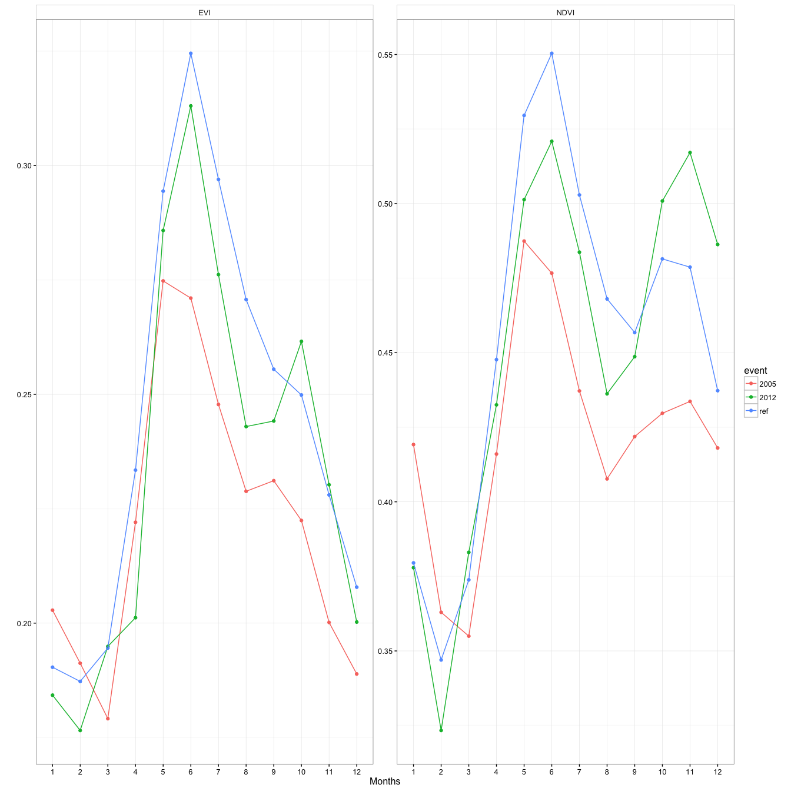
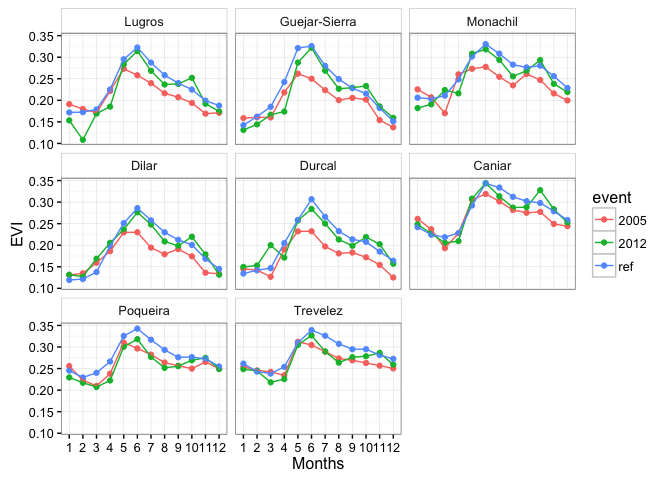
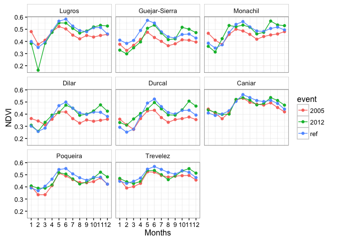
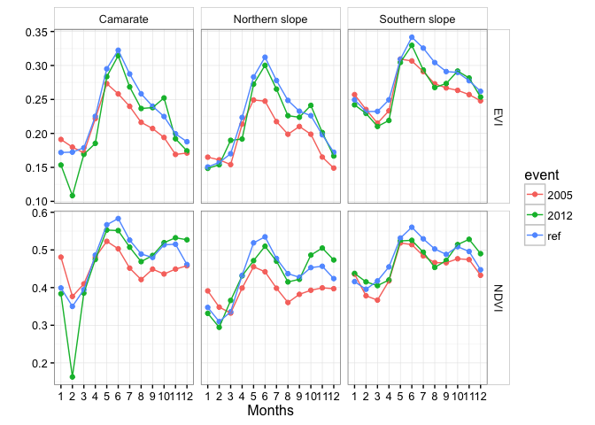

-   [Exploring patterns of resilience components (models)](#exploring-patterns-of-resilience-components-models)

Exploring patterns of resilience components (models)
====================================================

