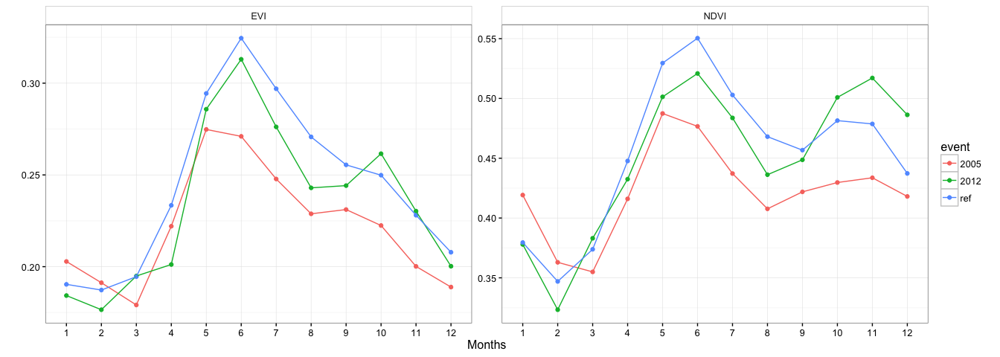
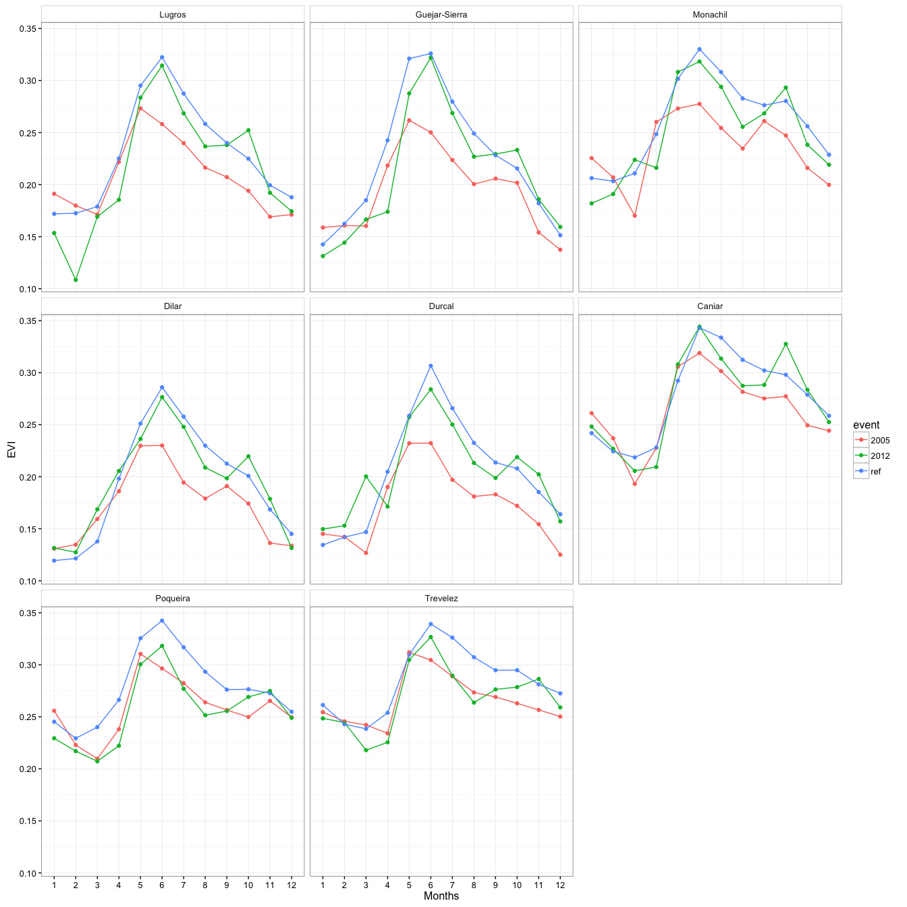

Annomalies for all *Q. pyrenaica* forests
-----------------------------------------

Annomalies by populations
-------------------------

Annomalies by populations cluster
---------------------------------

