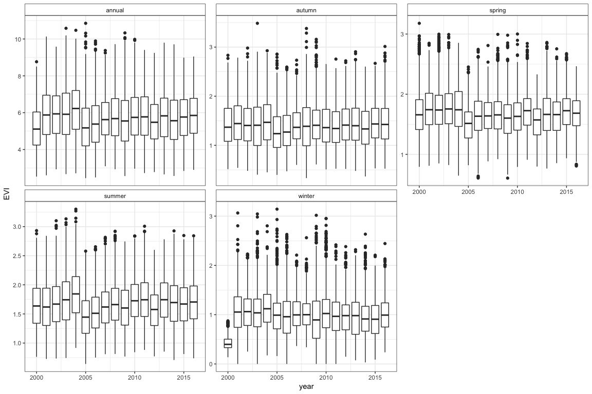
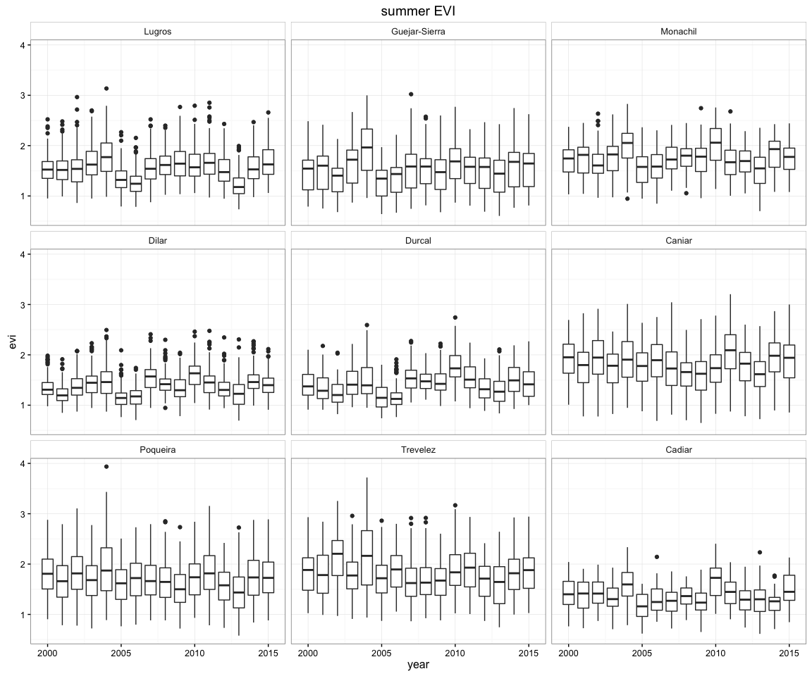

``` r
library("dplyr")
library("ggplot2")
library("reshape2")
```

Introduction
============

-   Read data of EVI attributes (see this [script](/analysis/prepare_evi_data.md))

``` r
# Read data
evidf <- read.csv(file=paste(di, "/data/evi_attributes_all.csv", sep=""), header = TRUE, sep = ',')
```

Exploring analysis evolution of EVI by season
---------------------------------------------

-   First we explore the evolution of EVI by season. We want to ask the question: *¿Which temporal scale does capture better the impacts of the drought event?*

``` r
ggplot(evidf, aes(x=year, y=evi, group=year)) + 
  geom_boxplot() + 
  facet_wrap(~seasonF, scales = "free_y") + 
  theme_bw() + 
  theme(strip.background=element_rect(fill='white')) + 
  ylab('EVI')
```

<!-- -->

Define the drought period
-------------------------

-   Another key step is to define the number of drought events and the **time span** of the events. For this purpose we review some literature ([1], [2], [3]). Some notes:

> Note: Drougths events.
>
> According to García-Herrera et al. 2007, the 6 greater droughts events recorded in Granada station from 1941 to 2005 were: 44-45, 48-49, 49-50, 92-93, 94-95, and 98-99.
>
> Trigo et al. 2013 reported a winter drought event for souther Iberian in 2011-2012.
>
> During the hydrological years of 2004/2005 and 2011/2012, Iberia was hit by two of the worst drought episodes ever recording in this semi-arid region (Gouveia and Trigo 2014)

We filter 2000-2002 and &gt; 2010, to revmoe the potential bias produced by this drougt events.

We states the period as:

-   Drought event: `2005-2006`
-   preDrought: `2003-2004`
-   postDrought: `2007-2010`

``` r
# define period 
pre <- c(2003,2004)
dr <- c(2005,2006)
post <- c(2007,2008,2009,2010)
```

Assign, also, names for each *Q. pyrenaica* patch:

``` r
# names of populations
label_pop <- c('1' = 'Lugros', '2' = 'Guejar-Sierra', '3' = 'Monachil',
                      '4' = 'Dilar', '5' = 'Durcal', '6' = 'Caniar', 
                      '7' = 'Poqueira', '8' = 'Trevelez', '9' = 'Cadiar')
```

### Explore evolution of summer EVI

-   Explore evolution of EVI summer
-   Filter data to period consider (`min(pre)` - `max(post)`)
-   Plot the evolution of EVI summer
-   Categorize summer EVI value into `pre`, `dr` and `post` leveles according to drought events defined above

``` r
# Choose season
myseason <- 'summer'

evisummer <- evidf %>%
  filter(seasonF == myseason) %>% 
  mutate(myperiod = ifelse(year %in% pre, 'pre',
                         ifelse(year %in% dr, 'dr',
                           ifelse(year %in% post, 'post', 'out')))) %>%
  filter(myperiod != 'out') 


ggplot(evisummer, aes(x=year, y=evi, group=year)) + 
  geom_boxplot() + facet_wrap(~poblacion, labeller = as_labeller(label_pop)) + 
  ggtitle(paste0(myseason, ' EVI')) + 
  theme_bw() + 
  theme(strip.background=element_rect(fill='white'))
```

<!-- -->

Compute resilience components
-----------------------------

-   Compute the resiliencie components according to \[^Lloret\_et\_al\] (see also this [notes](/man/notes_drought_in.md)):
-   ***Resistence*** (`rt`)
-   ***Resilience*** (`rs`)
-   ***Recovery*** (`rc`)

-   These inidcators were computed at pixel scale. For this purpose we aggregated the values of each period by pixel (*i.e.*: mean values of summer EVI for several years)

-   We also retain the attributes of `population` and coordinates (`lat` and `lng`)
-   Finally we export the dataframe generate ([`/data/evi_resilience.csv`](/data/evi_resilience.csv))

``` r
# First aggregate each pixel by period (get mean value of evi by period) 
eviperiod <- evisummer %>% 
  select(iv_malla_modi_id, poblacion, evi, myperiod, lng, lat) %>%
  group_by(iv_malla_modi_id, myperiod, poblacion, lng, lat) %>% 
  summarise(media_period = mean(evi))

# Change format of the dataset (long to wide)
df_aux <- dcast(eviperiod, iv_malla_modi_id + poblacion + lng + lat ~ myperiod, value.var = 'media_period')
  
# Compute components of resilience 

eviresi <- df_aux %>% 
  mutate(rt = dr / pre,
         rc = post / dr,
         rs = post / pre) 

# Export data
write.csv(eviresi, file=paste(di, "/data/evi_resilience.csv", sep=""), row.names = FALSE)
```

### Footnotes

-   -   -   

[1] Garcia-Herrera R, Paredes D, Trigo RM, Trigo IF, Hernandez E, Barriopedro D, Mendes MA (2007). The Outstanding 2004/05 Drought in the Iberian Peninsula: Associated Atmospheric Circulation. *Journal of Hydrometeorology*, 8: 483–498.

[2] Trigo RM, Añel J, Barriopedro D, García-Herrera R, Gimeno L, Nieto R, Castillo R, Allen MR, Massey N (2013). The record Winter drought of 2011-12 in the Iberian Peninsula \[in *"Explaining Extreme Events of 2012 from a Climate Perspective"*. \[Peterson TC, Hoerling MP, Stott PA Herring S (Eds.)\]. *Bulletin of the American Meteorological Society*, 94 (9): S41-S45.

[3] Gouveia CM and Trigo RM (2014) The 2005 and 2012 major drought events in Iberia: monitoring vegetation dynamics and crop yields using satellite data. EGU General Assembly Conference. Vol 16, EGU2014-15179-1. <http://meetingorganizer.copernicus.org/EGU2014/EGU2014-15179-1.pdf>
