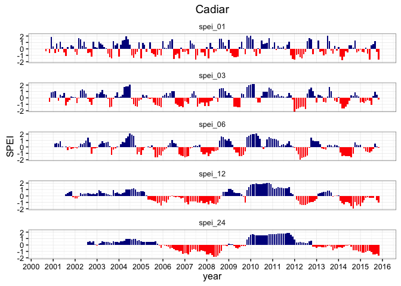
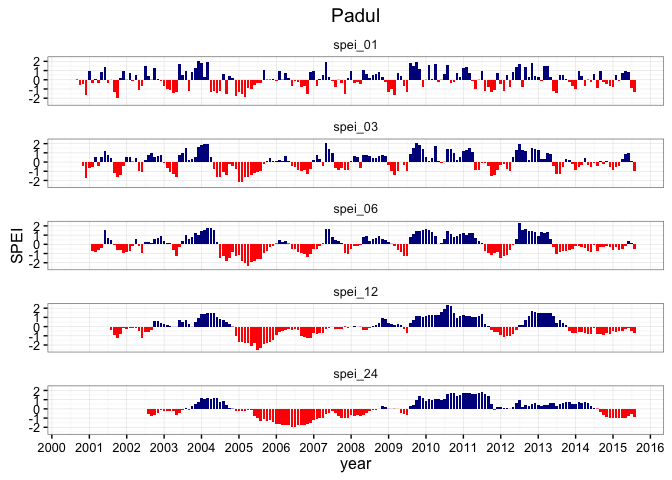
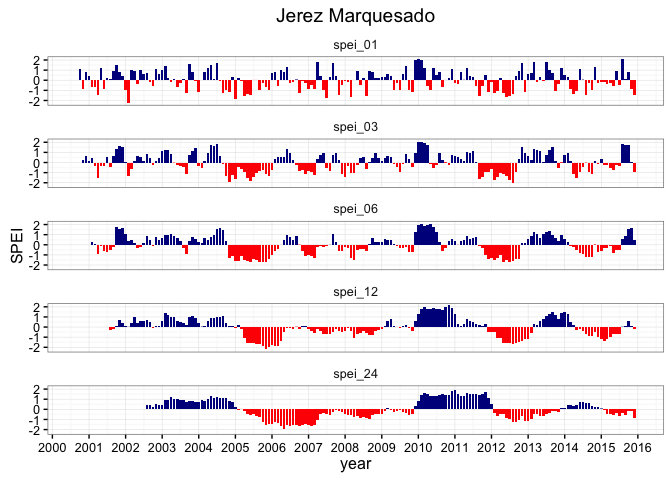
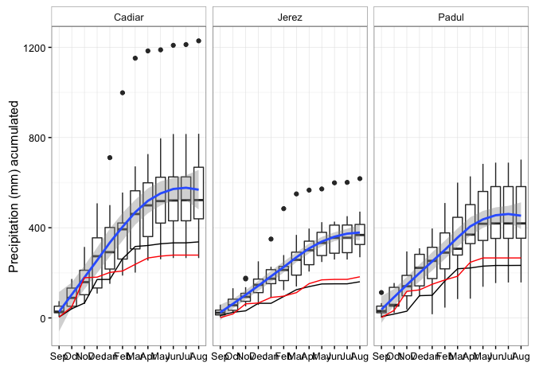
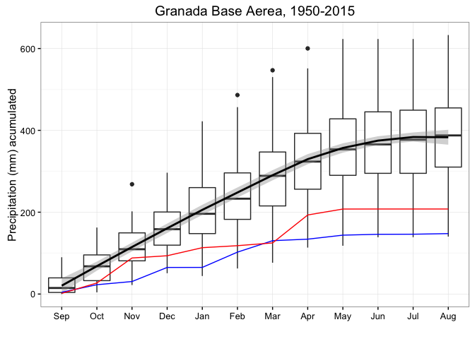
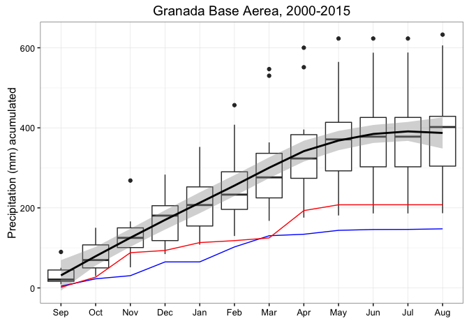

-   [SPEI Sierra Nevada](#spei-sierra-nevada)
-   [SPEI index](#spei-index)
    -   [Plot the SPEI indices for all sites](#plot-the-spei-indices-for-all-sites)
-   [Precipitation curves](#precipitation-curves)
    -   [Interactively by year](#interactively-by-year)
-   [Long term series REDIAM](#long-term-series-rediam)
    -   [Data from stations 5514 and 5515](#data-from-stations-5514-and-5515)

``` r
#---------------------------------
machine <- 'ajpelu'
#machine <- 'ajpeluLap'
di <- paste('/Users/', machine, '/Dropbox/phd/phd_repos/qpyr_resilience', sep='')
#---------------------------------
```

``` r
library('plyr')
library('dplyr')
```

    ## 
    ## Attaching package: 'dplyr'

    ## The following objects are masked from 'package:plyr':
    ## 
    ##     arrange, count, desc, failwith, id, mutate, rename, summarise,
    ##     summarize

    ## The following objects are masked from 'package:stats':
    ## 
    ##     filter, lag

    ## The following objects are masked from 'package:base':
    ## 
    ##     intersect, setdiff, setequal, union

``` r
library('lubridate')
```

    ## Warning: package 'lubridate' was built under R version 3.2.3

    ## 
    ## Attaching package: 'lubridate'

    ## The following object is masked from 'package:plyr':
    ## 
    ##     here

``` r
library('SPEI')
```

    ## Loading required package: lmomco

    ## Warning: package 'lmomco' was built under R version 3.2.5

    ## Loading required package: parallel

    ## # Package SPEI (1.6) loaded [try SPEINews()].

``` r
library('ggplot2')
```

    ## Warning: package 'ggplot2' was built under R version 3.2.4

``` r
library('zoo')
```

    ## 
    ## Attaching package: 'zoo'

    ## The following objects are masked from 'package:base':
    ## 
    ##     as.Date, as.Date.numeric

``` r
library('plotly')
```

    ## Warning: package 'plotly' was built under R version 3.2.5

    ## 
    ## Attaching package: 'plotly'

    ## The following object is masked from 'package:ggplot2':
    ## 
    ##     last_plot

    ## The following object is masked from 'package:graphics':
    ## 
    ##     layout

``` r
library('RCurl')
```

    ## Warning: package 'RCurl' was built under R version 3.2.4

    ## Loading required package: bitops

``` r
source(paste0(di, '/R/hydro_year.R'))
library("rgdal")
```

    ## Loading required package: sp

    ## rgdal: version: 1.1-3, (SVN revision 594)
    ##  Geospatial Data Abstraction Library extensions to R successfully loaded
    ##  Loaded GDAL runtime: GDAL 1.11.3, released 2015/09/16
    ##  Path to GDAL shared files: /usr/local/Cellar/gdal/1.11.3_1/share/gdal
    ##  Loaded PROJ.4 runtime: Rel. 4.9.2, 08 September 2015, [PJ_VERSION: 492]
    ##  Path to PROJ.4 shared files: (autodetected)
    ##  Linking to sp version: 1.1-1

``` r
library("sp")
library("raster")
```

    ## 
    ## Attaching package: 'raster'

    ## The following object is masked from 'package:dplyr':
    ## 
    ##     select

``` r
library("leaflet")
```

    ## Warning: package 'leaflet' was built under R version 3.2.3

SPEI Sierra Nevada
------------------

-   Compute SPEI of Sierra Nevada for three stations from [RIA network](http://www.juntadeandalucia.es/agriculturaypesca/ifapa/ria/servlet/FrontController): [Cadiar](http://www.juntadeandalucia.es/agriculturaypesca/ifapa/ria/servlet/FrontController?action=Static&url=coordenadas.jsp&c_provincia=18&c_estacion=7), [Padul](http://www.juntadeandalucia.es/agriculturaypesca/ifapa/ria/servlet/FrontController?action=Static&url=coordenadas.jsp&c_provincia=18&c_estacion=10) and [Jerez del Marquesado](http://www.juntadeandalucia.es/agriculturaypesca/ifapa/ria/servlet/FrontController?action=Static&url=coordenadas.jsp&c_provincia=18&c_estacion=6)
-   Temporal serie: 2000 - 2016

``` r
# Map of station

geoinfo_station <- read.table(file=paste0(di, '/data_raw/meteo/metadata_station_ria.txt'), header=TRUE, sep=';')

m <- leaflet(geoinfo_station) %>%  
    addProviderTiles("Esri.WorldImagery", 
                   group='Satellite') %>% 
  addMarkers(~long, ~lat, popup = ~as.character(name)) 

m
```

-   Read raw data and prepare data:
    -   Get month and year
    -   Compute hydrological year
    -   Filter (up to 2015)
    -   Compute the precipitation, evapotranspiration and mean temperature (average by month)

``` r
cadiar <- read.delim(file=paste0(di, '/data_raw/meteo/Cadiar.txt'), header=T, sep='')
padul <- read.delim(file=paste0(di, '/data_raw/meteo/Padul.txt'), header=T, sep='')
jerez <- read.delim(file=paste0(di, '/data_raw/meteo/Jerez del Marquesado.txt'), header=T, sep='')
                    

# Prepare data 
ca <- cadiar %>% 
  filter(complete.cases(.)) %>% 
  mutate(date = as.Date(FECHA, format="%d-%m-%y"), 
         year = lubridate::year(date), 
         month = lubridate::month(date),
         hyear = hydro_year(date), 
         hyear_f = paste0(hyear-1,'-', hyear)) %>%
  filter(year < 2016) %>% 
  dplyr::select(date, year, month, doy = DIA, tmed = Gr07TMed, prec = Gr07Precip, et0 = Gr07ETo, hyear, hyear_f) %>% 
  # Group by year and month 
  group_by(year, month, hyear, hyear_f) %>% 
  dplyr::summarise(prec_ac = sum(prec),
                   et0_ac = sum(et0),
                   tmed_avg = mean(tmed)) 


je <- jerez %>% 
  filter(complete.cases(.)) %>% 
  mutate(date = as.Date(FECHA, format="%d-%m-%y"), 
         year = lubridate::year(date), 
         month = lubridate::month(date),
         hyear = hydro_year(date), 
         hyear_f = paste0(hyear-1,'-', hyear)) %>%
  filter(year < 2016) %>% 
  dplyr::select(date, year, month, doy = DIA, tmed = Gr06TMed, prec = Gr06Precip, et0 = Gr06ETo, hyear, hyear_f) %>% 
  # Group by year and month 
  group_by(year, month, hyear, hyear_f) %>% 
  dplyr::summarise(prec_ac = sum(prec),
            et0_ac = sum(et0),
            tmed_avg = mean(tmed)) 


pa <- padul %>% 
  filter(complete.cases(.)) %>% 
  mutate(date = as.Date(FECHA, format="%d-%m-%y"), 
         year = lubridate::year(date), 
         month = lubridate::month(date),
         hyear = hydro_year(date), 
         hyear_f = paste0(hyear-1,'-', hyear)) %>%
  filter(year < 2016) %>% 
  dplyr::select(date, year, month, doy = DIA, tmed = Gr10TMed, prec = Gr10Precip, et0 = Gr10ETo, hyear, hyear_f) %>% 
  # Group by year and month 
  group_by(year, month, hyear, hyear_f) %>% 
  dplyr::summarise(prec_ac = sum(prec),
            et0_ac = sum(et0),
            tmed_avg = mean(tmed)) 
```

SPEI index
----------

Now compute the SPEI index. We first created a function to compute the spei (using SPEI package) in our dataframes.

``` r
# Compute the spei index 


compute_spei <- function(x, rango_mensual, inicio){
  # x = dataframe 
  # rango_mensual = vector with temporal range of spei
  
  # dataframe for output 
  outdf <- data.frame()
  
  for (i in rango_mensual){ 
    # Compute spei
    my_spei <- spei(x$prec_ac - x$et0_ac, i)
    
    # Create the ts 
    ts_aux <- ts(my_spei$fitted, start=inicio,frequency=12) 
    
    # Convert to dataframe 
    tsdf <- data.frame(Y=as.matrix(ts_aux), fecha=as.Date(as.yearmon(time(ts_aux))))
    
    # Rename 
    names(tsdf) <- c('value', 'fecha')
    
    
    tsdf <- tsdf %>% 
       mutate(signo = ifelse(value >= 0, 'pos', 'neg'),
              spei = paste0('spei_', i)) 
    
    # Rbind 
    outdf <- rbind(outdf, tsdf)
    
  }
  
  outdf <- outdf %>% 
    mutate(spei_ord = plyr::mapvalues(spei,
                                      c('spei_1', 'spei_3', 'spei_6', 'spei_12', 'spei_24'),
                                      c('spei_01', 'spei_03', 'spei_06', 'spei_12', 'spei_24'))) 
    
} 
```

### Plot the SPEI indices for all sites

``` r
# SPEI Cadiar
spei_ca <- compute_spei(ca, rango_mensual = c(1,3,6,12,24), inicio = c(2000,9))

df <- spei_ca
site <- 'Cadiar'

# PLOT 
ggplot(df, aes(x=fecha, y=value, fill=signo)) +  
  geom_bar(stat = "identity") + 
  scale_fill_manual(values = c("pos" = "darkblue", "neg" = "red")) + 
  facet_wrap(~spei_ord, ncol=1) +
  scale_x_date(date_breaks = "1 year", date_labels = "%Y") + 
  theme_bw() + 
  ylab('SPEI') + 
  xlab('year') + 
  theme(legend.position = "none", 
        strip.background = element_blank()) +
  ggtitle(site)
```

    ## Warning: Removed 41 rows containing missing values (position_stack).

    ## Warning: Stacking not well defined when ymin != 0



``` r
# SPEI Padul
spei_pa <- compute_spei(pa, rango_mensual = c(1,3,6,12,24), inicio = c(2000,9))

df <- spei_pa
site <- 'Padul' 

# PLOT 
ggplot(df, aes(x=fecha, y=value, fill=signo)) +  
  geom_bar(stat = "identity") + 
  scale_fill_manual(values = c("pos" = "darkblue", "neg" = "red")) + 
  facet_wrap(~spei_ord, ncol=1) +
  scale_x_date(date_breaks = "1 year", date_labels = "%Y") + 
  theme_bw() + 
  ylab('SPEI') + 
  xlab('year') + 
  theme(legend.position = "none", 
        strip.background = element_blank()) +
  ggtitle(site)
```

    ## Warning: Removed 41 rows containing missing values (position_stack).

    ## Warning: Stacking not well defined when ymin != 0



``` r
# SPEI Jerez 
spei_je <- compute_spei(je, rango_mensual = c(1,3,6,12,24), inicio = c(2000,9))

df <- spei_je
site <- 'Jerez Marquesado'

# PLOT 
ggplot(df, aes(x=fecha, y=value, fill=signo)) +  
  geom_bar(stat = "identity") + 
  scale_fill_manual(values = c("pos" = "darkblue", "neg" = "red")) + 
  facet_wrap(~spei_ord, ncol=1) +
  scale_x_date(date_breaks = "1 year", date_labels = "%Y") + 
  theme_bw() + 
  ylab('SPEI') + 
  xlab('year') + 
  theme(legend.position = "none", 
        strip.background = element_blank()) +
  ggtitle(site)
```

    ## Warning: Removed 41 rows containing missing values (position_stack).

    ## Warning: Stacking not well defined when ymin != 0



Precipitation curves
--------------------

We plot the cummulated precipitation (from september to september next year) (See Trigo et al. 2013).

``` r
mysites <- c('ca','je','pa')
all_sites <- data.frame() 

for (i in mysites){ 

  df <- get(i)
  aux <- df %>% 
    dplyr::mutate(hmonth = ifelse(month <= 8, month + 4, month -8)) %>% 
    group_by(hyear_f, hmonth) %>% 
    dplyr::summarise(prec_ac = sum(prec_ac)) %>%
    mutate(csum = cumsum(prec_ac)) %>% 
    mutate(loc = i) %>% 
    as.data.frame() 
  
  all_sites <- rbind(all_sites, aux)
}

all_sites <-  all_sites %>% 
  mutate(station= plyr::mapvalues(loc, c('ca', 'je', 'pa'), c("Cadiar", "Jerez", "Padul")))

all_sites %>% 
  filter(!(hyear_f %in% c('2004-2005', '2011-2012'))) %>% 
  ggplot(aes(x=as.factor(hmonth), y=csum)) + 
  geom_boxplot() + facet_wrap(~station) + 
  geom_smooth(aes(group=1), se=TRUE, level=0.95) + 
  geom_line(data=subset(all_sites, hyear_f == '2004-2005'),
            aes(x=as.factor(hmonth), y=csum, group=1)) +
  geom_line(data=subset(all_sites, hyear_f == '2011-2012'),
            aes(x=as.factor(hmonth), y=csum, group=1),
            colour='red') +
  theme_bw() + 
  theme(strip.background = element_rect(fill = NA, color = "black")) + 
  ylab('Precipitation (mm) acumulated') + xlab('') +
  scale_x_discrete(labels=c("1"="Sep", "2"="Oct", "3"="Nov", "4"="Dec", "5"="Jan", "6"="Feb",
                            "7"="Mar", "8"="Apr", "9"="May", "10"="Jun", "11"="Jul", "12"="Aug"))
```



The boxplots show the accumulated monthly precipitation (average from 2000 to 2015; 2005 and 2012 hidro. years are excluded). The red and black lines corresponding to 2004-2005 and 2011-2012 hydrological years respectively.

### Interactively by year

``` r
g <- ggplot(data=all_sites, aes(x=as.factor(hmonth), y=csum, group=hyear_f, colour=hyear_f)) + 
  geom_line() + facet_wrap(~station) + theme_bw() +
  theme(strip.background = element_rect(fill = NA, color = "black")) + 
  xlab('months (hydrological year; 1= sep)') +
  ylab('Precipitation (mm) acumulated') 

p <- ggplotly(g)
print(p)
```

Long term series REDIAM
-----------------------

### Data from stations 5514 and 5515

We requested official data to REDIAM from the following stations: \* 5514 Granada Base Aérea \* 5515 Granada Cartuja

as long as these two stations are the longest term series for southern Spain.

``` r
ltdf <- read.table(file=paste0(di, '/data_raw/meteo/long_term_data_rediam_data.txt'), header=T, sep=';', dec=',')

ltdf <- ltdf %>% 
  dplyr::select(cod = INDICATIVO, VARIABLE, FECHA, VALOR) %>% 
  dplyr::mutate(fecha = as.Date(FECHA, format='%d/%m/%Y'),
         month = lubridate::month(fecha),
         hmonth = ifelse(month <= 8, month + 4, month -8), 
         hyear = hydro_year(fecha),
         hyear_f = paste0(hyear-1,'-', hyear))
```

#### 5514 station

It's the longest term series.

``` r
# We used only the 5514 station (the most long term)
# Filter by station and prec
# Filter from 1950 
st5514 <- ltdf %>% 
  filter(VARIABLE == 'PM1') %>% 
  filter(cod == '5514') %>% 
  filter(hyear >= 1950) %>% 
  dplyr::select(fecha, month, hmonth, hyear, hyear_f, pre=VALOR)

st5514_pro <- st5514 %>% 
  group_by(hyear_f, hmonth) %>% 
  dplyr::summarise(pre = sum(pre)) %>%
  dplyr::mutate(csum = cumsum(pre)) 

st5514_pro  %>% 
  filter(!(hyear_f %in% c('2004-2005', '2011-2012'))) %>% 
  ggplot(aes(x=as.factor(hmonth), y=csum)) + 
  geom_boxplot() +  
  geom_smooth(aes(group=1), se=TRUE, level=0.95, colour='black') + 
  geom_line(data=subset(st5514_pro, hyear_f == '2004-2005'),
            aes(x=as.factor(hmonth), y=csum, group=1), colour='blue') +
  geom_line(data=subset(st5514_pro, hyear_f == '2011-2012'),
            aes(x=as.factor(hmonth), y=csum, group=1),
            colour='red') +
  theme_bw() + 
  theme(strip.background = element_rect(fill = NA, color = "black")) + 
  ylab('Precipitation (mm) acumulated') + xlab('') + 
  ggtitle('Granada Base Aerea, 1950-2015') + 
  scale_x_discrete(labels=c("1"="Sep", "2"="Oct", "3"="Nov", "4"="Dec", "5"="Jan", "6"="Feb",
                            "7"="Mar", "8"="Apr", "9"="May", "10"="Jun", "11"="Jul", "12"="Aug"))
```



Fig. Acumulated monthly precipitation during the hydrological year 2004-2005 (blue line) and 2011-2012 (red line). The boxplot representing the averaged from 1940-2015 period.

##### Cumulated precipitation from 2000 to 2015 for 5514 station

``` r
# Cumulated precipitation from 2000 to 2015 for 5514 station 
st5514_2000  <- ltdf %>% 
  filter(VARIABLE == 'PM1') %>% 
  filter(cod == '5514') %>% 
  filter(hyear >= 1999) %>% 
  dplyr::select(fecha, month, hmonth, hyear, hyear_f, pre=VALOR) %>% 
  group_by(hyear_f, hmonth) %>% 
  dplyr::summarise(pre = sum(pre)) %>%
  dplyr::mutate(csum = cumsum(pre)) 

st5514_2000 %>% 
  filter(!(hyear_f %in% c('2004-2005', '2011-2012'))) %>% 
  ggplot(aes(x=as.factor(hmonth), y=csum)) + 
  geom_boxplot() +  
  geom_smooth(aes(group=1), se=TRUE, level=0.95, colour='black') + 
  geom_line(data=subset(st5514_2000, hyear_f == '2004-2005'),
            aes(x=as.factor(hmonth), y=csum, group=1), colour='blue') +
  geom_line(data=subset(st5514_2000, hyear_f == '2011-2012'),
            aes(x=as.factor(hmonth), y=csum, group=1),
            colour='red') +
  theme_bw() + 
  theme(strip.background = element_rect(fill = NA, color = "black")) + 
  ylab('Precipitation (mm) acumulated') +  xlab('') + 
  ggtitle('Granada Base Aerea, 2000-2015') + 
  scale_x_discrete(labels=c("1"="Sep", "2"="Oct", "3"="Nov", "4"="Dec", "5"="Jan", "6"="Feb",
                            "7"="Mar", "8"="Apr", "9"="May", "10"="Jun", "11"="Jul", "12"="Aug"))
```



#### Interactive plots by year

``` r
ba_ip <- ggplot(data=st5514_pro, 
       aes(x=as.factor(hmonth), y=csum, group=hyear_f, colour=as.factor(hyear_f))) +
  geom_line() + 
  theme_bw() + 
  ylab('Cumulative precipitation (mm)') + 
  xlab('') + ggtitle('Granada Base Aerea, 1950-2015') + 
  theme(legend.title = element_blank()) +
  scale_x_discrete(labels=c("1"="Sep", "2"="Oct", "3"="Nov", "4"="Dec", "5"="Jan", "6"="Feb",
                            "7"="Mar", "8"="Apr", "9"="May", "10"="Jun", "11"="Jul", "12"="Aug"))

ba_ipp <- ggplotly(ba_ip)
print(ba_ipp)
```

``` r
### NOT EVALUATED -----------------------------


###  Long term serie for Granada Base Aérea (From Linaria)
raw <- read.csv(file=paste0(di, '/data_raw/meteo/meteo_data_base_aerea.csv'), header=T, sep=';')

raw <- raw %>% 
  dplyr::select(-codigo) %>% 
  mutate(miyear = lubridate::year(fecha),
         mimonth = lubridate::month(fecha),
         hyear = hydro_year(fecha),
         hyear_f = paste0(hyear-1,'-', hyear))


# Group by month-year and summarize 
pre <- raw %>%
  filter(codigo.1 == 'PI1') %>% 
  group_by(miyear, mimonth, hyear, hyear_f) %>% 
  summarize(prec_ac = sum(valor))

tmed <- raw %>%
  filter(codigo.1 == 'TI1') %>% 
  group_by(miyear, mimonth, hyear, hyear_f) %>% 
  summarize(tmed = mean(valor))

ba <- pre %>% 
  inner_join(tmed, by=c('miyear', 'mimonth', 'hyear', 'hyear_f'))


# Compute et0 
# Latitud: 37° 8' 13'' N - Longitud: 3° 37' 53'' O 
lat_ba <- 37.13694
ba$et0_ac <-thornthwaite(ba$tmed,lat_ba)

# Export data
write.csv(ba, file=paste0(di, '/data_raw/meteo/base_aerea_aggregated.csv'), row.names = FALSE)

spei_ba <- compute_spei(ba, rango_mensual = c(6,12,24), inicio = c(1951,1))


df <- spei_ba
site <- 'Base Aerea'

# PLOT 
ggplot(df, aes(x=fecha, y=value, fill=signo)) +  
  geom_bar(stat = "identity") + 
  scale_fill_manual(values = c("pos" = "darkblue", "neg" = "red")) + 
  facet_wrap(~spei_ord, ncol=1) +
  scale_x_date(date_breaks = "10 year", date_labels = "%Y") + 
  theme_bw() + 
  ylab('SPEI') + 
  xlab('year') + 
  theme(legend.position = "none", 
        strip.background = element_blank()) +
  ggtitle(site) + 
  geom_vline(xintercept=as.numeric(as.Date("2005-01-01"))) +
  geom_vline(xintercept=as.numeric(as.Date("2005-12-31"))) 

pre_acu <- pre %>% 
  mutate(hmonth = ifelse(mimonth <= 8, mimonth + 4, mimonth -8)) %>%
  filter(!(miyear == 1951 & hmonth >= 5)) %>% 
  mutate(hyear_corrected = hyear -1)
  
cumulate_preci <- pre_acu %>% 
  group_by(hyear_corrected, hmonth) %>% 
  summarise(prec_ac = sum(prec_ac)) %>%
  mutate(csum = cumsum(prec_ac)) 
  
cumulate_preci %>% 
  filter(!(hyear_corrected %in% c(2004, 1998))) %>% 
  ggplot(aes(x=as.factor(hmonth), y=csum)) + 
  geom_boxplot() + 
  geom_smooth(aes(group=1), se=TRUE, level=0.95) + 
  geom_line(data=subset(cumulate_preci, hyear_corrected == 2004),
            aes(x=as.factor(hmonth), y=csum, group=1)) +
  geom_line(data=subset(cumulate_preci, hyear_corrected == 1998),
            aes(x=as.factor(hmonth), y=csum, group=1),
            colour='red') +
  theme_bw() + ylab('Precipitation (mm) acumulated') + 
  xlab('months (hydrological year; 1= sep)') + 
  annotate("text", label = "2004-2005", x = 2, y = 500, size = 6, colour = "black") + 
  annotate("text", label = "1998-1999", x = 2, y = 550, size = 6, colour = "red") + 
  annotate("text", label = "mean 1950-2009", x = 3, y = 600, size = 6, colour = "blue")
```
