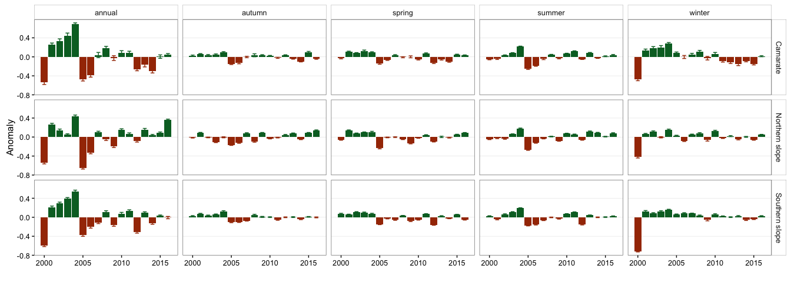
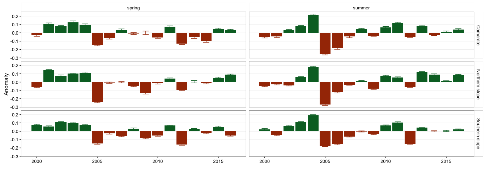
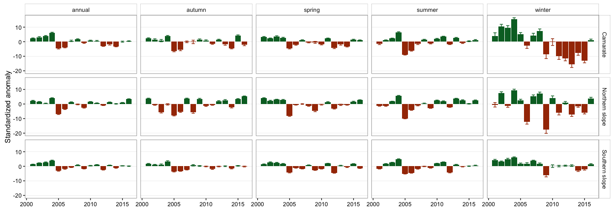
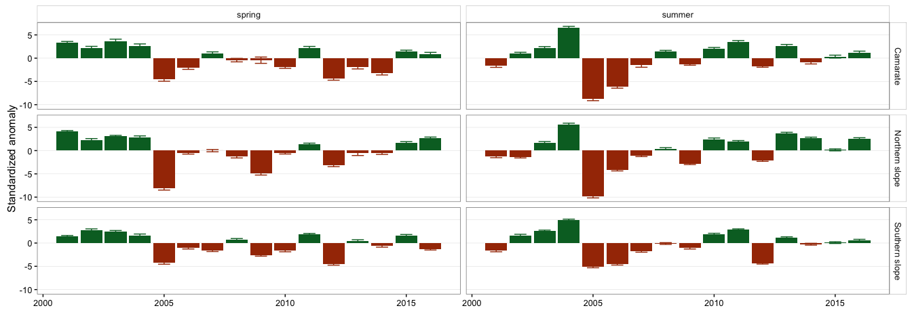
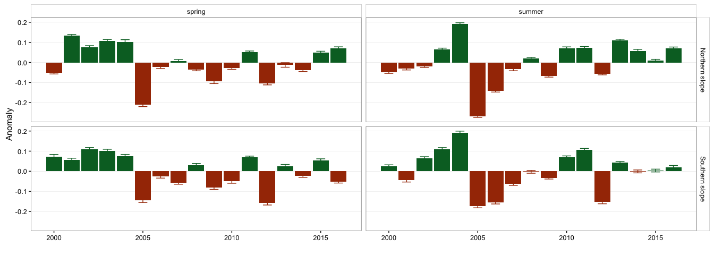
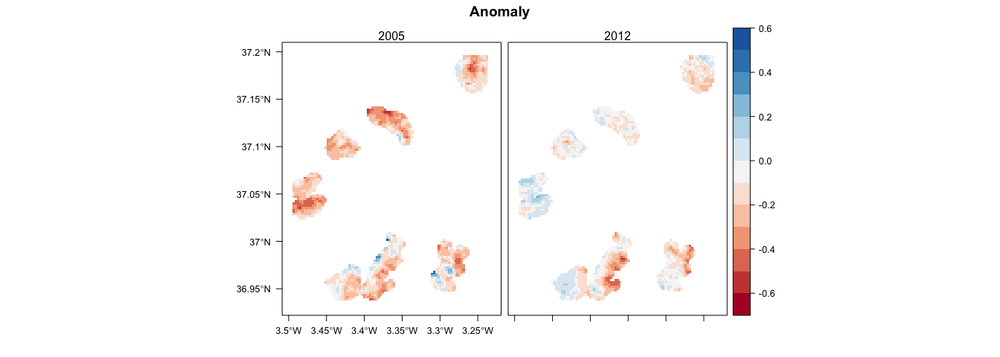

``` r
library("rgdal")
library("sp")
library("raster")
library("rasterVis")
source(paste0(di,"/R/exportpdf.R")) # function to export raster levelplots maps as pdf
library("dplyr")
library("ggplot2")
library("reshape2")
library("purrr")
# library("pander")
library("knitr")
```

Read data and Prepare Data
--------------------------

``` r
# Read data 
anomalias_season <- read.csv(file=paste(di, "/data/anomalies/anomalias_season.csv", sep=""), header = TRUE, sep = ',')
anomalias_composite <- read.csv(file=paste(di, "/data/anomalies/anomalias_composite.csv", sep=""), header = TRUE, sep = ',')


anomalias_season <- anomalias_season %>% 
  mutate(clu_pop = as.factor(ifelse(pop == 1, 'Camarate',
                             ifelse(pop %in% c(2,3,4,5), 'Northern slope',
                             ifelse(pop %in% c(6,7,8), 'Southern slope', 'out'))))) %>% 
    filter(clu_pop != 'out') 


anomalias_composite <- anomalias_composite %>% 
  mutate(clu_pop = as.factor(ifelse(pop == 1, 'Camarate',
                             ifelse(pop %in% c(2,3,4,5), 'Northern slope',
                             ifelse(pop %in% c(6,7,8), 'Southern slope', 'out'))))) %>% 
    filter(clu_pop != 'out')
```

Season data
===========

Get mean values of anomalies by clu\_pop
----------------------------------------

``` r
summ_aS <- anomalias_season %>% 
  # filter(y != 2000) %>% 
  group_by(clu_pop, y, composite) %>% 
  summarise(mean=mean(anomaly),
            sd = sd(anomaly),
            se = sd/sqrt(length(anomaly))) %>% 
 mutate(signo = ifelse(mean >= 0, 'pos', 'neg'))
               

summ_asS <- anomalias_season %>% 
  filter(y != 2000) %>%
  group_by(clu_pop, y, composite) %>% 
  summarise(mean=mean(anomaly_std),
            sd = sd(anomaly_std),
            se = sd/sqrt(length(anomaly_std))) %>% 
  mutate(signo = ifelse(mean >= 0, 'pos', 'neg'))
```

Plot anomaly
------------

### All seasons

``` r
anomalo_season_all_cluster_pop <- ggplot(summ_aS, aes(x=y, y=mean, fill=signo)) + 
  geom_bar(stat = "identity") + 
  geom_errorbar(aes(ymin = mean - 2*se, ymax = mean + 2*se, colour=signo), width=.5) +
  facet_grid(clu_pop ~ composite) + 
  scale_fill_manual(values = c("pos" = color_pos, "neg" =  color_neg)) +
  scale_color_manual(values = c("pos" = color_pos, "neg" =  color_neg)) +
  ylab('Anomaly') + xlab('') +
  theme_bw() +
  theme(legend.position = "none",
        panel.grid.major.x = element_blank(),
        panel.grid.minor = element_blank(),
        strip.background = element_rect(fill = "white"))


#pdf(file=paste0(di, "/images/anomalo_season_all_cluster_pop.pdf"), height = 10, width = 16)
anomalo_season_all_cluster_pop
```



``` r
#dev.off()
```

Only Summer and Spring
----------------------

``` r
anomalo_season_su_sp_cluster_pop <- summ_aS %>% filter(composite %in% c('spring', 'summer')) %>% 
ggplot(aes(x=y, y=mean, fill=signo)) + 
  geom_bar(stat = "identity") + 
  geom_errorbar(aes(ymin = mean - 2*se, ymax = mean + 2*se, colour=signo), width=.5) +
  facet_grid(clu_pop ~ composite) + 
  scale_fill_manual(values = c("pos" = color_pos, "neg" =  color_neg)) +
  scale_color_manual(values = c("pos" = color_pos, "neg" =  color_neg)) +
  ylab('Anomaly') + xlab('') +
  theme_bw() +
  theme(legend.position = "none",
        panel.grid.major.x = element_blank(),
        panel.grid.minor = element_blank(),
        strip.background = element_rect(fill = "white"))

#pdf(file=paste0(di, "/images/anomalo_season_su_sp_cluster_pop.pdf"), height = 6, width = 10)
anomalo_season_su_sp_cluster_pop
```



``` r
# dev.off()
```

Plot anomaly standardized
-------------------------

### All seasons

``` r
ggplot(summ_asS, aes(x=y, y=mean, fill=signo)) + 
  geom_bar(stat = "identity") + 
  geom_errorbar(aes(ymin = mean - 2*se, ymax = mean + 2*se, colour=signo), width=.5) +
  facet_grid(clu_pop ~ composite) + 
  scale_fill_manual(values = c("pos" = color_pos, "neg" =  color_neg)) +
  scale_color_manual(values = c("pos" = color_pos, "neg" =  color_neg)) +
  ylab('Standardized anomaly') + xlab('') +
  theme_bw() +
  theme(legend.position = "none",
        panel.grid.major.x = element_blank(),
        panel.grid.minor = element_blank(),
        strip.background = element_rect(fill = "white"))
```



Only Summer and Spring
----------------------

``` r
summ_asS %>% filter(composite %in% c('spring', 'summer')) %>% 
ggplot(aes(x=y, y=mean, fill=signo)) + 
  geom_bar(stat = "identity") + 
  geom_errorbar(aes(ymin = mean - 2*se, ymax = mean + 2*se, colour=signo), width=.5) +
  facet_grid(clu_pop ~ composite) + 
  scale_fill_manual(values = c("pos" = color_pos, "neg" =  color_neg)) +
  scale_color_manual(values = c("pos" = color_pos, "neg" =  color_neg)) +
  ylab('Standardized anomaly') + xlab('') +
  theme_bw() +
  theme(legend.position = "none",
        panel.grid.major.x = element_blank(),
        panel.grid.minor = element_blank(),
        strip.background = element_rect(fill = "white"))
```



### Combine N and S (not Camarate)

``` r
anomalias_seasonNS <- anomalias_season %>% 
  mutate(clu_pop = as.factor(ifelse(pop %in% c(1,2,3,4,5), 'Northern slope',
                             ifelse(pop %in% c(6,7,8), 'Southern slope', 'out')))) %>% 
    filter(clu_pop != 'out') 

summNS_aS <- anomalias_seasonNS %>% 
  # filter(y != 2000) %>% 
  group_by(clu_pop, y, composite) %>% 
  summarise(mean=mean(anomaly),
            sd = sd(anomaly),
            se = sd/sqrt(length(anomaly))) %>% 
 mutate(signo = ifelse(mean >= 0, 'pos', 'neg'))
               

summNS_asS <- anomalias_seasonNS %>% 
  filter(y != 2000) %>%
  group_by(clu_pop, y, composite) %>% 
  summarise(mean=mean(anomaly_std),
            sd = sd(anomaly_std),
            se = sd/sqrt(length(anomaly_std))) %>% 
  mutate(signo = ifelse(mean >= 0, 'pos', 'neg'))
```

Plot anomaly
------------

### All seasons

``` r
anomalo_season_all_cluster_popNS <- ggplot(summNS_aS, aes(x=y, y=mean, fill=signo)) + 
  geom_bar(stat = "identity") + 
  geom_errorbar(aes(ymin = mean - 2*se, ymax = mean + 2*se, colour=signo), width=.5) +
  facet_grid(clu_pop ~ composite) + 
  scale_fill_manual(values = c("pos" = color_pos, "neg" =  color_neg)) +
  scale_color_manual(values = c("pos" = color_pos, "neg" =  color_neg)) +
  ylab('Anomaly') + xlab('') +
  theme_bw() +
  theme(legend.position = "none",
        panel.grid.major.x = element_blank(),
        panel.grid.minor = element_blank(),
        strip.background = element_rect(fill = "white"))


#pdf(file=paste0(di, "/images/anomalo_season_all_cluster_popNS.pdf"), height = 10, width = 16)
anomalo_season_all_cluster_popNS
```


``` r
#dev.off()
```

Only Summer and Spring
----------------------

``` r
anomalo_season_su_sp_cluster_popNS <- summNS_aS %>% filter(composite %in% c('spring', 'summer')) %>% 
ggplot(aes(x=y, y=mean, fill=signo)) + 
  geom_bar(stat = "identity") + 
  geom_errorbar(aes(ymin = mean - 2*se, ymax = mean + 2*se, colour=signo), width=.5) +
  facet_grid(clu_pop ~ composite) + 
  scale_fill_manual(values = c("pos" = color_pos, "neg" =  color_neg)) +
  scale_color_manual(values = c("pos" = color_pos, "neg" =  color_neg)) +
  ylab('Anomaly') + xlab('') +
  theme_bw() +
  theme(legend.position = "none",
        panel.grid.major.x = element_blank(),
        panel.grid.minor = element_blank(),
        strip.background = element_rect(fill = "white"))

# pdf(file=paste0(di, "/images/anomalo_season_su_sp_cluster_popNS.pdf"), height = 6, width = 10)
anomalo_season_su_sp_cluster_popNS
```



``` r
# dev.off()
```

Maps
====

-   Create raster maps (two projections: `epsg:4326` and `epsg:23030`)

Spatial exploration of the anomaly
----------------------------------

``` r
# Select a palette http://colorbrewer2.org/
mypal <- brewer.pal(11, "RdYlGn")
# Specify the color palette
myTheme=rasterTheme(region=mypal)

lp <- levelplot(stack_a, 
          margin=FALSE,
          layer=c('anomaly_2005', 'anomaly_2012'),
          #par.settings=myTheme, 
          par.settings=RdBuTheme, 
          names.attr=c("2005", "2012"),
          pretty=TRUE,
          main='Anomaly', xlab=NULL, ylab=NULL) 

print(lp)
```



``` r
# tiff(filename=paste0(di, '/images/raster_maps/anomalies_2005_2012_blue.tiff'), 
#     height = 1600, width = 2500, res=150, pointsize = 20, bg='transparent')
# print(lp)
# dev.off()

#exportpdf(mypdf=paste0(di, '/man/images/raster_rs.pdf'), lp) 
```
