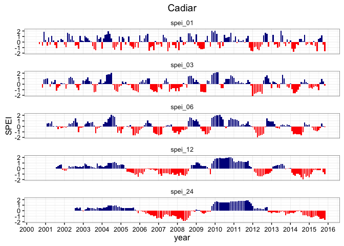
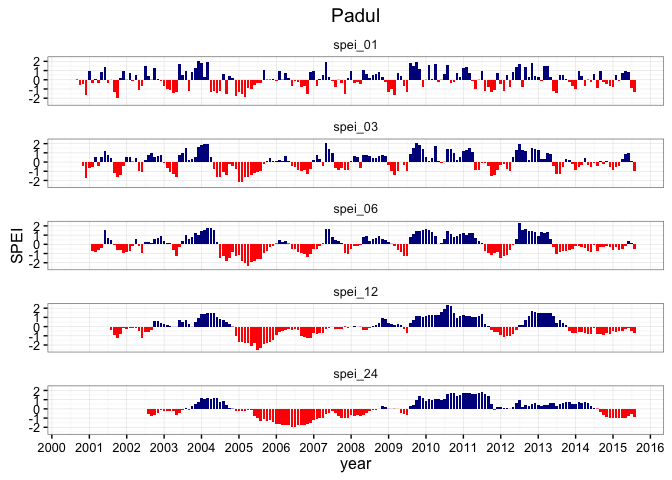
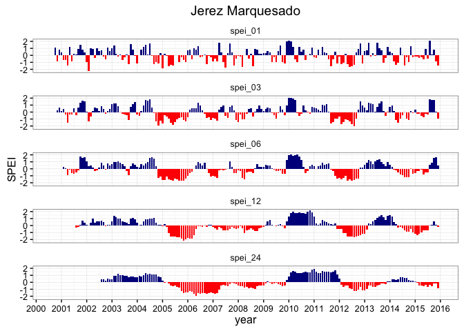
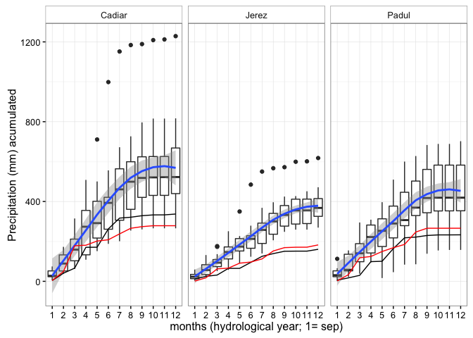

-   [Long term serie](#long-term-serie)

``` r
#---------------------------------
machine <- 'ajpelu'
# machine <- 'ajpeluLap'
di <- paste('/Users/', machine, '/Dropbox/phd/phd_repos/qpyr_resilience', sep='')
#---------------------------------
```

``` r
library('plyr')
library('dplyr')
```

    ## 
    ## Attaching package: 'dplyr'

    ## The following objects are masked from 'package:plyr':
    ## 
    ##     arrange, count, desc, failwith, id, mutate, rename, summarise,
    ##     summarize

    ## The following objects are masked from 'package:stats':
    ## 
    ##     filter, lag

    ## The following objects are masked from 'package:base':
    ## 
    ##     intersect, setdiff, setequal, union

``` r
library('lubridate')
```

    ## Warning: package 'lubridate' was built under R version 3.2.3

    ## 
    ## Attaching package: 'lubridate'

    ## The following object is masked from 'package:plyr':
    ## 
    ##     here

``` r
library('SPEI')
```

    ## Loading required package: lmomco

    ## Warning: package 'lmomco' was built under R version 3.2.5

    ## Loading required package: parallel

    ## # Package SPEI (1.6) loaded [try SPEINews()].

``` r
library('ggplot2')
```

    ## Warning: package 'ggplot2' was built under R version 3.2.4

``` r
library('zoo')
```

    ## 
    ## Attaching package: 'zoo'

    ## The following objects are masked from 'package:base':
    ## 
    ##     as.Date, as.Date.numeric

``` r
cadiar <- read.delim(file=paste0(di, '/data_raw/meteo/Cadiar.txt'), header=T, sep='')
padul <- read.delim(file=paste0(di, '/data_raw/meteo/Padul.txt'), header=T, sep='')
jerez <- read.delim(file=paste0(di, '/data_raw/meteo/Jerez del Marquesado.txt'), header=T, sep='')
                    

# Prepare data 
ca <- cadiar %>% 
  filter(complete.cases(.)) %>% 
  mutate(date = as.Date(FECHA, format="%d-%m-%y"), 
         year = lubridate::year(date), 
         month = lubridate::month(date)) %>%
  filter(year < 2016) %>% 
  select(date, year, month, doy = DIA, tmed = Gr07TMed, prec = Gr07Precip, et0 = Gr07ETo) %>% 
  # Group by year and month 
  group_by(year, month) %>% 
  summarise(prec_ac = sum(prec),
            et0_ac = sum(et0),
            tmed_avg = mean(tmed)) 


je <- jerez %>% 
  filter(complete.cases(.)) %>% 
  mutate(date = as.Date(FECHA, format="%d-%m-%y"), 
         year = lubridate::year(date), 
         month = lubridate::month(date)) %>%
  filter(year < 2016) %>% 
  select(date, year, month, doy = DIA, tmed = Gr06TMed, prec = Gr06Precip, et0 = Gr06ETo) %>% 
  # Group by year and month 
  group_by(year, month) %>% 
  summarise(prec_ac = sum(prec),
            et0_ac = sum(et0),
            tmed_avg = mean(tmed)) 


pa <- padul %>% 
  filter(complete.cases(.)) %>% 
  mutate(date = as.Date(FECHA, format="%d-%m-%y"), 
         year = lubridate::year(date), 
         month = lubridate::month(date)) %>%
  filter(year < 2016) %>% 
  select(date, year, month, doy = DIA, tmed = Gr10TMed, prec = Gr10Precip, et0 = Gr10ETo) %>% 
  # Group by year and month 
  group_by(year, month) %>% 
  summarise(prec_ac = sum(prec),
            et0_ac = sum(et0),
            tmed_avg = mean(tmed)) 
```

``` r
# Compute the spei index 

compute_spei <- function(x, rango_mensual, inicio){
  # x = dataframe 
  # rango_mensual = vector with temporal range of spei
  
  # dataframe for output 
  outdf <- data.frame()
  
  for (i in rango_mensual){ 
    # Compute spei
    my_spei <- spei(x$prec_ac - x$et0_ac, i)
    
    # Create the ts 
    ts_aux <- ts(my_spei$fitted, start=inicio,frequency=12) 
    
    # Convert to dataframe 
    tsdf <- data.frame(Y=as.matrix(ts_aux), fecha=as.Date(as.yearmon(time(ts_aux))))
    
    # Rename 
    names(tsdf) <- c('value', 'fecha')
    
    
    tsdf <- tsdf %>% 
       mutate(signo = ifelse(value >= 0, 'pos', 'neg'),
              spei = paste0('spei_', i)) 
    
    # Rbind 
    outdf <- rbind(outdf, tsdf)
    
  }
  
  outdf <- outdf %>% 
     mutate(spei_ord = plyr::mapvalues(spei,
                                       c('spei_1', 'spei_3', 'spei_6', 'spei_12'),
                                       c('spei_01', 'spei_03', 'spei_06', 'spei_12'))) 
    
  } 
```

``` r
# SPEI Cadiar
spei_ca <- compute_spei(ca, rango_mensual = c(1,3,6,12,24), inicio = c(2000,9))

df <- spei_ca
site <- 'Cadiar'

# PLOT 
ggplot(df, aes(x=fecha, y=value, fill=signo)) +  
  geom_bar(stat = "identity") + 
  scale_fill_manual(values = c("pos" = "darkblue", "neg" = "red")) + 
  facet_wrap(~spei_ord, ncol=1) +
  scale_x_date(date_breaks = "1 year", date_labels = "%Y") + 
  theme_bw() + 
  ylab('SPEI') + 
  xlab('year') + 
  theme(legend.position = "none", 
        strip.background = element_blank()) +
  ggtitle(site)
```

    ## Warning: Removed 41 rows containing missing values (position_stack).

    ## Warning: Stacking not well defined when ymin != 0



``` r
# SPEI Padul
spei_pa <- compute_spei(pa, rango_mensual = c(1,3,6,12,24), inicio = c(2000,9))

df <- spei_pa
site <- 'Padul' 

# PLOT 
ggplot(df, aes(x=fecha, y=value, fill=signo)) +  
  geom_bar(stat = "identity") + 
  scale_fill_manual(values = c("pos" = "darkblue", "neg" = "red")) + 
  facet_wrap(~spei_ord, ncol=1) +
  scale_x_date(date_breaks = "1 year", date_labels = "%Y") + 
  theme_bw() + 
  ylab('SPEI') + 
  xlab('year') + 
  theme(legend.position = "none", 
        strip.background = element_blank()) +
  ggtitle(site)
```

    ## Warning: Removed 41 rows containing missing values (position_stack).

    ## Warning: Stacking not well defined when ymin != 0



``` r
# SPEI Jerez 
spei_je <- compute_spei(je, rango_mensual = c(1,3,6,12,24), inicio = c(2000,9))

df <- spei_je
site <- 'Jerez Marquesado'

# PLOT 
ggplot(df, aes(x=fecha, y=value, fill=signo)) +  
  geom_bar(stat = "identity") + 
  scale_fill_manual(values = c("pos" = "darkblue", "neg" = "red")) + 
  facet_wrap(~spei_ord, ncol=1) +
  scale_x_date(date_breaks = "1 year", date_labels = "%Y") + 
  theme_bw() + 
  ylab('SPEI') + 
  xlab('year') + 
  theme(legend.position = "none", 
        strip.background = element_blank()) +
  ggtitle(site)
```

    ## Warning: Removed 41 rows containing missing values (position_stack).

    ## Warning: Stacking not well defined when ymin != 0



### Long term serie

``` r
raw <- read.csv(file=paste0(di, '/data_raw/meteo/meteo_data_base_aerea.csv'), header=T, sep=';')

raw <- raw %>% 
  select(-codigo) %>% 
  mutate(miyear = lubridate::year(fecha),
         mimonth = lubridate::month(fecha))


# Group by month-year and summarize 
pre <- raw %>%
  filter(codigo.1 == 'PI1') %>% 
  group_by(miyear, mimonth) %>% 
  summarize(prec_ac = sum(valor))

tmed <- raw %>%
  filter(codigo.1 == 'TI1') %>% 
  group_by(miyear, mimonth) %>% 
  summarize(tmed = mean(valor))

ba <- pre %>% 
  inner_join(tmed, by=c('miyear', 'mimonth'))


# Compute et0 
# Latitud: 37° 8' 13'' N - Longitud: 3° 37' 53'' O 
lat_ba <- 37.13694
ba$et0_ac <-thornthwaite(ba$tmed,lat_ba)


spei_ba <- compute_spei(ba, rango_mensual = c(6,12,24), inicio = c(1951,1))
```

    ## The following `from` values were not present in `x`: spei_1, spei_3

``` r
df <- spei_ba
site <- 'Base Aerea'

# PLOT 
ggplot(df, aes(x=fecha, y=value, fill=signo)) +  
  geom_bar(stat = "identity") + 
  scale_fill_manual(values = c("pos" = "darkblue", "neg" = "red")) + 
  facet_wrap(~spei_ord, ncol=1) +
  scale_x_date(date_breaks = "10 year", date_labels = "%Y") + 
  theme_bw() + 
  ylab('SPEI') + 
  xlab('year') + 
  theme(legend.position = "none", 
        strip.background = element_blank()) +
  ggtitle(site) + 
  geom_vline(xintercept=as.numeric(as.Date("2005-01-01"))) +
  geom_vline(xintercept=as.numeric(as.Date("2005-12-31"))) 
```

    ## Warning: Removed 39 rows containing missing values (position_stack).

    ## Warning: Stacking not well defined when ymin != 0


