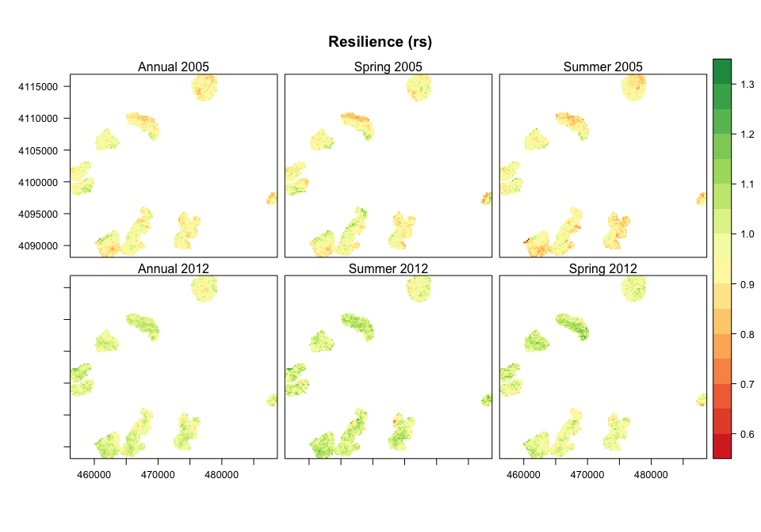
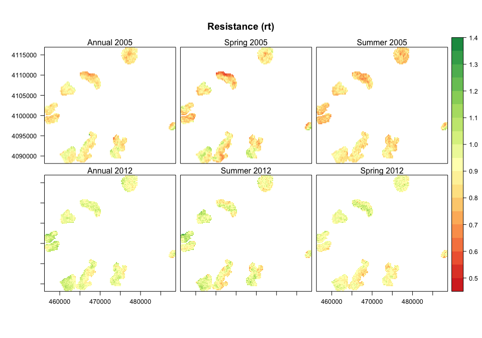
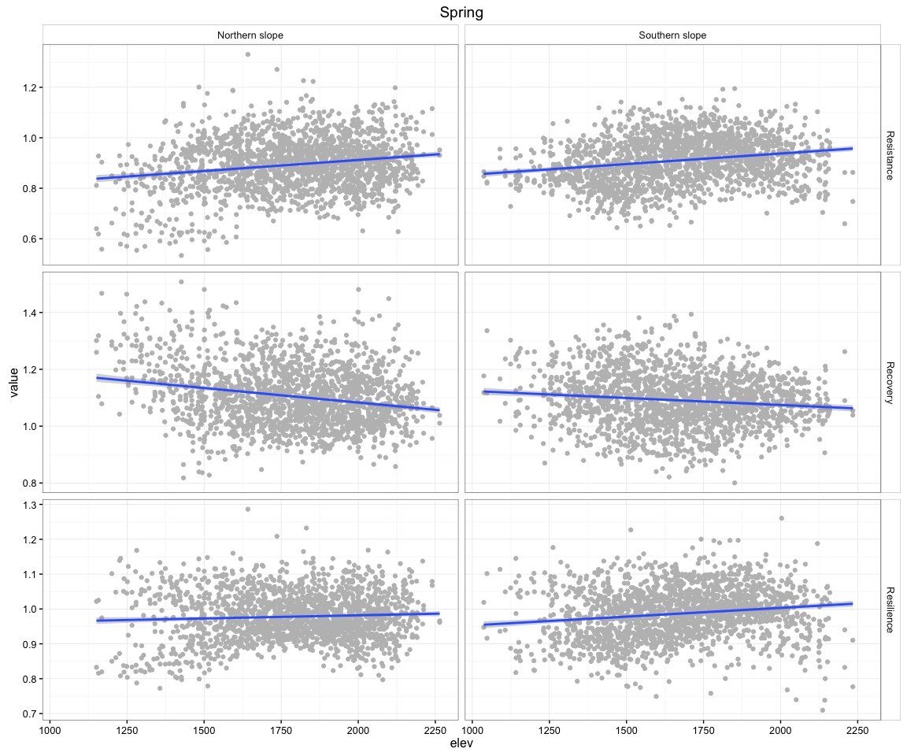

Explore resilience patterns of the different *Q. pyrenaica* patches
===================================================================

``` r
library("rgdal")
library("sp")
library("raster")
library("rasterVis")
source(paste0(di,"/R/exportpdf.R")) # function to export raster levelplots maps as pdf
library("dplyr")
library("ggplot2")
library("reshape2")
library("purrr")
library("pander")
library("knitr")
```

Read and prepare data
---------------------

``` r
# Read data
eviresi <- read.csv(file=paste(di, "/data/evi_resilience.csv", sep=""), header = TRUE, sep = ',')
```

Maps
====

-   Create raster maps (two projections: `epsg:4326` and `epsg:23030`)
-   Export raster maps and stacks (see `/data/raster/`)

Spatial exploration of the resilience components
------------------------------------------------

### Resilience


<p class="caption">
Resilience
</p>

    ## quartz_off_screen 
    ##                 2

### Resistance


<p class="caption">
Resistance
</p>

    ## quartz_off_screen 
    ##                 2

### Recovery


<p class="caption">
Recovery
</p>

    ## quartz_off_screen 
    ##                 2

### Relative Resilience


<p class="caption">
Relative Resilience
</p>

    ## quartz_off_screen 
    ##                 2

Elevation pattern
=================

-   We remove population `Cadiar`

``` r
# Prepare data
elev <- read.csv(file=paste(di, "/data/elev.csv", sep=""), header = TRUE, sep = ',')

eviresi <- eviresi %>% 
  # join elevation data
  dplyr::inner_join(elev, by='iv_malla_modi_id') %>% 
  # Add a variable for population cluster
  mutate(clu_pop = ifelse(poblacion == 1, 'a', 
                          ifelse(poblacion %in% c(2,3,4,5), 'b', 
                                 ifelse(poblacion %in% c(6,7,8), 'c', 'out'))))

# Filter out cluster 
eviresi_f <- eviresi %>% filter(clu_pop != 'out')
```

Explore elevation pattern general and by cluster of populations
---------------------------------------------------------------

``` r
# Change format of the dataset (wide to long)
df_melt <- melt(eviresi_f, id.vars = c('iv_malla_modi_id', 'poblacion',
                                      'lng', 'lat', 'elev', 'clu_pop'))

df_aux <- df_melt %>% filter(variable %in% c('rs','rt','rc', 'rrs'))

  
label_variable <- c('rt' = 'Resistance', 
                    'rc' = 'Recovery',
                    'rs' = 'Resilience',
                    'rrs' = 'Relative Resilience')
label_cluster <- c('a' = 'Camarate',
                   'b' = 'Northern slope',
                   'c' = 'Southern slope')
```

### General pattern

``` r
g <- ggplot(df_aux[df_aux$variable != 'rrs',], aes(x=elev, y=value)) + 
  geom_point(col='gray') + 
  geom_smooth(method = 'lm') + 
  facet_wrap(~variable, nrow=1, labeller = as_labeller(label_variable)) + 
  theme_bw() + 
  theme(strip.background = element_rect(fill = "white")) 

g
```


<p class="caption">
Resilience components vs. elevation
</p>

``` r
pdf(file=paste0(di, "/man/images/plot_resicomp_elev.pdf"), height = 5, width = 8)
g
dev.off() 
```

    ## quartz_off_screen 
    ##                 2

``` r
gr <- ggplot(df_aux[df_aux$variable == 'rrs',], aes(x=elev, y=value)) + 
  geom_point(col='gray') + 
  theme_bw() +
  geom_smooth(method = 'lm') + 
  ggtitle('Relative Resilience')

gr
```


<p class="caption">
Relative Resilience vs. elevation
</p>

``` r
pdf(file=paste0(di, "/man/images/plot_resi_rel_elev.pdf"), height = 5, width = 5)
gr
dev.off() 
```

    ## quartz_off_screen 
    ##                 2

### Elevational pattern by population

``` r
gp <- ggplot(df_aux[df_aux$variable != 'rrs',], aes(x=elev, y=value)) +
  geom_point(col='gray') + 
  geom_smooth(method = 'lm') + 
  facet_grid(variable ~clu_pop, scales = 'free_y',
             labeller = labeller(.rows = label_variable,
                                 .cols = label_cluster)) +
  # facet_wrap(~variable, labeller = as_labeller(label_variable)) + 
  theme_bw() + 
  theme(strip.background = element_rect(fill = "white")) 
gp 
```


<p class="caption">
Resilience components vs. elevation (grouped by cluster)
</p>

``` r
pdf(file=paste0(di, "/man/images/plot_resicomp_elev_grouped.pdf"), height = 8, width = 8)
gp
dev.off() 
```

    ## quartz_off_screen 
    ##                 2

``` r
gpr <- ggplot(df_aux[df_aux$variable == 'rrs',], aes(x=elev, y=value)) +
  geom_point(col='gray') + 
  geom_smooth(method = 'lm') + 
  facet_wrap(~clu_pop, labeller = as_labeller(label_cluster)) +
  theme_bw() + 
  theme(strip.background = element_rect(fill = "white")) 
gpr 
```


<p class="caption">
Relative resilience vs. elevation (grouped by cluster)
</p>

``` r
pdf(file=paste0(di, "/man/images/plot_resi_rel_elev_grouped.pdf"), height = 6, width = 12)
gpr
dev.off()
```

    ## quartz_off_screen 
    ##                 2

Explore pattern by population (cluster)
=======================================

``` r
gpop <- ggplot(df_aux, aes(x=clu_pop, y=value)) + 
  geom_boxplot() + 
  facet_wrap(~variable, scales = 'free_y', labeller = as_labeller(label_variable)) + 
  theme_bw() + xlab('')+
  theme(strip.background = element_rect(fill = "white")) +  
  scale_x_discrete(labels = label_cluster)

gpop
```


<p class="caption">
Resilience components by cluster (populations)
</p>

``` r
pdf(file=paste0(di, "/man/images/plot_resicomp_by_cluster.pdf"), height = 7, width = 8)
gpop
dev.off()
```

    ## quartz_off_screen 
    ##                 2

Exploring relationships
=======================

``` r
# https://cran.r-project.org/web/packages/broom/vignettes/broom_and_dplyr.html

# Regresssion models resilience component ~ elevation by cluster pop 

# 'rs' 
myformula <- as.formula(rs ~ elev) 

# Get coef
reg_coef_rs <- eviresi_f %>% dplyr::group_by(clu_pop) %>%
    do(fit = lm(myformula, data =.)) %>% broom::tidy(fit) %>% mutate(variable = 'rs')
# Get stat regression
reg_summ_rs <- eviresi_f %>% dplyr::group_by(clu_pop) %>%
    do(fit = lm(myformula, data =.)) %>%  broom::glance(fit) %>% mutate(variable = 'rs')


# 'rt' 
myformula <- as.formula(rt ~ elev) 

# Get coef
reg_coef_rt <- eviresi_f %>% dplyr::group_by(clu_pop) %>%
    do(fit = lm(myformula, data =.)) %>% broom::tidy(fit) %>% mutate(variable = 'rt')
# Get stat regression
reg_summ_rt <- eviresi_f %>% dplyr::group_by(clu_pop) %>%
    do(fit = lm(myformula, data =.)) %>%  broom::glance(fit) %>% mutate(variable = 'rt')


# 'rc' 
myformula <- as.formula(rc ~ elev) 

# Get coef
reg_coef_rc <- eviresi_f %>% dplyr::group_by(clu_pop) %>%
    do(fit = lm(myformula, data =.)) %>% broom::tidy(fit) %>% mutate(variable = 'rc')
# Get stat regression
reg_summ_rc <- eviresi_f %>% dplyr::group_by(clu_pop) %>%
    do(fit = lm(myformula, data =.)) %>%  broom::glance(fit) %>% mutate(variable = 'rc')


# 'rrs' 
myformula <- as.formula(rrs ~ elev) 

# Get coef
reg_coef_rrs <- eviresi_f %>% dplyr::group_by(clu_pop) %>%
    do(fit = lm(myformula, data =.)) %>% broom::tidy(fit) %>% mutate(variable = 'rrs')
# Get stat regression
reg_summ_rrs <- eviresi_f %>% dplyr::group_by(clu_pop) %>%
    do(fit = lm(myformula, data =.)) %>%  broom::glance(fit) %>% mutate(variable = 'rrs')


# Create table with all regressions output 

reg_coef <- rbind(reg_coef_rs, reg_coef_rt, reg_coef_rc, reg_coef_rrs)
reg_summ <- rbind(reg_summ_rs, reg_summ_rt, reg_summ_rc, reg_summ_rrs)

pandoc.table(reg_coef, caption = "Coefficients of Regression")
```

    ## 
    ## -------------------------------------------------------------------------------------
    ##  clu_pop     term       estimate     std.error    statistic     p.value     variable 
    ## --------- ----------- ------------- ------------ ----------- ------------- ----------
    ##     a     (Intercept) 7.894425e-01  2.161243e-02 36.5272427  4.306921e-103     rs    
    ## 
    ##     a        elev     6.498992e-05  1.161407e-05  5.5957913  5.677323e-08      rs    
    ## 
    ##     b     (Intercept) 6.407635e-01  1.520864e-02 42.1315370  1.012933e-186     rs    
    ## 
    ##     b        elev     1.615879e-04  8.527524e-06 18.9489825  6.721011e-64      rs    
    ## 
    ##     c     (Intercept) 6.884233e-01  1.192370e-02 57.7357090  3.869945e-299     rs    
    ## 
    ##     c        elev     1.454022e-04  7.081746e-06 20.5319672  1.230757e-76      rs    
    ## 
    ##     a     (Intercept) 6.481512e-01  2.072724e-02 31.2705042  4.592893e-89      rt    
    ## 
    ##     a        elev     7.290324e-05  1.113839e-05  6.5452235  3.261658e-10      rt    
    ## 
    ##     b     (Intercept) 6.324168e-01  1.660687e-02 38.0816295  1.243211e-166     rt    
    ## 
    ##     b        elev     9.708395e-05  9.311515e-06 10.4262251  1.293461e-23      rt    
    ## 
    ##     c     (Intercept) 6.919481e-01  1.245159e-02 55.5710547  8.094784e-288     rt    
    ## 
    ##     c        elev     9.540826e-05  7.395271e-06 12.9012525  5.863386e-35      rt    
    ## 
    ##     a     (Intercept) 1.213092e+00  2.902688e-02 41.7920150  7.863564e-116     rc    
    ## 
    ##     a        elev     -2.704312e-05 1.559844e-05 -1.7337065  8.418361e-02      rc    
    ## 
    ##     b     (Intercept) 1.041181e+00  2.033918e-02 51.1908890  1.872011e-228     rc    
    ## 
    ##     b        elev     6.421463e-05  1.140423e-05  5.6307724  2.687215e-08      rc    
    ## 
    ##     c     (Intercept) 1.009208e+00  1.676361e-02 60.2022961  9.745185e-312     rc    
    ## 
    ##     c        elev     5.207547e-05  9.956272e-06  5.2304183  2.122127e-07      rc    
    ## 
    ##     a     (Intercept) 1.412912e-01  2.053552e-02  6.8803354  4.636525e-11     rrs    
    ## 
    ##     a        elev     -7.913322e-06 1.103536e-05 -0.7170877  4.739789e-01     rrs    
    ## 
    ##     b     (Intercept) 8.346701e-03  1.519929e-02  0.5491508  5.830935e-01     rrs    
    ## 
    ##     b        elev     6.450395e-05  8.522278e-06  7.5688623  1.317820e-13     rrs    
    ## 
    ##     c     (Intercept) -3.524742e-03 1.357824e-02 -0.2595875  7.952436e-01     rrs    
    ## 
    ##     c        elev     4.999391e-05  8.064412e-06  6.1993248  8.766513e-10     rrs    
    ## -------------------------------------------------------------------------------------
    ## 
    ## Table: Coefficients of Regression

``` r
kable(reg_coef, caption = "Coefficients of Regression")
```

| clu\_pop | term        |    estimate|  std.error|   statistic|    p.value| variable |
|:---------|:------------|-----------:|----------:|-----------:|----------:|:---------|
| a        | (Intercept) |   0.7894425|  0.0216124|  36.5272427|  0.0000000| rs       |
| a        | elev        |   0.0000650|  0.0000116|   5.5957913|  0.0000001| rs       |
| b        | (Intercept) |   0.6407635|  0.0152086|  42.1315370|  0.0000000| rs       |
| b        | elev        |   0.0001616|  0.0000085|  18.9489825|  0.0000000| rs       |
| c        | (Intercept) |   0.6884233|  0.0119237|  57.7357090|  0.0000000| rs       |
| c        | elev        |   0.0001454|  0.0000071|  20.5319672|  0.0000000| rs       |
| a        | (Intercept) |   0.6481512|  0.0207272|  31.2705042|  0.0000000| rt       |
| a        | elev        |   0.0000729|  0.0000111|   6.5452235|  0.0000000| rt       |
| b        | (Intercept) |   0.6324168|  0.0166069|  38.0816295|  0.0000000| rt       |
| b        | elev        |   0.0000971|  0.0000093|  10.4262251|  0.0000000| rt       |
| c        | (Intercept) |   0.6919481|  0.0124516|  55.5710547|  0.0000000| rt       |
| c        | elev        |   0.0000954|  0.0000074|  12.9012525|  0.0000000| rt       |
| a        | (Intercept) |   1.2130916|  0.0290269|  41.7920150|  0.0000000| rc       |
| a        | elev        |  -0.0000270|  0.0000156|  -1.7337065|  0.0841836| rc       |
| b        | (Intercept) |   1.0411809|  0.0203392|  51.1908890|  0.0000000| rc       |
| b        | elev        |   0.0000642|  0.0000114|   5.6307724|  0.0000000| rc       |
| c        | (Intercept) |   1.0092078|  0.0167636|  60.2022961|  0.0000000| rc       |
| c        | elev        |   0.0000521|  0.0000100|   5.2304183|  0.0000002| rc       |
| a        | (Intercept) |   0.1412912|  0.0205355|   6.8803354|  0.0000000| rrs      |
| a        | elev        |  -0.0000079|  0.0000110|  -0.7170877|  0.4739789| rrs      |
| b        | (Intercept) |   0.0083467|  0.0151993|   0.5491508|  0.5830935| rrs      |
| b        | elev        |   0.0000645|  0.0000085|   7.5688623|  0.0000000| rrs      |
| c        | (Intercept) |  -0.0035247|  0.0135782|  -0.2595875|  0.7952436| rrs      |
| c        | elev        |   0.0000500|  0.0000081|   6.1993248|  0.0000000| rrs      |

``` r
kable(reg_summ[,c(1:3,6,13)], caption = "Coefficients of Regression")
```

| clu\_pop |  r.squared|  adj.r.squared|    p.value| variable |
|:---------|----------:|--------------:|----------:|:---------|
| a        |  0.1097493|      0.1062443|  0.0000001| rs       |
| b        |  0.3594004|      0.3583994|  0.0000000| rs       |
| c        |  0.3274109|      0.3266342|  0.0000000| rs       |
| a        |  0.1443200|      0.1409512|  0.0000000| rt       |
| b        |  0.1451920|      0.1438564|  0.0000000| rt       |
| c        |  0.1612122|      0.1602436|  0.0000000| rt       |
| a        |  0.0116952|      0.0078043|  0.0841836| rc       |
| b        |  0.0472016|      0.0457129|  0.0000000| rc       |
| c        |  0.0306230|      0.0295036|  0.0000002| rc       |
| a        |  0.0020204|     -0.0019087|  0.4739789| rrs      |
| b        |  0.0821579|      0.0807238|  0.0000000| rrs      |
| c        |  0.0424926|      0.0413869|  0.0000000| rrs      |
