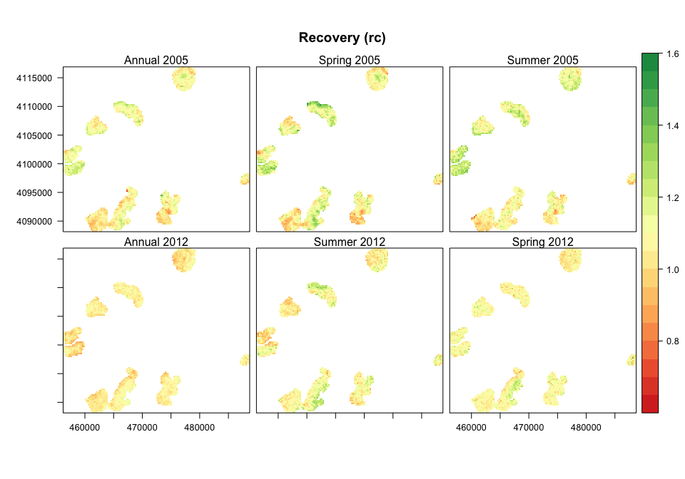
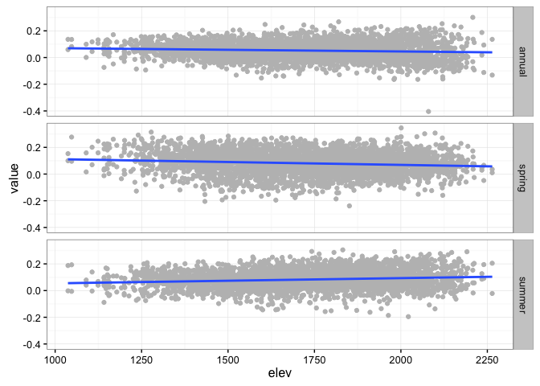
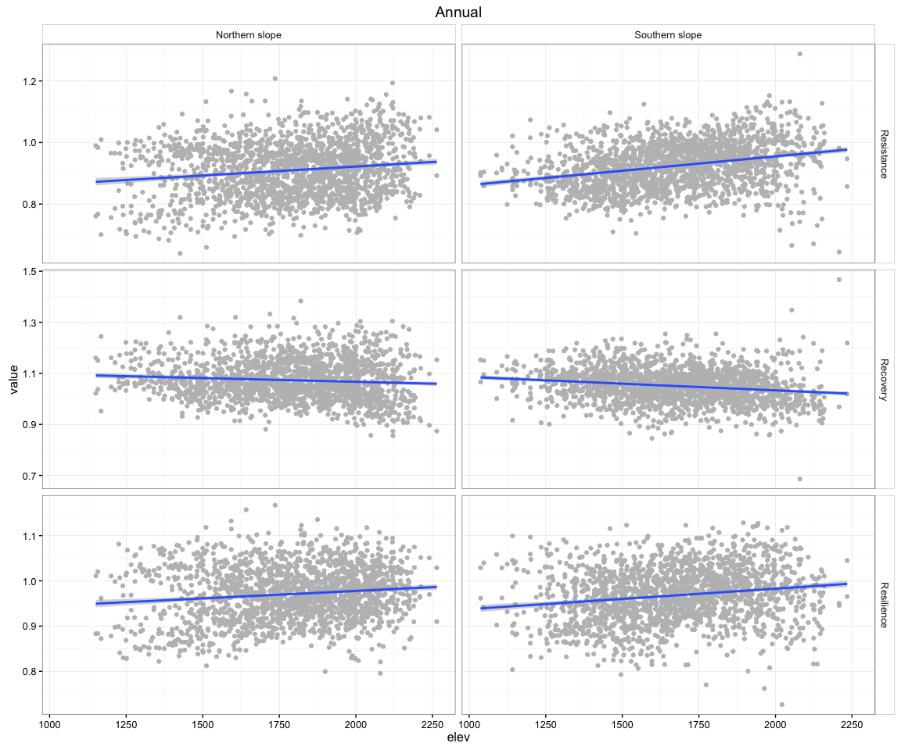
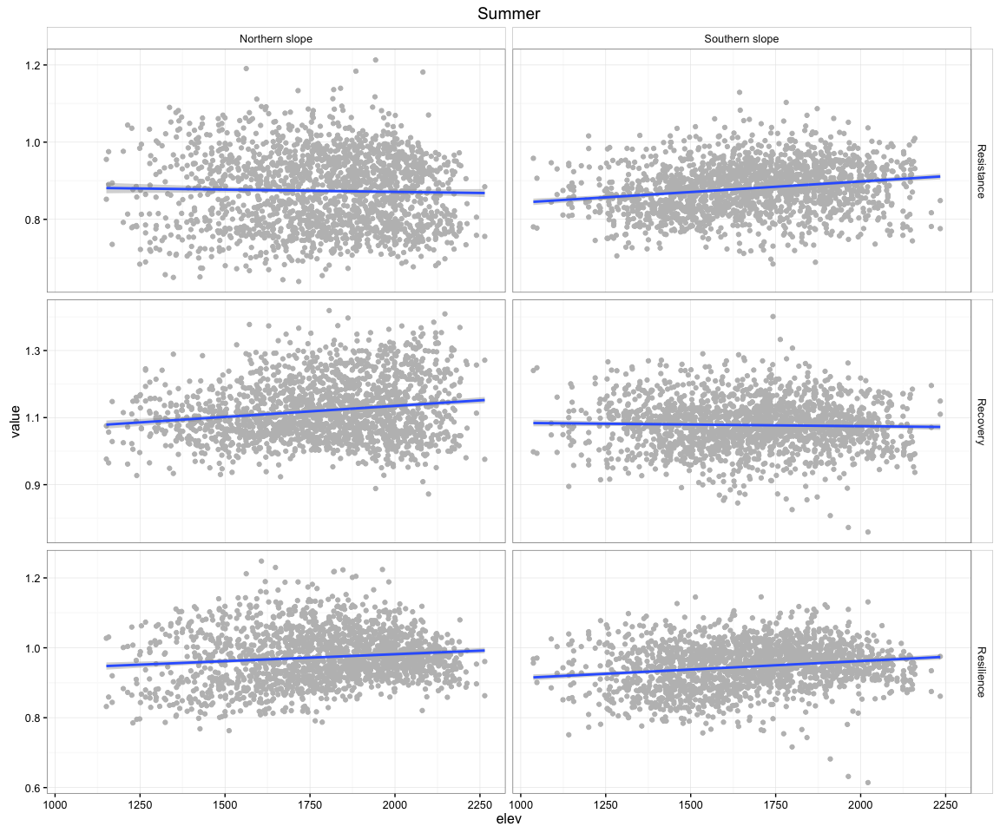
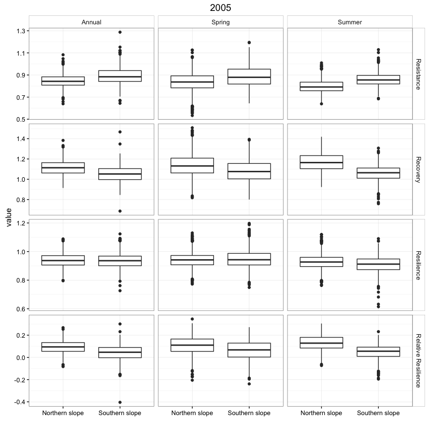

Explore resilience patterns of the different *Q. pyrenaica* patches
===================================================================

``` r
library("rgdal")
library("sp")
library("raster")
library("rasterVis")
source(paste0(di,"/R/exportpdf.R")) # function to export raster levelplots maps as pdf
library("dplyr")
library("ggplot2")
library("reshape2")
library("purrr")
# library("pander")
library("knitr")
```

Read and prepare data
---------------------

``` r
# Read resilience
evi_resilience <- read.csv(file=paste(di, "/data/evi_resilience.csv", sep=""), header = TRUE, sep = ',')
```

Maps
====

-   Create raster maps (two projections: `epsg:4326` and `epsg:23030`)
-   Export raster maps and stacks (see `/data/raster/`)

Spatial exploration of the resilience components
------------------------------------------------

### Resilience


    ## quartz_off_screen 
    ##                 2

### Resistance


    ## quartz_off_screen 
    ##                 2

### Recovery



    ## quartz_off_screen 
    ##                 2

### Relative Resilience


    ## quartz_off_screen 
    ##                 2

Elevation pattern
=================

-   We remove population `Cadiar`

``` r
# Prepare data
elev <- read.csv(file=paste(di, "/data/elev.csv", sep=""), header = TRUE, sep = ',')

eviresi <- evi_resilience %>% 
  # join elevation data
  dplyr::inner_join(elev, by='iv_malla_modi_id') %>% 
  # Add a variable for population cluster
  mutate(clu_pop = ifelse(pop %in% c(1,2,3,4,5), 'a', 'b'))
```

Explore elevation pattern general and by cluster of populations
---------------------------------------------------------------

``` r
# Change format of the dataset (wide to long)
df_melt <- melt(eviresi, id.vars = c('iv_malla_modi_id', 'pop',
                                      'long', 'lat', 'elev', 'clu_pop', 
                                     'event', 'seasonF'))

df_aux <- df_melt %>% filter(variable %in% c('rs','rt','rc', 'rrs'))

  
label_variable <- c('rt' = 'Resistance', 
                    'rc' = 'Recovery',
                    'rs' = 'Resilience',
                    'rrs' = 'Relative Resilience',
                    '0_pre' = 'PreDrought',
                    '1_dr' = 'Drought',
                    '2_post' = 'PostDrought')
label_cluster <- c('a' = 'Northern slope',
                   'b' = 'Southern slope')

label_season <- c('annual' = 'Annual',
                  'summer' = 'Summer',
                  'spring' = 'Spring')
```

### General pattern

``` r
g <- df_aux %>% 
  filter(variable %in% c('rt', 'rc', 'rs')) %>% 
  ggplot(aes(x=elev, y=value)) + 
  geom_point(col='gray') + 
  geom_smooth(method = 'lm') + 
  facet_grid(seasonF~variable,
             labeller = labeller(.cols = label_variable,
                                 .rows = label_season)) +
             # labeller = as_labeller(label_variable)) + 
  theme_bw() + 
  theme(strip.background = element_rect(fill = "white")) 

g
```


``` r
pdf(file=paste0(di, "/images/plot_resi_elev.pdf"), height = 9, width = 9)
g
dev.off() 
```

    ## quartz_off_screen 
    ##                 2

``` r
gr <- df_aux %>% 
  filter(variable == 'rrs') %>%
  ggplot(aes(x=elev, y=value)) + 
  geom_point(col='gray') + 
  theme_bw() +
  geom_smooth(method = 'lm') + 
  facet_grid(seasonF~.)
  ggtitle('Relative Resilience')
```

    ## $title
    ## [1] "Relative Resilience"
    ## 
    ## attr(,"class")
    ## [1] "labels"

``` r
gr
```



``` r
pdf(file=paste0(di, "/images/plot_resi_rel_elev.pdf"), height = 8, width = 5)
gr
dev.off() 
```

    ## quartz_off_screen 
    ##                 2

### Elevational pattern by population

#### Annual

``` r
gp <- 
  df_aux %>% filter(variable %in% c('rt', 'rc', 'rs')) %>% filter(seasonF == 'annual') %>%  
  ggplot( aes(x=elev, y=value)) +
  geom_point(col='gray') + 
  geom_smooth(method = 'lm') + 
  facet_grid(variable ~ clu_pop, scales = 'free_y',
             labeller = labeller(.rows = label_variable,
                                 .cols = label_cluster)) +
  # facet_wrap(~variable, labeller = as_labeller(label_variable)) + 
  theme_bw() + ggtitle('Annual') +
  theme(strip.background = element_rect(fill = "white")) 
gp 
```



``` r
pdf(file=paste0(di, "/images/plot_resicomp_elev_grouped_annual.pdf"), height = 8, width = 8)
gp
dev.off() 
```

    ## quartz_off_screen 
    ##                 2

#### Spring

``` r
gp <- 
  df_aux %>% filter(variable %in% c('rt', 'rc', 'rs')) %>% filter(seasonF == 'spring') %>%  
  ggplot( aes(x=elev, y=value)) +
  geom_point(col='gray') + 
  geom_smooth(method = 'lm') + 
  facet_grid(variable ~ clu_pop, scales = 'free_y',
             labeller = labeller(.rows = label_variable,
                                 .cols = label_cluster)) +
  # facet_wrap(~variable, labeller = as_labeller(label_variable)) + 
  theme_bw() + ggtitle('Spring') +
  theme(strip.background = element_rect(fill = "white")) 
gp 
```


``` r
pdf(file=paste0(di, "/images/plot_resicomp_elev_grouped_spring.pdf"), height = 8, width = 8)
gp
dev.off() 
```

    ## quartz_off_screen 
    ##                 2

#### Summer

``` r
gp <- 
  df_aux %>% filter(variable %in% c('rt', 'rc', 'rs')) %>% filter(seasonF == 'summer') %>%  
  ggplot( aes(x=elev, y=value)) +
  geom_point(col='gray') + 
  geom_smooth(method = 'lm') + 
  facet_grid(variable ~ clu_pop, scales = 'free_y',
             labeller = labeller(.rows = label_variable,
                                 .cols = label_cluster)) +
  # facet_wrap(~variable, labeller = as_labeller(label_variable)) + 
  theme_bw() + ggtitle('Summer') +
  theme(strip.background = element_rect(fill = "white")) 
gp 
```



``` r
pdf(file=paste0(di, "/images/plot_resicomp_elev_grouped_summer.pdf"), height = 8, width = 8)
gp
dev.off() 
```

    ## quartz_off_screen 
    ##                 2

Explore pattern by population (cluster)
=======================================

### Event 1 (2005)

``` r
gpop_2005 <- df_aux %>% filter(event == 1) %>% 
  ggplot(aes(x=clu_pop, y=value)) + 
  geom_boxplot() + 
  facet_grid(variable~seasonF, scales = 'free_y',
             labeller = labeller(.rows = label_variable,
                                 .cols = label_season)) +
  # facet_wrap(~variable, scales = 'free_y', labeller = as_labeller(label_variable)) + 
  theme_bw() + xlab('')+
  theme(strip.background = element_rect(fill = "white")) +  
  ggtitle('2005') + 
  scale_x_discrete(labels = label_cluster)

gpop_2005
```



``` r
pdf(file=paste0(di, "/images/plot_resicomp_by_cluster_event1.pdf"), height = 7, width = 8)
gpop_2005
dev.off()
```

    ## quartz_off_screen 
    ##                 2

### Event 2 (2012)

``` r
gpop_2012 <- df_aux %>% filter(event == 2) %>% 
  ggplot(aes(x=clu_pop, y=value)) + 
  geom_boxplot() + 
  facet_grid(variable~seasonF, scales = 'free_y',
             labeller = labeller(.rows = label_variable,
                                 .cols = label_season)) +
  # facet_wrap(~variable, scales = 'free_y', labeller = as_labeller(label_variable)) + 
  theme_bw() + xlab('')+
  theme(strip.background = element_rect(fill = "white")) + 
  ggtitle('2012') + 
  scale_x_discrete(labels = label_cluster)

gpop_2012
```


``` r
pdf(file=paste0(di, "/images/plot_resicomp_by_cluster_event2.pdf"), height = 7, width = 8)
gpop_2012
dev.off()
```

    ## quartz_off_screen 
    ##                 2

Bar plots
=========

Raw variables
-------------

``` r
# Bar plot 
variables <- c('dr','post', 'pre','rs','rc','rt','rrs')
myseasons <- unique(evi_resilience$seasonF)
auxdf <- data.frame()

for (m in myseasons){ 
  # filter by season
  aux_season <- eviresi %>% filter(seasonF == m)
  
  for (j in c(1:2)){
    # filter by event 
    auxilio <- aux_season %>% filter(event==j) 
    
    for (i in variables){ 
      aux <- auxilio %>% 
        dplyr::group_by(clu_pop) %>% 
        summarise_each_(funs(mean, sd, se=sd(.)/sqrt(n())), i) %>% 
        mutate(variable=i) %>% 
        mutate(event = j) %>% 
        mutate(seasonF = m)
      
      auxdf <- rbind(auxdf, aux)
    }
  }
}

auxdf <- auxdf %>% mutate(variable = plyr::mapvalues(variable,
                                                         c("dr","post","pre","rs","rc","rt","rrs"),
                                                         c("1_dr","2_post","0_pre","rs","rc","rt","rrs")),
                          event = plyr::mapvalues(event, c(1,2), c(2005,2012)))
```

``` r
col2012 <- '#0700fe'
col2005 <- '#19e00b'


gpop_bar <- auxdf %>% 
  filter(variable %in% c('1_dr', '0_pre', '2_post')) %>% filter(seasonF=='annual') %>% 
  ggplot(aes(x=variable, y=mean, fill=as.factor(event))) + 
  geom_bar(stat='identity', position="dodge") +# fill='black', colour='black') + 
  geom_errorbar(aes(ymin=mean-sd, ymax=mean+sd, colour=as.factor(event)), 
                width=.2, position=position_dodge(.9))+ 
  facet_wrap(~clu_pop, labeller = as_labeller(label_cluster)) + 
  theme_bw() + xlab('') + 
  theme(strip.background = element_rect(fill = "white")) +
  scale_colour_manual(values=c(col2005, col2012),name='') + 
  scale_fill_manual(values=c(col2005, col2012), name='') +
  ylab('Annual EVI') +
  scale_x_discrete(labels = label_variable) 

gpop_bar
```


``` r
pdf(file=paste0(di, "/images/plot_rawcomp_bar_by_cluster_annual.pdf"), height = 6, width = 8)
gpop_bar
dev.off()
```

    ## quartz_off_screen 
    ##                 2

``` r
gpop_bar <- auxdf %>% 
  filter(variable %in% c('1_dr', '0_pre', '2_post')) %>% filter(seasonF=='summer') %>% 
  ggplot(aes(x=variable, y=mean, fill=as.factor(event))) + 
  geom_bar(stat='identity', position="dodge") +# fill='black', colour='black') + 
  geom_errorbar(aes(ymin=mean-sd, ymax=mean+sd, colour=as.factor(event)), 
                width=.2, position=position_dodge(.9))+ 
  facet_wrap(~clu_pop, labeller = as_labeller(label_cluster)) + 
  theme_bw() + xlab('') + 
  theme(strip.background = element_rect(fill = "white")) +
  scale_colour_manual(values=c(col2005, col2012),name='') + 
  scale_fill_manual(values=c(col2005, col2012), name='') +
  ylab('Summer EVI') +
  scale_x_discrete(labels = label_variable) 

gpop_bar
```


``` r
pdf(file=paste0(di, "/images/plot_rawcomp_bar_by_cluster_summer.pdf"), height = 6, width = 8)
gpop_bar
dev.off()
```

    ## quartz_off_screen 
    ##                 2

``` r
gpop_bar <- auxdf %>% 
  filter(variable %in% c('1_dr', '0_pre', '2_post')) %>% filter(seasonF=='spring') %>% 
  ggplot(aes(x=variable, y=mean, fill=as.factor(event))) + 
  geom_bar(stat='identity', position="dodge") +# fill='black', colour='black') + 
  geom_errorbar(aes(ymin=mean-sd, ymax=mean+sd, colour=as.factor(event)), 
                width=.2, position=position_dodge(.9))+ 
  facet_wrap(~clu_pop, labeller = as_labeller(label_cluster)) + 
  theme_bw() + xlab('') + 
  theme(strip.background = element_rect(fill = "white")) +
  scale_colour_manual(values=c(col2005, col2012),name='') + 
  scale_fill_manual(values=c(col2005, col2012), name='') +
  ylab('Spring EVI') +
  scale_x_discrete(labels = label_variable) 

gpop_bar
```


``` r
pdf(file=paste0(di, "/images/plot_rawcomp_bar_by_cluster_spring.pdf"), height = 6, width = 8)
gpop_bar
dev.off()
```

    ## quartz_off_screen 
    ##                 2

Resilience bar
--------------

``` r
gpop_bar <- auxdf %>% 
  filter(variable %in% c('rs', 'rc', 'rt')) %>% filter(seasonF=='annual') %>% 
  ggplot(aes(x=clu_pop, y=mean, fill=as.factor(event))) + 
  geom_bar(stat='identity', position="dodge") +# fill='black', colour='black') + 
  geom_errorbar(aes(ymin=mean-sd, ymax=mean+sd, colour=as.factor(event)), 
                width=.2, position=position_dodge(.9))+ 
  facet_wrap(~variable, labeller = as_labeller(label_variable)) + 
  theme_bw() + xlab('') + 
  theme(strip.background = element_rect(fill = "white")) +
  scale_colour_manual(values=c(col2005, col2012),name='') + 
  scale_fill_manual(values=c(col2005, col2012), name='') +
  ylab('Annual EVI') +
  scale_x_discrete(labels = label_cluster) 

gpop_bar
```


``` r
pdf(file=paste0(di, "/images/plot_resicomp_bar_by_cluster_annual.pdf"), height = 6, width = 8)
gpop_bar
dev.off()
```

    ## quartz_off_screen 
    ##                 2

``` r
gpop_bar <- auxdf %>% 
  filter(variable %in% c('rs', 'rc', 'rt')) %>% filter(seasonF=='summer') %>% 
  ggplot(aes(x=clu_pop, y=mean, fill=as.factor(event))) + 
  geom_bar(stat='identity', position="dodge") +# fill='black', colour='black') + 
  geom_errorbar(aes(ymin=mean-sd, ymax=mean+sd, colour=as.factor(event)), 
                width=.2, position=position_dodge(.9))+ 
  facet_wrap(~variable, labeller = as_labeller(label_variable)) + 
  theme_bw() + xlab('') + 
  theme(strip.background = element_rect(fill = "white")) +
  scale_colour_manual(values=c(col2005, col2012),name='') + 
  scale_fill_manual(values=c(col2005, col2012), name='') +
  ylab('Summer EVI') +
  scale_x_discrete(labels = label_cluster) 

gpop_bar
```


``` r
pdf(file=paste0(di, "/images/plot_resicomp_bar_by_cluster_summer.pdf"), height = 6, width = 8)
gpop_bar
dev.off()
```

    ## quartz_off_screen 
    ##                 2

``` r
gpop_bar <- auxdf %>% 
  filter(variable %in% c('rs', 'rc', 'rt')) %>% filter(seasonF=='spring') %>% 
  ggplot(aes(x=clu_pop, y=mean, fill=as.factor(event))) + 
  geom_bar(stat='identity', position="dodge") +# fill='black', colour='black') + 
  geom_errorbar(aes(ymin=mean-sd, ymax=mean+sd, colour=as.factor(event)), 
                width=.2, position=position_dodge(.9))+ 
  facet_wrap(~variable, labeller = as_labeller(label_variable)) + 
  theme_bw() + xlab('') + 
  theme(strip.background = element_rect(fill = "white")) +
  scale_colour_manual(values=c(col2005, col2012),name='') + 
  scale_fill_manual(values=c(col2005, col2012), name='') +
  ylab('Spring EVI') +
  scale_x_discrete(labels = label_cluster) 

gpop_bar
```


``` r
pdf(file=paste0(di, "/images/plot_resicomp_bar_by_cluster_spring.pdf"), height = 6, width = 8)
gpop_bar
dev.off()
```

    ## quartz_off_screen 
    ##                 2

Exploring relationships
=======================
